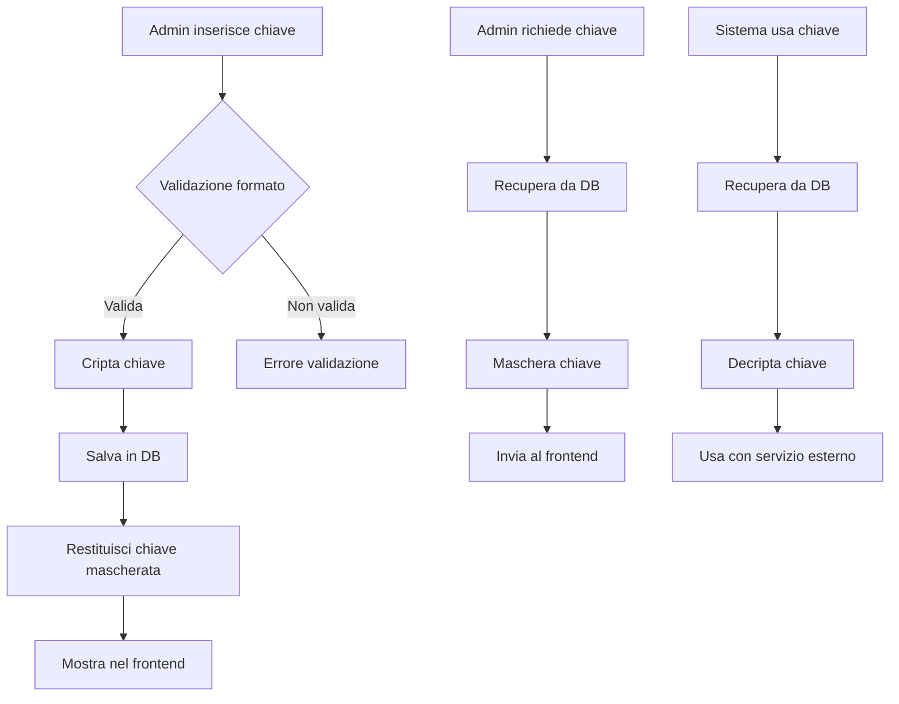

# API Keys Management - Documentazione

## 📋 Panoramica

Il sistema di gestione delle API Keys permette agli amministratori di configurare e gestire le chiavi API per servizi esterni integrati nel sistema.

## 🔐 Sicurezza

### Crittografia e Mascheramento
- **Storage**: Le chiavi sono salvate **criptate** nel database
- **Visualizzazione**: Le chiavi sono sempre mostrate **mascherate** (primi 10 caratteri + "..." + ultimi 4)
- **Accesso**: Solo utenti con ruolo `SUPER_ADMIN` possono gestire le API keys

### Formato Mascheramento
```
Originale: AIzaSyB-defghijklmnopqrstuvwxyz123456789
Mascherata: AIzaSyB-de...6789
```

## 🎯 Servizi Supportati

### 1. Google Maps (`GOOGLE_MAPS`)
- **Formato**: Deve iniziare con `AIza`
- **APIs Utilizzate**:
  - Maps JavaScript API
  - Geocoding API
  - Places API
  - Directions API (opzionale)
  - Distance Matrix API (opzionale)

### 2. OpenAI (`OPENAI`)
- **Formato**: Deve iniziare con `sk-`
- **Utilizzo**: AI Assistant, generazione contenuti

### 3. Brevo (`BREVO`)
- **Formato**: Deve contenere `xkeysib-`
- **Utilizzo**: Invio email transazionali

## 📡 API Endpoints

### GET /api/admin/api-keys
Ottieni tutte le API keys configurate

**Autorizzazione**: `SUPER_ADMIN`

**Response**:
```json
{
  "success": true,
  "data": [
    {
      "id": "uuid",
      "service": "GOOGLE_MAPS",
      "key": "AIzaSyB-de...6789",
      "isActive": true,
      "configuration": {},
      "lastUsed": "2024-01-15T10:30:00Z",
      "createdAt": "2024-01-01T00:00:00Z"
    }
  ]
}
```

### GET /api/admin/api-keys/:service
Ottieni una specifica API key

**Autorizzazione**: `SUPER_ADMIN`

**Parametri**:
- `service`: `GOOGLE_MAPS` | `OPENAI` | `BREVO`

**Response**:
```json
{
  "success": true,
  "data": {
    "id": "uuid",
    "service": "GOOGLE_MAPS",
    "key": "AIzaSyB-de...6789",
    "isActive": true,
    "configuration": {
      "enabled": true,
      "apis": ["maps", "geocoding", "places"],
      "restrictions": {
        "allowedReferrers": ["http://localhost:5193"]
      }
    }
  }
}
```

### POST /api/admin/api-keys
Crea o aggiorna una API key

**Autorizzazione**: `SUPER_ADMIN`

**Body**:
```json
{
  "service": "GOOGLE_MAPS",
  "key": "AIzaSyB-defghijklmnopqrstuvwxyz123456789",
  "configuration": {
    "enabled": true,
    "apis": ["maps", "geocoding", "places"]
  },
  "isActive": true
}
```

**Response**:
```json
{
  "success": true,
  "message": "API key updated successfully",
  "data": {
    "id": "uuid",
    "service": "GOOGLE_MAPS",
    "key": "AIzaSyB-de...6789",
    "isActive": true
  }
}
```

### POST /api/admin/api-keys/:service/test
Testa la connettività di una API key

**Autorizzazione**: `SUPER_ADMIN`

**Response**:
```json
{
  "success": true,
  "message": "Connection successful",
  "details": {
    "service": "GOOGLE_MAPS",
    "status": "active",
    "lastCheck": "2024-01-15T10:30:00Z"
  }
}
```

### DELETE /api/admin/api-keys/:service
Elimina una API key

**Autorizzazione**: `SUPER_ADMIN`

**Response**:
```json
{
  "success": true,
  "message": "API key deleted successfully"
}
```

## 💻 Frontend Components

### GoogleMapsConfig Component

**Location**: `/src/pages/admin/api-keys/GoogleMapsConfig.tsx`

**Funzionalità**:
- ✅ Visualizzazione chiave mascherata
- ✅ Inserimento nuova chiave con validazione formato
- ✅ Configurazione APIs abilitate
- ✅ Gestione domini autorizzati
- ✅ Test connessione
- ✅ Indicatore stato (Configurata/Non configurata)

**Stati Gestiti**:
```typescript
- showKey: boolean // Mostra/nascondi chiave
- isNewKey: boolean // Traccia se si sta inserendo una nuova chiave
- formData: {
    key: string,
    configuration: {
      enabled: boolean,
      apis: string[],
      restrictions: object
    }
  }
```

### Comportamento Salvataggio

1. **Prima del salvataggio**: Validazione formato chiave
2. **Durante il salvataggio**: 
   - Backend salva la chiave criptata
   - Backend restituisce la chiave mascherata
3. **Dopo il salvataggio**:
   - Frontend mostra la chiave mascherata
   - Campo non viene svuotato
   - Badge stato aggiornato

## 🗄️ Database Schema

### Tabella: api_keys

```sql
CREATE TABLE api_keys (
  id UUID PRIMARY KEY DEFAULT gen_random_uuid(),
  organization_id UUID NOT NULL REFERENCES organizations(id),
  service VARCHAR(50) NOT NULL, -- GOOGLE_MAPS, OPENAI, BREVO
  key TEXT NOT NULL, -- Encrypted
  configuration JSONB DEFAULT '{}',
  is_active BOOLEAN DEFAULT true,
  last_used TIMESTAMP,
  created_at TIMESTAMP DEFAULT NOW(),
  updated_at TIMESTAMP DEFAULT NOW(),
  created_by UUID REFERENCES users(id),
  
  UNIQUE(organization_id, service)
);
```

## 🔧 Service Layer

### apiKey.service.ts

**Metodi principali**:

```typescript
class ApiKeyService {
  // Cripta la chiave prima del salvataggio
  async upsertApiKey(data: CreateApiKeyDto, organizationId: string, userId: string)
  
  // Decripta la chiave per l'uso interno
  async getDecryptedKey(service: string, organizationId: string)
  
  // Restituisce la chiave mascherata per il frontend
  async getApiKey(service: string, organizationId: string)
  
  // Testa la validità della chiave
  async testApiKey(service: string, organizationId: string)
}
```

## 🔒 Encryption Utils

### Crittografia
```typescript
// Cripta la chiave per lo storage
encrypt(text: string): string {
  const cipher = crypto.createCipheriv(algorithm, key, iv);
  let encrypted = cipher.update(text, 'utf8', 'hex');
  encrypted += cipher.final('hex');
  return encrypted;
}

// Decripta la chiave per l'uso
decrypt(encryptedText: string): string {
  const decipher = crypto.createDecipheriv(algorithm, key, iv);
  let decrypted = decipher.update(encryptedText, 'hex', 'utf8');
  decrypted += decipher.final('utf8');
  return decrypted;
}
```

## 🚨 Error Handling

### Errori Comuni

| Codice | Messaggio | Causa |
|--------|-----------|-------|
| 400 | Invalid API key format | Formato chiave non valido |
| 401 | Unauthorized | Utente non autenticato |
| 403 | Forbidden | Utente non è SUPER_ADMIN |
| 404 | API key not found | Chiave non configurata |
| 500 | Decryption failed | Errore decrittazione chiave |

## 📝 Best Practices

1. **Mai esporre chiavi complete** nel frontend o nei log
2. **Validare sempre il formato** delle chiavi prima del salvataggio
3. **Testare la connessione** dopo ogni modifica
4. **Ruotare le chiavi** periodicamente per sicurezza
5. **Monitorare l'uso** delle API per rilevare anomalie

## 🔄 Workflow Completo



## 📊 Monitoraggio

### Metriche Tracked
- Numero di chiamate API per servizio
- Ultimo utilizzo di ogni chiave
- Errori di autenticazione
- Rate limit raggiunti

### Logging
```typescript
logger.info(`API key ${service} updated by user ${userId}`);
logger.error(`API key ${service} test failed: ${error.message}`);
logger.warn(`API key ${service} rate limit approaching`);
```

## 🔮 Miglioramenti Futuri

- [ ] Rotazione automatica chiavi
- [ ] Notifiche scadenza chiavi
- [ ] Backup chiavi criptate
- [ ] Audit log dettagliato
- [ ] Rate limiting per servizio
- [ ] Dashboard utilizzo API
- [ ] Alerting su errori ricorrenti

---

*Ultima modifica: 24 Agosto 2025*
*Versione: 1.0.0*
