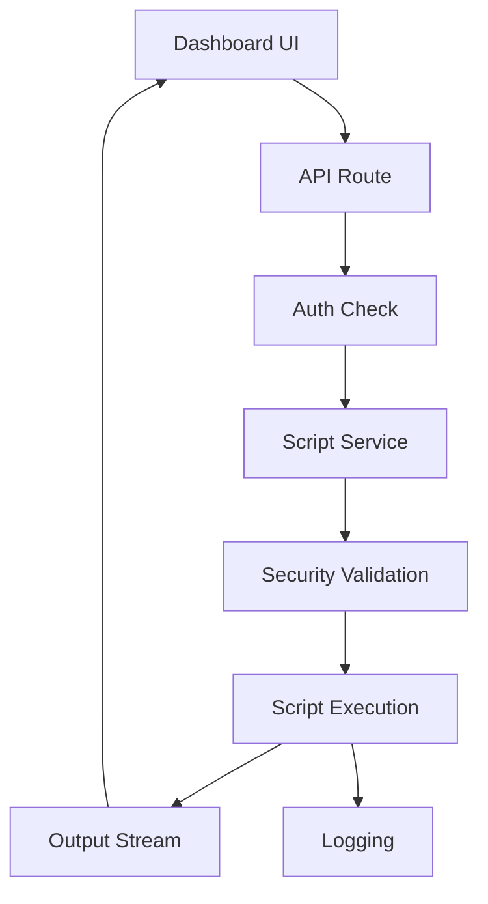

# 🛠️ SCRIPT MANAGER - DOCUMENTAZIONE COMPLETA
**Versione**: 2.0.0  
**Data**: 8 Settembre 2025  
**Stato**: Production Ready

---

## 📋 INDICE

1. [Overview](#1-overview)
2. [Architettura](#2-architettura)
3. [Dashboard UI](#3-dashboard-ui)
4. [Script Disponibili](#4-script-disponibili)
5. [API Reference](#5-api-reference)
6. [Sicurezza](#6-sicurezza)
7. [Best Practices](#7-best-practices)
8. [Troubleshooting](#8-troubleshooting)

---

## 1. OVERVIEW

### 🎯 Scopo
Il **Script Manager** è un sistema centralizzato per la gestione e l'esecuzione sicura di script di manutenzione e utilità dal pannello amministrativo.

### 🚀 Caratteristiche Principali
- **Esecuzione Sicura**: Sandbox environment con controlli di sicurezza
- **UI Intuitiva**: Dashboard per esecuzione senza terminale
- **Logging Completo**: Tracciamento di tutte le operazioni
- **Controllo Accessi**: Solo SUPER_ADMIN può eseguire script critici
- **Real-time Output**: Visualizzazione output in tempo reale
- **Categorizzazione**: Script organizzati per categoria
- **Parametri Dinamici**: Input personalizzabili per ogni script

### 📊 Categorie Script
- **🗄️ Database**: Backup, restore, migrations
- **🧹 Manutenzione**: Pulizia, ottimizzazione
- **📊 Report**: Generazione report e statistiche
- **🔐 Sicurezza**: Audit, controlli sicurezza
- **🛠️ Utilità**: Script generici di supporto

---

## 2. ARCHITETTURA

### 🏗️ Struttura del Sistema

```
Script Manager
├── Dashboard UI (React)
├── API Routes (Express)
├── Script Service (Node.js)
├── Script Registry (JSON)
├── Execution Engine
└── Security Layer
```

### 📁 Struttura File

```
backend/
├── src/
│   ├── routes/
│   │   └── admin/
│   │       └── scripts.routes.ts
│   ├── services/
│   │   └── scripts.service.ts
│   └── scripts/
│       ├── database/
│       │   ├── backup.ts
│       │   ├── restore.ts
│       │   └── optimize.ts
│       ├── maintenance/
│       │   ├── cleanup.ts
│       │   └── cache-clear.ts
│       └── registry.json
```

### 🔄 Flusso Esecuzione



---

## 3. DASHBOARD UI

### 🎨 Interfaccia Amministrativa

Accessibile da: **Menu → Script Manager**

### 📑 Sezioni Dashboard

#### 1. Lista Script
- **Grid View**: Card per ogni script
- **Categorizzazione**: Filtro per categoria
- **Search**: Ricerca per nome/descrizione
- **Status Indicators**: Ultimo run, successo/fallimento

#### 2. Dettaglio Script
- **Descrizione**: Cosa fa lo script
- **Parametri**: Input richiesti
- **Rischi**: Warning per script critici
- **Storia**: Ultimi 10 run

#### 3. Esecuzione
- **Form Parametri**: Input dinamici
- **Confirmation Dialog**: Per script critici
- **Progress Bar**: Durante esecuzione
- **Output Console**: Real-time output
- **Result Status**: Success/Error finale

### 🎮 Componenti UI

```typescript
// Componente principale
<ScriptManager>
  <ScriptList />          // Lista script disponibili
  <ScriptDetail />        // Dettagli script selezionato
  <ScriptExecutor />      // Form esecuzione
  <ScriptOutput />        // Console output
  <ScriptHistory />       // Storico esecuzioni
</ScriptManager>
```

### 🖼️ Layout UI

```
┌─────────────────────────────────────────────┐
│            Script Manager Dashboard          │
├──────────┬──────────────────────────────────┤
│          │                                   │
│  Script  │        Script Details             │
│   List   │                                   │
│          │   ┌─────────────────────┐        │
│  [DB]    │   │   Parameters Form   │        │
│  [Maint] │   └─────────────────────┘        │
│  [Utils] │                                   │
│          │   ┌─────────────────────┐        │
│          │   │   Console Output    │        │
│          │   │   > Running...      │        │
│          │   │   > Complete!       │        │
│          │   └─────────────────────┘        │
└──────────┴──────────────────────────────────┘
```

---

## 4. SCRIPT DISPONIBILI

### 🗄️ Database Scripts

#### backup-database
```typescript
{
  "id": "backup-database",
  "name": "Database Backup",
  "category": "database",
  "description": "Crea backup completo del database",
  "risk": "low",
  "parameters": [
    {
      "name": "compress",
      "type": "boolean",
      "default": true,
      "description": "Comprimi il backup"
    }
  ],
  "requireConfirmation": false,
  "minRole": "ADMIN"
}
```

#### restore-database
```typescript
{
  "id": "restore-database",
  "name": "Database Restore",
  "category": "database",
  "description": "Ripristina database da backup",
  "risk": "critical",
  "parameters": [
    {
      "name": "backupFile",
      "type": "string",
      "required": true,
      "description": "Nome del file di backup"
    }
  ],
  "requireConfirmation": true,
  "minRole": "SUPER_ADMIN"
}
```

### 🧹 Maintenance Scripts

#### cleanup-old-data
```typescript
{
  "id": "cleanup-old-data",
  "name": "Pulizia Dati Vecchi",
  "category": "maintenance",
  "description": "Rimuove dati obsoleti",
  "risk": "medium",
  "parameters": [
    {
      "name": "days",
      "type": "number",
      "default": 90,
      "description": "Giorni da mantenere"
    }
  ]
}
```

#### clear-cache
```typescript
{
  "id": "clear-cache",
  "name": "Clear Cache",
  "category": "maintenance",
  "description": "Pulisce cache Redis",
  "risk": "low",
  "parameters": []
}
```

### 📊 Report Scripts

#### generate-usage-report
```typescript
{
  "id": "generate-usage-report",
  "name": "Report Utilizzo",
  "category": "report",
  "description": "Genera report utilizzo sistema",
  "risk": "low",
  "parameters": [
    {
      "name": "startDate",
      "type": "date",
      "required": true
    },
    {
      "name": "endDate",
      "type": "date",
      "required": true
    },
    {
      "name": "format",
      "type": "select",
      "options": ["pdf", "csv", "json"],
      "default": "pdf"
    }
  ]
}
```

---

## 5. API REFERENCE

### 🔌 Endpoints

Base URL: `/api/admin/scripts`

#### Script Management
```http
GET    /                    # Lista script disponibili
GET    /:id                 # Dettagli script
POST   /:id/execute         # Esegui script
GET    /:id/history         # Storico esecuzioni
GET    /:id/output/:runId   # Output specifica esecuzione
```

### 📤 Request/Response

#### Execute Script
```http
POST /api/admin/scripts/backup-database/execute
Content-Type: application/json
Authorization: Bearer {token}

{
  "parameters": {
    "compress": true,
    "excludeTables": ["logs", "temp_data"]
  }
}
```

#### Response
```json
{
  "success": true,
  "data": {
    "runId": "run_abc123",
    "status": "running",
    "startedAt": "2025-09-08T10:00:00Z",
    "output": []
  },
  "message": "Script execution started"
}
```

#### Get Output (WebSocket)
```javascript
// Real-time output via WebSocket
socket.on('script:output', (data) => {
  console.log(data.line);
  // Output: "Backing up table users... [OK]"
});

socket.on('script:complete', (data) => {
  console.log('Script completed:', data.status);
});
```

---

## 6. SICUREZZA

### 🔐 Controlli di Sicurezza

#### 1. Autenticazione & Autorizzazione
- **JWT Required**: Tutti gli endpoint richiedono token valido
- **Role-Based**: Script critici solo per SUPER_ADMIN
- **Session Validation**: Controllo sessione attiva

#### 2. Input Validation
```typescript
// Validazione parametri con Zod
const backupSchema = z.object({
  compress: z.boolean().optional(),
  excludeTables: z.array(z.string()).optional()
});

// Sanitizzazione input
const sanitized = DOMPurify.sanitize(userInput);
```

#### 3. Execution Sandbox
- **Process Isolation**: Child process separato
- **Resource Limits**: CPU e memoria limitati
- **Timeout**: Max execution time
- **No Shell Access**: Nessun accesso shell diretto

#### 4. Audit Logging
```typescript
// Ogni esecuzione viene loggata
{
  userId: "user_123",
  scriptId: "backup-database",
  parameters: {...},
  startedAt: "2025-09-08T10:00:00Z",
  completedAt: "2025-09-08T10:05:00Z",
  status: "success",
  output: "...",
  ipAddress: "192.168.1.1"
}
```

### 🛡️ Protezioni Aggiuntive

- **Rate Limiting**: Max 10 esecuzioni/ora per utente
- **Concurrent Execution**: Max 3 script contemporanei
- **File System Protection**: Accesso solo a directory autorizzate
- **Network Isolation**: No accesso rete per script locali
- **Environment Variables**: Secrets non esposti

---

## 7. BEST PRACTICES

### ✅ DO's

1. **Sempre testare in development**
   ```bash
   NODE_ENV=development npm run script:test
   ```

2. **Usare parametri invece di hardcoding**
   ```typescript
   // Good
   const days = parameters.days || 30;
   
   // Bad
   const days = 30;
   ```

3. **Implementare rollback**
   ```typescript
   try {
     await executeOperation();
   } catch (error) {
     await rollback();
     throw error;
   }
   ```

4. **Logging dettagliato**
   ```typescript
   logger.info(`Starting backup for ${tables.length} tables`);
   logger.debug(`Processing table: ${table}`);
   logger.error(`Failed to backup ${table}:`, error);
   ```

### ❌ DON'Ts

1. **Mai esporre credenziali**
   ```typescript
   // Bad
   const password = "admin123";
   
   // Good
   const password = process.env.DB_PASSWORD;
   ```

2. **Evitare operazioni distruttive senza conferma**
   ```typescript
   // Always require confirmation for:
   - DROP TABLE
   - DELETE without WHERE
   - TRUNCATE
   - System modifications
   ```

3. **Non bypassare validazioni**
   ```typescript
   // Always validate input
   if (!isValidInput(params)) {
     throw new ValidationError();
   }
   ```

---

## 8. TROUBLESHOOTING

### ❌ Problemi Comuni

#### Script non appare nella lista
```bash
# Verifica registry
cat backend/src/scripts/registry.json

# Ricarica registry
npm run scripts:reload
```

#### Esecuzione fallisce
```bash
# Check logs
tail -f backend/logs/scripts.log

# Verifica permessi
ls -la backend/src/scripts/

# Test manuale
npm run script:test -- backup-database
```

#### Output non visibile
```bash
# Verifica WebSocket
# Browser console:
socket.connected // should be true

# Backend logs
grep "WebSocket" backend/logs/combined.log
```

### 📋 Checklist Debug

- [ ] Utente ha ruolo corretto?
- [ ] Script presente nel registry?
- [ ] Parametri validi?
- [ ] Database/Redis connessi?
- [ ] Spazio disco sufficiente?
- [ ] Permessi file corretti?
- [ ] WebSocket connesso?

### 🔍 Log Analysis

```bash
# Script execution logs
tail -f backend/logs/scripts/execution.log

# Error logs
tail -f backend/logs/scripts/errors.log

# Audit logs
grep "SCRIPT_EXECUTE" backend/logs/audit.log
```

### 🛠️ Comandi Utili

```bash
# Test script locale
npm run script:test -- <script-id>

# Lista script disponibili
npm run scripts:list

# Validazione registry
npm run scripts:validate

# Clear script cache
npm run scripts:cache:clear

# Emergency stop all scripts
npm run scripts:stop:all
```

---

## 📚 APPENDICI

### A. Script Template

```typescript
/**
 * Script Template
 * @name My Script
 * @category utility
 * @risk low|medium|high|critical
 */

import { ScriptContext, ScriptResult } from '../types';
import { logger } from '../../utils/logger';

export interface MyScriptParams {
  param1: string;
  param2?: number;
}

export async function execute(
  context: ScriptContext<MyScriptParams>
): Promise<ScriptResult> {
  const { parameters, onProgress } = context;
  
  try {
    // Validation
    if (!parameters.param1) {
      throw new Error('param1 is required');
    }
    
    // Execution
    onProgress('Starting operation...');
    
    // Your logic here
    const result = await doSomething(parameters);
    
    onProgress('Operation completed');
    
    return {
      success: true,
      output: result,
      message: 'Script executed successfully'
    };
    
  } catch (error) {
    logger.error('Script failed:', error);
    
    return {
      success: false,
      error: error.message,
      message: 'Script execution failed'
    };
  }
}

// Metadata for registry
export const metadata = {
  id: 'my-script',
  name: 'My Script',
  description: 'Does something useful',
  category: 'utility',
  risk: 'low',
  parameters: [
    {
      name: 'param1',
      type: 'string',
      required: true,
      description: 'First parameter'
    },
    {
      name: 'param2',
      type: 'number',
      required: false,
      default: 10,
      description: 'Second parameter'
    }
  ],
  requireConfirmation: false,
  minRole: 'ADMIN'
};
```

### B. Registry Schema

```json
{
  "$schema": "http://json-schema.org/draft-07/schema#",
  "type": "object",
  "properties": {
    "scripts": {
      "type": "array",
      "items": {
        "type": "object",
        "required": ["id", "name", "category", "path"],
        "properties": {
          "id": { "type": "string" },
          "name": { "type": "string" },
          "description": { "type": "string" },
          "category": {
            "enum": ["database", "maintenance", "report", "security", "utility"]
          },
          "path": { "type": "string" },
          "risk": {
            "enum": ["low", "medium", "high", "critical"]
          },
          "parameters": {
            "type": "array",
            "items": {
              "type": "object",
              "properties": {
                "name": { "type": "string" },
                "type": {
                  "enum": ["string", "number", "boolean", "date", "select", "file"]
                },
                "required": { "type": "boolean" },
                "default": {},
                "description": { "type": "string" },
                "options": { "type": "array" }
              }
            }
          },
          "requireConfirmation": { "type": "boolean" },
          "minRole": {
            "enum": ["ADMIN", "SUPER_ADMIN"]
          },
          "timeout": { "type": "number" },
          "enabled": { "type": "boolean" }
        }
      }
    }
  }
}
```

---

**FINE DOCUMENTO**

Ultimo aggiornamento: 8 Settembre 2025  
Mantenuto da: Team Sviluppo