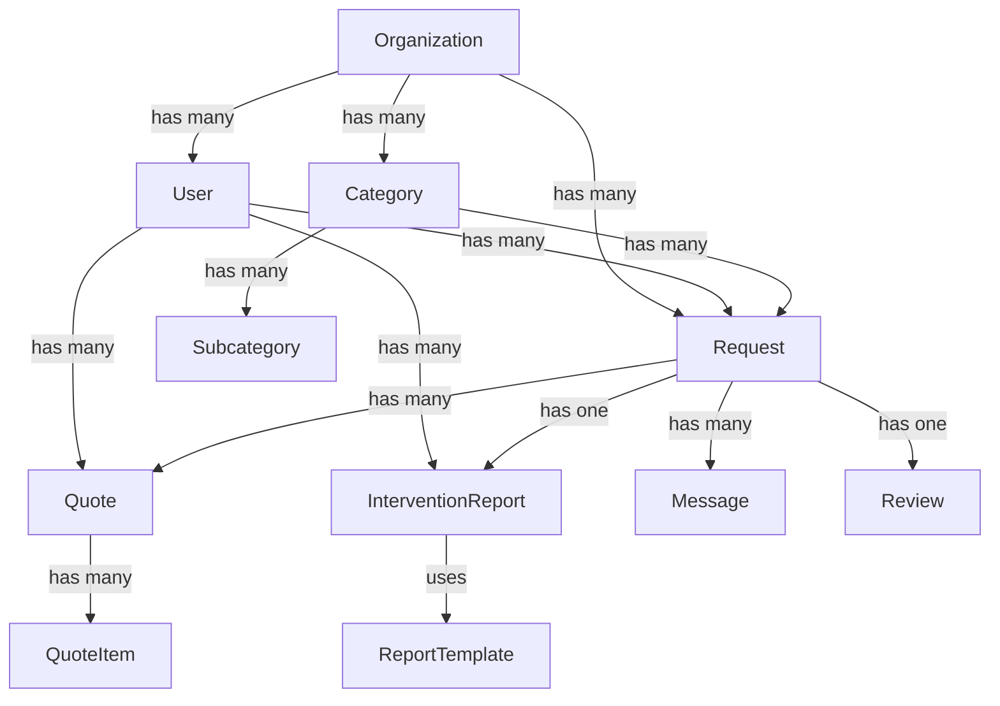

# 🗄️ DATABASE SCHEMA REFERENCE
## Sistema di Richiesta Assistenza

Ultimo aggiornamento: **6 Gennaio 2025**

---

## 📋 INDICE

1. [Overview Database](#overview-database)
2. [Tabelle Principali](#tabelle-principali)
3. [Tabelle di Supporto](#tabelle-di-supporto)
4. [Tabelle di Sistema](#tabelle-di-sistema)
5. [Relazioni e Vincoli](#relazioni-e-vincoli)
6. [Indici e Performance](#indici-e-performance)
7. [Migrazioni](#migrazioni)
8. [Seed Data](#seed-data)

---

## 1. OVERVIEW DATABASE

### Informazioni Generali
```yaml
Database: PostgreSQL 14+
ORM: Prisma 5.x
Schema Location: backend/prisma/schema.prisma
Naming Convention: camelCase per campi, PascalCase per modelli
ID Type: CUID (string)
Timestamps: createdAt, updatedAt automatici
Soft Delete: Implementato su tabelle critiche
```

### Statistiche Schema
```yaml
Tabelle Totali: 35+
Relazioni: 50+
Indici: 40+
Enums: 15+
Stored Procedures: 0 (logica in application layer)
Triggers: 0 (gestiti da Prisma)
```

---

## 2. TABELLE PRINCIPALI

### 📊 Organization
Gestione multi-tenancy e organizzazioni.

```prisma
model Organization {
  id                String    @id @default(cuid())
  name              String
  slug              String    @unique
  description       String?
  logo              String?
  website           String?
  email             String
  phone             String?
  address           String?
  city              String?
  province          String?
  postalCode        String?
  country           String    @default("IT")
  
  // Fiscale
  vatNumber         String?   @unique
  fiscalCode        String?   @unique
  pec               String?
  sdiCode           String?
  
  // Settings
  settings          Json?     @default("{}")
  features          Json?     @default("[]")
  isActive          Boolean   @default(true)
  
  // Relazioni
  users             User[]
  requests          Request[]
  categories        Category[]
  
  // Audit
  createdAt         DateTime  @default(now())
  updatedAt         DateTime  @updatedAt
  
  @@index([slug])
}
```

### 👤 User
Tabella utenti con supporto multi-ruolo.

```prisma
model User {
  id                String    @id @default(cuid())
  email             String    @unique
  username          String?   @unique
  password          String
  
  // Dati anagrafici
  firstName         String
  lastName          String
  fullName          String?
  phone             String?
  avatar            String?
  
  // Ruolo e organizzazione
  role              Role      @default(CLIENT)
  organizationId    String?
  organization      Organization? @relation(fields: [organizationId], references: [id])
  
  // Indirizzo principale
  address           String?
  city              String?
  province          String?
  postalCode        String?
  country           String    @default("IT")
  latitude          Float?
  longitude         Float?
  
  // Dati professionista
  profession        String?
  specializations   Json?     // ["idraulica", "elettricista"]
  workAddress       String?
  workCity          String?
  workProvince      String?
  workPostalCode    String?
  workLatitude      Float?
  workLongitude     Float?
  workRadius        Int?      // km di copertura
  hourlyRate        Int?      // in centesimi
  
  // Dati fiscali
  fiscalCode        String?
  vatNumber         String?   
  companyName       String?
  companyAddress    String?
  
  // Autenticazione e sicurezza
  emailVerified     Boolean   @default(false)
  emailVerifyToken  String?
  passwordResetToken String?
  passwordResetExpires DateTime?
  twoFactorEnabled  Boolean   @default(false)
  twoFactorSecret   String?
  
  // Status
  isActive          Boolean   @default(true)
  isVerified        Boolean   @default(false)
  lastLogin         DateTime?
  loginCount        Int       @default(0)
  
  // Relazioni
  requestsAsClient      Request[]   @relation("ClientRequests")
  requestsAsProfessional Request[]  @relation("ProfessionalRequests")
  quotes               Quote[]
  interventionReports  InterventionReport[]
  messages            Message[]
  notifications       Notification[]
  reviews             Review[]
  loginLogs           LoginLog[]
  
  // Audit
  createdAt         DateTime  @default(now())
  updatedAt         DateTime  @updatedAt
  deletedAt         DateTime? // Soft delete
  
  @@index([email])
  @@index([organizationId])
  @@index([role])
}
```

### 📋 Request
Richieste di assistenza.

```prisma
model Request {
  id                String    @id @default(cuid())
  requestNumber     String    @unique // REQ-2025-0001
  
  // Organizzazione
  organizationId    String
  organization      Organization @relation(fields: [organizationId], references: [id])
  
  // Dettagli richiesta
  title             String
  description       String    @db.Text
  priority          Priority  @default(NORMAL)
  status            RequestStatus @default(PENDING)
  
  // Categoria
  categoryId        String
  category          Category  @relation(fields: [categoryId], references: [id])
  subcategoryId     String?
  subcategory       Subcategory? @relation(fields: [subcategoryId], references: [id])
  
  // Utenti coinvolti
  clientId          String
  client            User      @relation("ClientRequests", fields: [clientId], references: [id])
  professionalId    String?
  professional      User?     @relation("ProfessionalRequests", fields: [professionalId], references: [id])
  
  // Localizzazione
  address           String
  city              String
  province          String
  postalCode        String
  country           String    @default("IT")
  latitude          Float?
  longitude         Float?
  locationDetails   String?   // Piano, scala, citofono, etc.
  
  // Date e tempi
  requestedDate     DateTime? // Data preferita intervento
  assignedDate      DateTime? // Data assegnazione professionista
  startedDate       DateTime? // Data inizio lavoro
  completedDate     DateTime? // Data completamento
  cancelledDate     DateTime? // Data cancellazione
  
  // Informazioni aggiuntive
  estimatedHours    Float?    // Ore stimate
  actualHours       Float?    // Ore effettive
  estimatedCost     Int?      // Costo stimato in centesimi
  finalCost         Int?      // Costo finale in centesimi
  
  // Cancellazione
  cancellationReason String?
  cancelledBy       String?   // userId di chi ha cancellato
  
  // Metadata
  metadata          Json?     // Dati aggiuntivi flessibili
  tags              String[]  // Tags per categorizzazione
  
  // Relazioni
  quotes            Quote[]
  messages          Message[]
  attachments       Attachment[]
  statusHistory     StatusHistory[]
  interventionReports InterventionReport[]
  reviews           Review[]
  
  // Audit
  createdAt         DateTime  @default(now())
  updatedAt         DateTime  @updatedAt
  
  @@index([organizationId])
  @@index([clientId])
  @@index([professionalId])
  @@index([status])
  @@index([categoryId])
  @@index([createdAt])
}
```

### 💰 Quote
Preventivi per le richieste.

```prisma
model Quote {
  id                String    @id @default(cuid())
  quoteNumber       String    @unique // QT-2025-0001
  version           Int       @default(1)
  
  // Relazioni principali
  requestId         String
  request           Request   @relation(fields: [requestId], references: [id], onDelete: Cascade)
  professionalId    String
  professional      User      @relation(fields: [professionalId], references: [id])
  
  // Dettagli preventivo
  title             String
  description       String?   @db.Text
  status            QuoteStatus @default(DRAFT)
  
  // Importi (in centesimi)
  subtotal          Int       // Totale senza IVA
  taxRate           Float     @default(22) // Percentuale IVA
  taxAmount         Int       // Importo IVA
  discount          Int       @default(0)
  totalAmount       Int       // Totale finale
  currency          String    @default("EUR")
  
  // Deposito
  depositRequired   Boolean   @default(false)
  depositAmount     Int?      // Importo deposito
  depositPaid       Boolean   @default(false)
  depositPaidAt     DateTime?
  
  // Validità e accettazione
  validUntil        DateTime?
  acceptedAt        DateTime?
  rejectedAt        DateTime?
  rejectionReason   String?
  
  // Note e condizioni
  notes             String?   @db.Text
  termsAndConditions String?  @db.Text
  paymentTerms      String?   // "30gg FM", "Immediato", etc.
  
  // Tempi previsti
  estimatedStartDate DateTime?
  estimatedEndDate  DateTime?
  estimatedHours    Float?
  
  // Metadata
  metadata          Json?
  
  // Relazioni
  items             QuoteItem[]
  
  // Audit
  createdAt         DateTime  @default(now())
  updatedAt         DateTime  @updatedAt
  
  @@index([requestId])
  @@index([professionalId])
  @@index([status])
}
```

### 📝 InterventionReport
Rapporti di intervento digitali.

```prisma
model InterventionReport {
  id                String    @id @default(cuid())
  reportNumber      String    @unique // RA-2025-0001
  
  // Relazioni principali
  requestId         String
  request           Request   @relation(fields: [requestId], references: [id])
  professionalId    String
  professional      User      @relation(fields: [professionalId], references: [id])
  
  // Template e tipologia
  templateId        String?
  template          ReportTemplate? @relation(fields: [templateId], references: [id])
  typeId            String?
  type              InterventionType? @relation(fields: [typeId], references: [id])
  
  // Dettagli intervento
  interventionDate  DateTime
  startTime         String    // "09:00"
  endTime           String    // "11:30"
  actualHours       Float?    // Ore effettive lavorate
  
  // Contenuto dinamico (JSON)
  formData          Json      // Dati del form dinamico
  
  // Campi standard
  description       String    @db.Text
  problemFound      String    @db.Text
  solutionApplied   String    @db.Text
  
  // Materiali utilizzati
  materials         Json?     // Array di materiali
  materialsCost     Int?      // Costo totale materiali
  
  // Note
  internalNotes     String?   @db.Text // Note private professionista
  clientNotes       String?   @db.Text // Note per il cliente
  recommendations   String?   @db.Text // Raccomandazioni
  
  // Follow-up
  followUpRequired  Boolean   @default(false)
  followUpDate      DateTime?
  followUpNotes     String?   @db.Text
  
  // Stato e firma
  status            ReportStatus @default(DRAFT)
  isDraft           Boolean   @default(true)
  isSigned          Boolean   @default(false)
  
  // Firma professionista
  professionalSignedAt DateTime?
  professionalSignature String? // Base64 firma
  
  // Firma cliente
  clientSignedAt    DateTime?
  clientSignature   String?   // Base64 firma
  clientSignerName  String?   // Nome di chi firma per il cliente
  
  // File e allegati
  photos            Json?     // Array di percorsi foto
  pdfPath           String?   // Path PDF generato
  pdfGeneratedAt    DateTime?
  
  // Email
  sentToClientAt    DateTime?
  clientEmail       String?   // Email dove è stato inviato
  
  // Metadata
  metadata          Json?
  weatherConditions String?   // Condizioni meteo durante intervento
  gpsCoordinates    Json?     // Coordinate GPS intervento
  
  // Audit
  createdAt         DateTime  @default(now())
  updatedAt         DateTime  @updatedAt
  
  @@index([requestId])
  @@index([professionalId])
  @@index([status])
  @@index([interventionDate])
}
```

---

## 3. TABELLE DI SUPPORTO

### 📁 Category
Categorie di servizi.

```prisma
model Category {
  id                String    @id @default(cuid())
  organizationId    String
  organization      Organization @relation(fields: [organizationId], references: [id])
  
  name              String
  slug              String
  description       String?
  icon              String?   // Nome icona (es. "wrench", "bolt")
  color             String    @default("#3B82F6") // Hex color
  image             String?   // URL immagine
  
  displayOrder      Int       @default(0)
  isActive          Boolean   @default(true)
  isDefault         Boolean   @default(false)
  
  // Configurazione
  requiresSpecialization Boolean @default(false)
  minimumPrice      Int?      // Prezzo minimo in centesimi
  maximumPrice      Int?      // Prezzo massimo in centesimi
  estimatedHours    Float?    // Ore medie per intervento
  
  // Relazioni
  subcategories     Subcategory[]
  requests          Request[]
  
  // Audit
  createdAt         DateTime  @default(now())
  updatedAt         DateTime  @updatedAt
  
  @@unique([organizationId, slug])
  @@index([organizationId])
}
```

### 📂 Subcategory
Sottocategorie di servizi.

```prisma
model Subcategory {
  id                String    @id @default(cuid())
  categoryId        String
  category          Category  @relation(fields: [categoryId], references: [id], onDelete: Cascade)
  
  name              String
  slug              String
  description       String?
  
  displayOrder      Int       @default(0)
  isActive          Boolean   @default(true)
  
  // Configurazione specifica
  requiredDocuments String[]  // Documenti richiesti
  estimatedHours    Float?
  priceRange        Json?     // {min: 5000, max: 20000}
  
  // Relazioni
  requests          Request[]
  
  // Audit
  createdAt         DateTime  @default(now())
  updatedAt         DateTime  @updatedAt
  
  @@unique([categoryId, slug])
  @@index([categoryId])
}
```

### 💬 Message
Sistema di messaggistica.

```prisma
model Message {
  id                String    @id @default(cuid())
  
  // Contesto
  requestId         String
  request           Request   @relation(fields: [requestId], references: [id], onDelete: Cascade)
  
  // Mittente
  senderId          String
  sender            User      @relation(fields: [senderId], references: [id])
  
  // Contenuto
  content           String    @db.Text
  type              MessageType @default(TEXT) // TEXT, IMAGE, FILE, SYSTEM
  
  // Allegati
  attachments       Json?     // Array di file allegati
  
  // Status
  isRead            Boolean   @default(false)
  readAt            DateTime?
  isEdited          Boolean   @default(false)
  editedAt          DateTime?
  
  // Parent (per thread)
  parentId          String?
  parent            Message?  @relation("MessageReplies", fields: [parentId], references: [id])
  replies           Message[] @relation("MessageReplies")
  
  // Audit
  createdAt         DateTime  @default(now())
  updatedAt         DateTime  @updatedAt
  
  @@index([requestId])
  @@index([senderId])
  @@index([createdAt])
}
```

### 📎 Attachment
Gestione file allegati.

```prisma
model Attachment {
  id                String    @id @default(cuid())
  
  // Contesto
  requestId         String?
  request           Request?  @relation(fields: [requestId], references: [id], onDelete: Cascade)
  
  // File info
  fileName          String
  originalName      String
  filePath          String
  mimeType          String
  fileSize          Int       // in bytes
  
  // Metadata
  uploadedById      String
  uploadedBy        User      @relation(fields: [uploadedById], references: [id])
  description       String?
  
  // Tipo e categoria
  type              AttachmentType @default(DOCUMENT)
  category          String?   // "invoice", "photo", "contract", etc.
  
  // Security
  isPublic          Boolean   @default(false)
  accessKey         String?   // Per accesso temporaneo
  expiresAt         DateTime? // Scadenza link
  
  // Audit
  createdAt         DateTime  @default(now())
  updatedAt         DateTime  @updatedAt
  
  @@index([requestId])
  @@index([uploadedById])
}
```

### 🔔 Notification
Sistema notifiche.

```prisma
model Notification {
  id                String    @id @default(cuid())
  
  // Destinatario
  userId            String
  user              User      @relation(fields: [userId], references: [id], onDelete: Cascade)
  
  // Contenuto
  type              NotificationType
  title             String
  content           String    @db.Text
  
  // Metadata e link
  metadata          Json?     // Dati aggiuntivi per il tipo di notifica
  actionUrl         String?   // Link all'azione
  
  // Status
  isRead            Boolean   @default(false)
  readAt            DateTime?
  
  // Canali di invio
  sentViaEmail      Boolean   @default(false)
  sentViaSMS        Boolean   @default(false)
  sentViaPush       Boolean   @default(false)
  
  // Audit
  createdAt         DateTime  @default(now())
  updatedAt         DateTime  @updatedAt
  
  @@index([userId])
  @@index([isRead])
  @@index([createdAt])
}
```

### ⭐ Review
Recensioni e valutazioni.

```prisma
model Review {
  id                String    @id @default(cuid())
  
  // Contesto
  requestId         String    @unique
  request           Request   @relation(fields: [requestId], references: [id])
  
  // Recensore
  reviewerId        String
  reviewer          User      @relation(fields: [reviewerId], references: [id])
  
  // Valutazioni (1-5)
  overallRating     Int       // Valutazione generale
  qualityRating     Int?      // Qualità del lavoro
  priceRating       Int?      // Rapporto qualità/prezzo
  punctualityRating Int?      // Puntualità
  professionalityRating Int?  // Professionalità
  
  // Feedback
  comment           String?   @db.Text
  wouldRecommend    Boolean   @default(true)
  
  // Risposta professionista
  professionalResponse String? @db.Text
  professionalResponseAt DateTime?
  
  // Moderazione
  isApproved        Boolean   @default(true)
  isVisible         Boolean   @default(true)
  moderatedAt       DateTime?
  moderatedBy       String?
  moderationNotes   String?
  
  // Audit
  createdAt         DateTime  @default(now())
  updatedAt         DateTime  @updatedAt
  
  @@index([reviewerId])
}
```

---

## 4. TABELLE DI SISTEMA

### 🔐 Session
Sessioni utente (gestite da connect-pg-simple).

```sql
CREATE TABLE "session" (
  "sid" varchar NOT NULL COLLATE "default",
  "sess" json NOT NULL,
  "expire" timestamp(6) NOT NULL
)
WITH (OIDS=FALSE);

ALTER TABLE "session" 
  ADD CONSTRAINT "session_pkey" 
  PRIMARY KEY ("sid") NOT DEFERRABLE INITIALLY IMMEDIATE;

CREATE INDEX "IDX_session_expire" ON "session" ("expire");
```

### 📊 LoginLog
Log accessi utente.

```prisma
model LoginLog {
  id                String    @id @default(cuid())
  
  userId            String
  user              User      @relation(fields: [userId], references: [id])
  
  method            String    // local, google, facebook
  ipAddress         String?
  userAgent         String?
  
  success           Boolean
  failureReason     String?
  
  createdAt         DateTime  @default(now())
  
  @@index([userId])
  @@index([createdAt])
}
```

### 🎯 StatusHistory
Storico cambiamenti stato richieste.

```prisma
model StatusHistory {
  id                String    @id @default(cuid())
  
  requestId         String
  request           Request   @relation(fields: [requestId], references: [id], onDelete: Cascade)
  
  fromStatus        RequestStatus
  toStatus          RequestStatus
  
  changedById       String
  changedBy         User      @relation(fields: [changedById], references: [id])
  
  reason            String?
  notes             String?
  
  createdAt         DateTime  @default(now())
  
  @@index([requestId])
  @@index([createdAt])
}
```

### 📋 ReportTemplate
Template per rapporti intervento.

```prisma
model ReportTemplate {
  id                String    @id @default(cuid())
  
  name              String
  description       String?
  
  // Struttura template
  sections          Json      // Array di sezioni
  fields            Json      // Campi personalizzati
  
  // Configurazione
  isDefault         Boolean   @default(false)
  isActive          Boolean   @default(true)
  
  // Relazioni
  interventionReports InterventionReport[]
  
  // Audit
  createdAt         DateTime  @default(now())
  updatedAt         DateTime  @updatedAt
}
```

### 🏷️ InterventionType
Tipologie di intervento.

```prisma
model InterventionType {
  id                String    @id @default(cuid())
  
  name              String
  code              String    @unique
  description       String?
  
  categoryId        String?
  estimatedHours    Float?
  
  isActive          Boolean   @default(true)
  
  // Relazioni
  interventionReports InterventionReport[]
  
  // Audit
  createdAt         DateTime  @default(now())
  updatedAt         DateTime  @updatedAt
}
```

### 💼 ProfessionalSettings
Impostazioni professionista per rapporti.

```prisma
model ProfessionalSettings {
  id                String    @id @default(cuid())
  professionalId    String    @unique
  
  // Dati aziendali
  businessName      String?
  businessAddress   String?
  businessCity      String?
  businessProvince  String?
  businessPostalCode String?
  businessPhone     String?
  businessEmail     String?
  businessWebsite   String?
  businessLogo      String?
  
  // Preferenze rapporti
  autoStartTimer    Boolean   @default(false)
  autoGpsLocation   Boolean   @default(false)
  includeWeather    Boolean   @default(false)
  defaultTemplate   String?
  signatureImage    String?   // Base64 firma predefinita
  
  // Email
  emailSignature    String?   @db.Text
  autoSendReport    Boolean   @default(false)
  ccEmails          String[]  // Email in CC automatica
  
  // Fatturazione
  invoicePrefix     String?   // Prefisso numero fattura
  invoiceCounter    Int       @default(1)
  paymentTerms      String?   // Termini pagamento default
  bankDetails       String?   @db.Text
  
  // Audit
  createdAt         DateTime  @default(now())
  updatedAt         DateTime  @updatedAt
}
```

---

## 5. RELAZIONI E VINCOLI

### Relazioni Principali



### Vincoli di Integrità

```sql
-- Vincoli unique compositi
ALTER TABLE Request 
  ADD CONSTRAINT unique_request_number 
  UNIQUE (organizationId, requestNumber);

ALTER TABLE Category 
  ADD CONSTRAINT unique_category_slug 
  UNIQUE (organizationId, slug);

-- Vincoli check
ALTER TABLE User 
  ADD CONSTRAINT check_role 
  CHECK (role IN ('CLIENT', 'PROFESSIONAL', 'ADMIN', 'SUPER_ADMIN'));

ALTER TABLE Request 
  ADD CONSTRAINT check_status 
  CHECK (status IN ('PENDING', 'ASSIGNED', 'IN_PROGRESS', 'COMPLETED', 'CANCELLED'));

ALTER TABLE Quote 
  ADD CONSTRAINT check_amounts 
  CHECK (totalAmount >= 0 AND subtotal >= 0);

-- Vincoli foreign key con cascade
ALTER TABLE Quote 
  ADD CONSTRAINT fk_quote_request 
  FOREIGN KEY (requestId) 
  REFERENCES Request(id) 
  ON DELETE CASCADE;
```

---

## 6. INDICI E PERFORMANCE

### Indici Critici

```sql
-- Indici per query frequenti
CREATE INDEX idx_request_status_org ON Request(organizationId, status);
CREATE INDEX idx_request_client_status ON Request(clientId, status);
CREATE INDEX idx_request_professional ON Request(professionalId) WHERE professionalId IS NOT NULL;
CREATE INDEX idx_request_created_date ON Request(createdAt DESC);

-- Indici per ricerca
CREATE INDEX idx_user_email ON User(email);
CREATE INDEX idx_user_fullname ON User(fullName);
CREATE INDEX idx_request_title ON Request USING gin(to_tsvector('italian', title));

-- Indici per join
CREATE INDEX idx_quote_request ON Quote(requestId);
CREATE INDEX idx_message_request ON Message(requestId);
CREATE INDEX idx_notification_user ON Notification(userId, isRead);

-- Indici per performance
CREATE INDEX idx_request_composite ON Request(organizationId, status, createdAt DESC);
CREATE INDEX idx_report_date ON InterventionReport(interventionDate DESC);
```

### Query Ottimizzate

```sql
-- Query richieste con filtri multipli
SELECT r.*, 
       u.fullName as clientName,
       p.fullName as professionalName,
       c.name as categoryName
FROM Request r
LEFT JOIN User u ON r.clientId = u.id
LEFT JOIN User p ON r.professionalId = p.id
LEFT JOIN Category c ON r.categoryId = c.id
WHERE r.organizationId = $1
  AND r.status = $2
  AND r.createdAt >= $3
ORDER BY r.createdAt DESC
LIMIT 20;

-- Query dashboard professionista
SELECT 
  COUNT(*) FILTER (WHERE status = 'ASSIGNED') as assigned,
  COUNT(*) FILTER (WHERE status = 'IN_PROGRESS') as inProgress,
  COUNT(*) FILTER (WHERE status = 'COMPLETED' AND completedDate >= NOW() - INTERVAL '30 days') as completedMonth,
  AVG(EXTRACT(EPOCH FROM (completedDate - startedDate))/3600) as avgHours
FROM Request
WHERE professionalId = $1;
```

---

## 7. MIGRAZIONI

### Gestione Migrazioni

```bash
# Crea nuova migrazione
cd backend
npx prisma migrate dev --name add_new_feature

# Applica migrazioni in produzione
npx prisma migrate deploy

# Reset database (ATTENZIONE!)
npx prisma migrate reset

# Genera client Prisma
npx prisma generate

# Introspect database esistente
npx prisma db pull
```

### Esempio Migrazione

```sql
-- Migration: 20250106_add_intervention_reports
CREATE TABLE "InterventionReport" (
    "id" TEXT NOT NULL,
    "reportNumber" TEXT NOT NULL,
    "requestId" TEXT NOT NULL,
    "professionalId" TEXT NOT NULL,
    "interventionDate" TIMESTAMP(3) NOT NULL,
    "startTime" TEXT NOT NULL,
    "endTime" TEXT NOT NULL,
    "description" TEXT NOT NULL,
    "problemFound" TEXT NOT NULL,
    "solutionApplied" TEXT NOT NULL,
    "status" TEXT NOT NULL DEFAULT 'DRAFT',
    "createdAt" TIMESTAMP(3) NOT NULL DEFAULT CURRENT_TIMESTAMP,
    "updatedAt" TIMESTAMP(3) NOT NULL,

    CONSTRAINT "InterventionReport_pkey" PRIMARY KEY ("id")
);

CREATE UNIQUE INDEX "InterventionReport_reportNumber_key" ON "InterventionReport"("reportNumber");
CREATE INDEX "InterventionReport_requestId_idx" ON "InterventionReport"("requestId");
CREATE INDEX "InterventionReport_professionalId_idx" ON "InterventionReport"("professionalId");

ALTER TABLE "InterventionReport" 
  ADD CONSTRAINT "InterventionReport_requestId_fkey" 
  FOREIGN KEY ("requestId") REFERENCES "Request"("id") ON DELETE CASCADE;
```

---

## 8. SEED DATA

### Seed Script

```typescript
// backend/prisma/seed.ts
import { PrismaClient } from '@prisma/client';
import bcrypt from 'bcryptjs';

const prisma = new PrismaClient();

async function main() {
  // Crea organizzazione default
  const org = await prisma.organization.create({
    data: {
      name: 'Demo Organization',
      slug: 'demo',
      email: 'info@demo.com',
      isActive: true
    }
  });

  // Crea categorie
  const categories = await Promise.all([
    prisma.category.create({
      data: {
        organizationId: org.id,
        name: 'Idraulica',
        slug: 'idraulica',
        icon: 'water',
        color: '#0066CC',
        isActive: true,
        subcategories: {
          create: [
            { name: 'Riparazioni bagno', slug: 'riparazioni-bagno' },
            { name: 'Installazioni', slug: 'installazioni' }
          ]
        }
      }
    }),
    prisma.category.create({
      data: {
        organizationId: org.id,
        name: 'Elettricista',
        slug: 'elettricista',
        icon: 'bolt',
        color: '#FFA500',
        isActive: true
      }
    })
  ]);

  // Crea utenti
  const hashedPassword = await bcrypt.hash('password123', 10);

  const admin = await prisma.user.create({
    data: {
      organizationId: org.id,
      email: 'admin@demo.com',
      password: hashedPassword,
      firstName: 'Admin',
      lastName: 'User',
      fullName: 'Admin User',
      role: 'ADMIN',
      isActive: true,
      isVerified: true,
      emailVerified: true
    }
  });

  const client = await prisma.user.create({
    data: {
      organizationId: org.id,
      email: 'client@demo.com',
      password: hashedPassword,
      firstName: 'Mario',
      lastName: 'Rossi',
      fullName: 'Mario Rossi',
      role: 'CLIENT',
      phone: '+39 333 1234567',
      address: 'Via Roma 1',
      city: 'Milano',
      province: 'MI',
      postalCode: '20100',
      isActive: true,
      isVerified: true,
      emailVerified: true
    }
  });

  const professional = await prisma.user.create({
    data: {
      organizationId: org.id,
      email: 'professional@demo.com',
      password: hashedPassword,
      firstName: 'Luigi',
      lastName: 'Bianchi',
      fullName: 'Luigi Bianchi',
      role: 'PROFESSIONAL',
      profession: 'Idraulico',
      specializations: ['idraulica', 'riscaldamento'],
      workRadius: 20,
      hourlyRate: 5000, // 50€/ora
      isActive: true,
      isVerified: true,
      emailVerified: true
    }
  });

  // Crea richieste demo
  const request = await prisma.request.create({
    data: {
      organizationId: org.id,
      requestNumber: 'REQ-2025-0001',
      title: 'Riparazione rubinetto cucina',
      description: 'Il rubinetto della cucina perde acqua continuamente',
      priority: 'HIGH',
      status: 'PENDING',
      categoryId: categories[0].id,
      clientId: client.id,
      address: 'Via Roma 1',
      city: 'Milano',
      province: 'MI',
      postalCode: '20100',
      requestedDate: new Date('2025-01-15')
    }
  });

  console.log('Seed completed successfully!');
}

main()
  .catch(e => {
    console.error(e);
    process.exit(1);
  })
  .finally(async () => {
    await prisma.$disconnect();
  });
```

### Esecuzione Seed

```bash
# Aggiungi script in package.json
"scripts": {
  "db:seed": "tsx prisma/seed.ts"
}

# Esegui seed
cd backend
npm run db:seed
```

---

## 📊 STATISTICHE DATABASE

### Dimensioni Stimate

```yaml
# Per 1000 utenti attivi
Users: ~1000 records (500 KB)
Requests: ~5000 records (10 MB)
Messages: ~20000 records (15 MB)
Quotes: ~3000 records (5 MB)
InterventionReports: ~2000 records (8 MB)
Attachments: ~10000 records (5 MB + file storage)
Notifications: ~50000 records (20 MB)

Total DB Size: ~65 MB (senza file)
File Storage: ~5-10 GB (dipende dall'uso)
```

### Performance Targets

```yaml
Query Response Times:
- Simple SELECT: < 10ms
- Complex JOIN: < 50ms
- Dashboard aggregations: < 100ms
- Search queries: < 200ms

Throughput:
- Read QPS: 1000+
- Write QPS: 100+
- Concurrent connections: 100

Availability:
- Uptime target: 99.9%
- Backup frequency: Daily
- Recovery time: < 1 hour
```

---

**Database Schema Reference v2.0** - Sistema Richiesta Assistenza
*Ultimo aggiornamento: 6 Gennaio 2025*