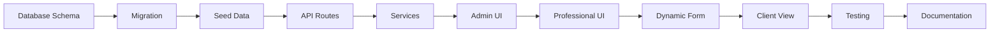

# 📚 MASTER PLAN - IMPLEMENTAZIONE SISTEMA RAPPORTI DI INTERVENTO

## OVERVIEW PROGETTO

### Obiettivo
Implementare un sistema completo di Rapporti di Intervento per professionisti che permetta:
- Creazione rapporti digitali configurabili
- Personalizzazione template per professionista
- Firma digitale cliente/professionista
- Notifiche e visualizzazione area cliente
- Gestione completamente tabellata (niente hardcoded)

### Durata Stimata
**10-12 giorni lavorativi** suddivisi in 6 fasi

### Principi Fondamentali
1. **TUTTO TABELLATO** - Nessun valore hardcoded
2. **CONFIGURABILE** - Admin può modificare tutto
3. **PERSONALIZZABILE** - Professionista può personalizzare
4. **SICURO** - Validazioni e permessi rigorosi
5. **TRACCIABILE** - Log di tutte le operazioni

---

## 📋 FASI DI IMPLEMENTAZIONE

### FASE 1 - DATABASE (2 giorni)
**Documento**: `01-DATABASE-IMPLEMENTATION.md`
- Creazione schema Prisma
- Migration database
- Seed dati iniziali
- Test relazioni

### FASE 2 - API BASE (2-3 giorni)
**Documento**: `02-API-BASE-IMPLEMENTATION.md`
- CRUD configurazioni
- CRUD template
- CRUD rapporti
- Sistema numerazione
- Generazione PDF

### FASE 3 - ADMIN PANEL (2-3 giorni)
**Documento**: `03-ADMIN-PANEL-IMPLEMENTATION.md`
- Gestione tabelle configurazione
- Editor template drag-drop
- Gestione stati e workflow
- Import/Export dati

### FASE 4 - AREA PROFESSIONISTA (2-3 giorni)
**Documento**: `04-PROFESSIONAL-AREA-IMPLEMENTATION.md`
- Dashboard rapporti
- Personalizzazione template
- Gestione frasi ricorrenti
- Gestione materiali personali

### FASE 5 - FORM DINAMICO (2 giorni)
**Documento**: `05-DYNAMIC-FORM-IMPLEMENTATION.md`
- Rendering form da template
- Validazioni dinamiche
- Upload foto opzionale
- Sistema firma digitale

### FASE 6 - AREA CLIENTE (1-2 giorni)
**Documento**: `06-CLIENT-AREA-IMPLEMENTATION.md`
- Visualizzazione rapporti
- Download PDF
- Firma online
- Sistema notifiche

---

## 🎯 PROMPT DA USARE PER LE SESSIONI

### PROMPT INIZIALE PER OGNI SESSIONE

```
Ciao, devo implementare la FASE [X] del Sistema Rapporti di Intervento.

DOCUMENTI DA LEGGERE PRIMA:
1. /Docs/RAPPORTI-INTERVENTO/00-MASTER-PLAN.md
2. /Docs/RAPPORTI-INTERVENTO/[DOCUMENTO-FASE-X].md
3. /Docs/RAPPORTI-INTERVENTO/PROGRESS-TRACKER.md

REGOLE FONDAMENTALI:
- Seguire SEMPRE ISTRUZIONI-PROGETTO.md
- Usare SEMPRE ResponseFormatter nelle routes
- TUTTO deve essere tabellato (niente hardcoded)
- Fare backup prima di modifiche importanti
- Aggiornare PROGRESS-TRACKER.md dopo ogni step completato

Iniziamo dall'inizio della FASE [X], step by step.
```

### PROMPT PER CONTROLLO AVANZAMENTO

```
Controlla il file PROGRESS-TRACKER.md e dimmi:
1. Cosa è stato completato
2. Cosa manca da fare
3. Eventuali problemi bloccanti

Poi continuiamo dal prossimo step da completare.
```

### PROMPT PER TESTING

```
Esegui i test della FASE [X] seguendo TEST-CHECKLIST.md:
1. Verifica che tutti gli endpoint rispondano
2. Controlla che i dati siano salvati correttamente
3. Testa i casi limite
4. Verifica permessi e sicurezza

Riporta i risultati nel PROGRESS-TRACKER.md
```

---

## 📊 STRUTTURA TABELLE DATABASE

### Tabelle Configurazione Sistema
1. `InterventionReportConfig` - Configurazione globale
2. `InterventionFieldType` - Tipi di campo disponibili
3. `InterventionTemplateSection` - Sezioni template
4. `InterventionReportStatus` - Stati possibili rapporto
5. `InterventionType` - Tipi di intervento

### Tabelle Template
6. `InterventionReportTemplate` - Template di sistema
7. `InterventionTemplateField` - Campi del template
8. `ProfessionalReportTemplate` - Template personalizzati professionista

### Tabelle Dati Operativi
9. `InterventionReport` - Rapporti compilati
10. `InterventionMaterial` - Database materiali

### Tabelle Personalizzazione Professionista
11. `ProfessionalReportPhrase` - Frasi ricorrenti
12. `ProfessionalMaterial` - Materiali personali
13. `ProfessionalReportSettings` - Impostazioni personali
14. `ProfessionalReportFolder` - Organizzazione rapporti

---

## 🔄 WORKFLOW IMPLEMENTAZIONE



---

## ✅ CHECKLIST GENERALE

### Pre-Implementazione
- [ ] Backup database esistente
- [ ] Backup codice esistente
- [ ] Creazione branch git `feature/intervention-reports`
- [ ] Setup ambiente di test

### Durante Implementazione
- [ ] Seguire ISTRUZIONI-PROGETTO.md
- [ ] Aggiornare PROGRESS-TRACKER.md giornalmente
- [ ] Test ad ogni step completato
- [ ] Commit frequenti con messaggi chiari

### Post-Implementazione
- [ ] Test completo end-to-end
- [ ] Documentazione utente
- [ ] Training professionisti
- [ ] Deploy graduale

---

## 🚨 PUNTI CRITICI DA RICORDARE

1. **ResponseFormatter OBBLIGATORIO** in tutte le routes
2. **Niente hardcoded** - tutto da tabelle
3. **Validazioni rigorose** su tutti gli input
4. **Permessi** - verificare sempre chi può fare cosa
5. **Backup** prima di modifiche critiche
6. **Test** - ogni funzionalità deve essere testata
7. **Documentazione** - aggiornare sempre

---

## 📝 TEMPLATE REPORT GIORNALIERO

Ogni sessione deve terminare con un report in `/REPORT-SESSIONI-CLAUDE/[DATA]/`:

```markdown
# Report Sessione - [DATA]

## Fase Lavorata
FASE [X] - [Nome Fase]

## Completato Oggi
- [ ] Step 1.1: [Descrizione]
- [ ] Step 1.2: [Descrizione]

## Problemi Riscontrati
- Problema: [Descrizione]
  Soluzione: [Come risolto]

## Da Fare Prossima Sessione
- [ ] Step 2.1: [Descrizione]
- [ ] Step 2.2: [Descrizione]

## File Modificati
- `path/to/file1.ts` - [Cosa modificato]
- `path/to/file2.tsx` - [Cosa aggiunto]

## Test Eseguiti
- [x] Test 1: [Risultato]
- [x] Test 2: [Risultato]

## Note
[Eventuali note o considerazioni]
```

---

## 🎯 OBIETTIVI DI QUALITÀ

1. **Performance**: Caricamento rapporti < 2 secondi
2. **Usabilità**: Compilazione rapporto < 5 minuti
3. **Affidabilità**: 0 perdite dati
4. **Scalabilità**: Supporto 1000+ rapporti/giorno
5. **Sicurezza**: Validazione tutti input, audit trail completo

---

## 📞 SUPPORTO E RIFERIMENTI

- **Documento principale**: ISTRUZIONI-PROGETTO.md
- **Schema esistente**: /backend/prisma/schema.prisma
- **Routes esistenti**: /backend/src/routes/
- **Services esistenti**: /backend/src/services/
- **Frontend**: /src/

---

Ultimo aggiornamento: ${new Date().toISOString()}
