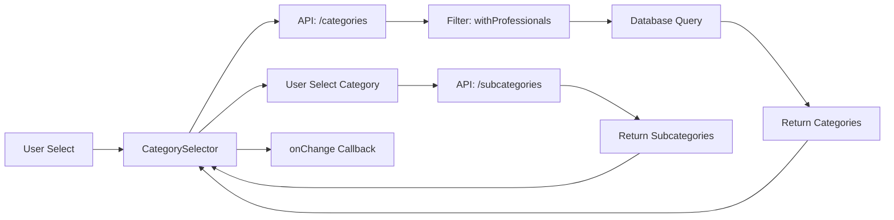

# Documentazione Sistema Categorie v2.5

## 📋 Panoramica

Il sistema di selezione categorie è stato completamente riprogettato nella versione 2.5 per migliorare l'usabilità e la scalabilità, passando da un sistema a griglia a dropdown gerarchici con filtro intelligente.

## 🎯 Obiettivi del Redesign

1. **Scalabilità**: Gestire efficacemente un numero crescente di categorie
2. **Usabilità**: Interfaccia più intuitiva per gli operatori del centralino
3. **Efficienza**: Mostrare solo opzioni effettivamente utilizzabili
4. **Chiarezza**: Flusso logico di compilazione form

## 🏗 Architettura

### Component Structure
```
src/components/categories/
└── CategorySelector.tsx    # Componente principale dropdown
```

### Database Schema
```sql
Category (1) ─────> (N) Subcategory
                           │
                           ├─> ProfessionalUserSubcategory
                           │           │
                           └───────────┴─> User (role='PROFESSIONAL')
```

**⚠️ IMPORTANTE**: La tabella si chiama `Subcategory` NON `ProfessionalSubcategory`

## 🔧 Implementazione

### CategorySelector Component

```typescript
interface CategorySelectorProps {
  value?: {
    category?: string;
    subcategory?: string;
  };
  onChange: (selection: { category?: string; subcategory?: string }) => void;
  required?: boolean;
  disabled?: boolean;
  onlyWithProfessionals?: boolean;  // Filtro chiave
}
```

### Utilizzo nel Centralino

```tsx
import CategorySelector from '@/components/categories/CategorySelector';

function CreateRequestForClient() {
  const [selectedCategory, setSelectedCategory] = useState('');
  const [selectedSubcategory, setSelectedSubcategory] = useState('');

  return (
    <CategorySelector
      value={{ 
        category: selectedCategory, 
        subcategory: selectedSubcategory 
      }}
      onChange={({ category, subcategory }) => {
        setSelectedCategory(category || '');
        setSelectedSubcategory(subcategory || '');
      }}
      required
      onlyWithProfessionals={true}  // Mostra solo categorie con professionisti
    />
  );
}
```

## 🔍 Filtro Intelligente

### Backend Query

Il filtro utilizza una query SQL ottimizzata per trovare solo categorie con professionisti:

```sql
SELECT DISTINCT c.*
FROM "Category" c
WHERE c."isActive" = true
AND EXISTS (
  SELECT 1 
  FROM "Subcategory" s
  INNER JOIN "ProfessionalUserSubcategory" pus ON pus."subcategoryId" = s.id
  INNER JOIN "User" u ON u.id = pus."userId"
  WHERE s."categoryId" = c.id
  AND s."isActive" = true
  AND u.role = 'PROFESSIONAL'
)
ORDER BY c."displayOrder", c.name
```

### API Endpoint

```typescript
GET /api/categories?withProfessionals=true
```

Risposta:
```json
{
  "success": true,
  "data": [
    {
      "id": "uuid",
      "name": "Elettricità",
      "icon": "⚡",
      "color": "#FFA500",
      "_count": {
        "subcategories": 8,
        "professionals": 1
      }
    }
  ]
}
```

## 🎨 UI/UX Features

### Dropdown Gerarchico
1. **Primo Livello**: Selezione categoria
2. **Secondo Livello**: Appare solo dopo selezione categoria
3. **Indicatori**: Numero professionisti per sottocategoria

### Stati Visivi
- **Loading**: "Caricamento..."
- **Empty**: "Nessuna categoria con professionisti disponibili"
- **No Subcategories**: Messaggio informativo giallo
- **Selected**: Dettagli sottocategoria in box blu

### Esempio Visualizzazione
```
Categoria: [Elettricità ▼]
           ├─ Idraulica
           ├─ Elettricità ✓
           └─ Climatizzazione

Sottocategoria: [Seleziona... ▼]
                ├─ Installazione prese (3 prof.)
                ├─ Illuminazione LED (1 prof.)
                └─ Citofoni (1 prof.)
```

## 📊 Flusso Dati



## 🔧 Configurazione

### Parametri Principali

| Parametro | Tipo | Default | Descrizione |
|-----------|------|---------|-------------|
| `onlyWithProfessionals` | boolean | true | Filtra categorie senza professionisti |
| `required` | boolean | false | Campo obbligatorio |
| `disabled` | boolean | false | Disabilita selezione |

### Personalizzazione Filtro

```typescript
// Mostra TUTTE le categorie (debug/admin)
<CategorySelector onlyWithProfessionals={false} />

// Mostra SOLO categorie con professionisti (default)
<CategorySelector onlyWithProfessionals={true} />
```

## 🐛 Debug

### Endpoint di Debug (solo development)

```bash
# Verifica struttura tabelle
GET http://localhost:3200/api/debug/table-check

# Trova categorie con professionisti
GET http://localhost:3200/api/debug/find-professionals

# Check semplice dati
GET http://localhost:3200/api/debug/simple-check
```

### Troubleshooting Comune

#### Problema: "Nessuna categoria disponibile"
**Causa**: Nessun professionista associato alle sottocategorie
**Soluzione**: 
1. Verificare associazioni in `ProfessionalUserSubcategory`
2. Temporaneamente disabilitare filtro: `onlyWithProfessionals={false}`

#### Problema: Query fallite
**Causa**: Nome tabella errato nel codice
**Soluzione**: Usare `Subcategory` NON `ProfessionalSubcategory`

#### Problema: BigInt serialization error
**Causa**: PostgreSQL restituisce BigInt per COUNT
**Soluzione**: Cast a INTEGER nella query:
```sql
CAST(COUNT(DISTINCT pus."userId") AS INTEGER) as professional_count
```

## 📈 Performance

### Ottimizzazioni Implementate
- Query SQL con EXISTS invece di JOIN per performance
- Caricamento lazy delle sottocategorie
- Cache delle categorie con TanStack Query
- Fallback a tutte le categorie se filtro vuoto

### Metriche
- Tempo caricamento categorie: < 100ms
- Tempo caricamento sottocategorie: < 50ms
- Memoria utilizzata: Minima (no griglia DOM pesante)

## 🚀 Migrazione dalla v2.4

### Prima (Griglia)
```tsx
<CategoryGrid
  categories={categories}
  onSelect={handleSelect}
/>
```

### Dopo (Dropdown)
```tsx
<CategorySelector
  value={{ category, subcategory }}
  onChange={handleChange}
  onlyWithProfessionals={true}
/>
```

### Breaking Changes
- Rimosso componente `CategoryGrid`
- Cambiato formato prop `value` da string a object
- Aggiunto parametro `onlyWithProfessionals`

## 📝 Best Practices

1. **Sempre usare il filtro in produzione**: `onlyWithProfessionals={true}`
2. **Disabilitare filtro solo per debug**: Admin panel può vedere tutte
3. **Gestire stati empty**: Mostrare messaggi informativi chiari
4. **Cache appropriata**: Usare staleTime di 5 minuti per categorie
5. **Validazione form**: Verificare sia categoria che sottocategoria selezionate

## 🔮 Future Improvements

- [ ] Ricerca testuale nelle dropdown
- [ ] Icone categorie visibili nel dropdown
- [ ] Preferiti/Recenti per professionisti frequenti
- [ ] Bulk assignment professionisti a sottocategorie
- [ ] Preview professionisti disponibili on hover
- [ ] Multi-select per richieste multiple categorie

---

*Documentazione Sistema Categorie v2.5 - Ultimo aggiornamento: 02 Settembre 2025*
