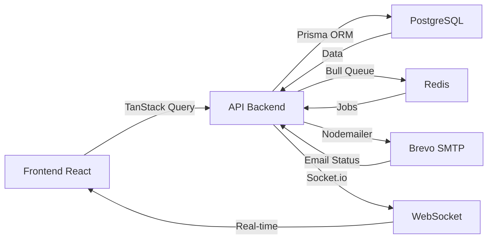

# 📚 DOCUMENTAZIONE SISTEMA GESTIONE UTENTI
**Versione**: 1.0.0  
**Data**: 6 Gennaio 2025  
**Autore**: Team Sviluppo

---

## 📋 INDICE

1. [Panoramica del Sistema](#1-panoramica-del-sistema)
2. [Funzionalità Complete](#2-funzionalità-complete)
3. [Architettura Tecnica](#3-architettura-tecnica)
4. [API Endpoints](#4-api-endpoints)
5. [Configurazione Email (Brevo)](#5-configurazione-email-brevo)
6. [Guida all'Uso dell'Interfaccia](#6-guida-alluso-dellinterfaccia)
7. [Sistema di Notifiche](#7-sistema-di-notifiche)
8. [Gestione Permessi e Ruoli](#8-gestione-permessi-e-ruoli)
9. [Troubleshooting](#9-troubleshooting)
10. [Changelog e Aggiornamenti](#10-changelog-e-aggiornamenti)

---

## 1. PANORAMICA DEL SISTEMA

### 🎯 Scopo
Il Sistema di Gestione Utenti è il modulo core per l'amministrazione completa degli utenti sulla piattaforma Richiesta Assistenza. Permette la gestione CRUD completa, l'invio di comunicazioni, il monitoraggio delle attività e la gestione dei permessi.

### 🔑 Caratteristiche Principali
- **Gestione CRUD completa** (Create, Read, Update, Delete)
- **Sistema email integrato** con Brevo
- **Conteggio automatico** richieste e preventivi
- **Azioni di massa** su gruppi di utenti
- **Export dati** in CSV e JSON
- **Sistema di notifiche** multi-canale
- **Gestione password** con reset e notifiche
- **Statistiche in tempo reale**

### 📊 Metriche Supportate
- Totale utenti registrati
- Utenti attivi/inattivi
- Nuove registrazioni (giornaliere/settimanali/mensili)
- Distribuzione per ruolo
- Attività per utente (richieste, preventivi, pagamenti)

---

## 2. FUNZIONALITÀ COMPLETE

### ✅ Operazioni CRUD

#### **CREATE - Creazione Nuovo Utente**
- Creazione manuale dall'admin panel
- Campi obbligatori: email, nome, cognome, ruolo
- Campi opzionali: telefono, indirizzo, professione, tariffe
- Invio automatico email di benvenuto (opzionale)
- Generazione username automatica se non fornita
- Hash password con bcrypt (12 rounds)

#### **READ - Visualizzazione Utenti**
- **Vista Tabella**: Layout compatto con tutte le informazioni
- **Vista Griglia**: Card visuali per overview rapida
- **Dettagli Utente**: Modal con informazioni complete, statistiche, cronologia
- **Filtri Avanzati**:
  - Per ruolo (Cliente, Professionista, Admin, Super Admin)
  - Per stato (Attivo, Inattivo, Bloccato, Email Verificata)
  - Per città/provincia
  - Ricerca testuale (nome, email, telefono)
- **Ordinamento**: Per data, nome, email, ruolo, ultimo accesso

#### **UPDATE - Modifica Utente**
- Modifica tutti i campi eccetto ID
- Aggiornamento ruolo e permessi
- Cambio stato (attivo/inattivo/bloccato)
- Modifica dati professionali (tariffe, raggio operativo)
- Log automatico modifiche

#### **DELETE - Eliminazione Utente**
- Soft delete (marca come "deleted", non elimina fisicamente)
- Blocco permanente account
- Preservazione dati per audit trail
- Non eliminabile: Super Admin

### 📧 Sistema Email

#### **Email di Benvenuto**
- Template HTML professionale responsive
- Personalizzazione con nome utente
- Link di verifica email (opzionale)
- Informazioni sui servizi disponibili
- Disponibile per:
  - Singolo utente (pulsante nella tabella/griglia)
  - Multipli utenti (azioni di massa)
  - Nuovo utente (checkbox in creazione)

#### **Reset Password**
- Generazione nuova password
- Invio email con notifica cambio
- Opzione per forzare cambio al prossimo login
- Log sicurezza per tracking

#### **Notifiche Personalizzate**
- Template predefiniti nel sistema
- Invio immediato o programmato
- Multi-canale (Email, In-App, SMS ready)

### 🔧 Azioni di Massa

Operazioni disponibili su utenti multipli selezionati:
- **Attiva utenti**: Rimuove blocchi e attiva account
- **Disattiva utenti**: Sospende temporaneamente accesso
- **Blocca utenti**: Blocco con motivazione e durata
- **Sblocca utenti**: Rimuove blocchi esistenti
- **Verifica email**: Marca email come verificate
- **Invia email benvenuto**: Batch di email di benvenuto
- **Elimina utenti**: Soft delete multiplo

### 📊 Conteggi e Statistiche

#### **Per Utente**
- **Clienti**: Numero totale richieste create
- **Professionisti**: 
  - Richieste assegnate
  - Preventivi inviati
  - Lavori completati
- **Data registrazione** e **ultimo accesso**
- **Stato account** (attivo, verificato, bloccato)

#### **Globali (Dashboard)**
- Totale utenti per ruolo
- Crescita registrazioni (trend grafico)
- Percentuale utenti attivi
- Utenti bloccati/da verificare

### 📥 Export Dati

#### **Formato CSV**
- Export completo o filtrato
- Campi: ID, Email, Nome, Ruolo, Telefono, Città, Stato, Date
- Encoding UTF-8 con BOM per Excel
- Separatore virgola standard

#### **Formato JSON**
- Struttura gerarchica completa
- Include relazioni e conteggi
- Pretty-print per leggibilità
- Ideale per backup o migrazione

---

## 3. ARCHITETTURA TECNICA

### 🏗️ Stack Tecnologico

#### **Backend**
```typescript
// Stack principale
- Node.js 18+ LTS
- Express.js v5
- TypeScript 5.9.2
- Prisma ORM 6.15.0
- PostgreSQL 14+

// Servizi
- Autenticazione: JWT + Speakeasy 2FA
- Email: Nodemailer + Brevo API
- Queue: Bull + Redis
- WebSocket: Socket.io
- Logging: Winston
```

#### **Frontend**
```typescript
// Framework e librerie
- React 18.3.1
- Vite 7.x (build tool)
- TypeScript 5.9.2
- TanStack Query v5 (server state)
- Zustand v5 (client state)

// UI/UX
- TailwindCSS 3.4.x
- Heroicons v2
- React Hot Toast (notifiche)
- Framer Motion (animazioni)
```

### 📁 Struttura File

#### **Backend - User Management**
```
backend/src/
├── routes/
│   └── admin-users.routes.ts    # Endpoints API admin
├── services/
│   ├── user.service.ts          # Logica business utenti
│   ├── notification.service.ts  # Sistema notifiche
│   └── email.service.ts         # Servizio email Brevo
├── middleware/
│   └── auth.ts                  # Protezione routes
└── utils/
    └── responseFormatter.ts      # Formattazione risposte
```

#### **Frontend - User Management**
```
src/
├── pages/
│   └── UsersPage.tsx            # Pagina principale gestione
├── components/admin/users/
│   ├── UserDetailsModal.tsx     # Modal dettagli utente
│   ├── CreateUserModal.tsx      # Modal creazione
│   ├── EditUserModal.tsx        # Modal modifica
│   ├── ResetPasswordModal.tsx   # Modal reset password
│   └── BulkActionsModal.tsx     # Modal azioni massa
└── services/
    └── api.ts                   # Client API
```

### 🔄 Flusso Dati



---

## 4. API ENDPOINTS

### 🔐 Autenticazione
Tutti gli endpoint richiedono JWT token nell'header:
```
Authorization: Bearer <token>
```

### 📍 Endpoints Disponibili

#### **Lista Utenti con Filtri**
```http
GET /api/admin/users
```
**Query Parameters:**
- `page` (number): Pagina corrente (default: 1)
- `limit` (number): Risultati per pagina (default: 20)
- `search` (string): Ricerca testuale
- `role` (string): CLIENT | PROFESSIONAL | ADMIN | SUPER_ADMIN
- `isActive` (boolean): true | false
- `emailVerified` (boolean): true | false
- `city` (string): Filtra per città
- `province` (string): Filtra per provincia (2 lettere)
- `sortBy` (string): Campo ordinamento
- `sortOrder` (string): asc | desc

**Response:**
```json
{
  "success": true,
  "data": {
    "users": [
      {
        "id": "uuid",
        "email": "user@example.com",
        "firstName": "Mario",
        "lastName": "Rossi",
        "role": "CLIENT",
        "isActive": true,
        "emailVerified": true,
        "requestsCount": 5,
        "quotesCount": 2,
        "createdAt": "2025-01-06T10:00:00Z"
      }
    ],
    "pagination": {
      "page": 1,
      "limit": 20,
      "total": 150,
      "pages": 8
    },
    "stats": {
      "total": 150,
      "active": 120,
      "blocked": 5,
      "verified": 145,
      "byRole": {
        "CLIENT": 100,
        "PROFESSIONAL": 45,
        "ADMIN": 4,
        "SUPER_ADMIN": 1
      },
      "growth": {
        "today": 2,
        "week": 15,
        "month": 45
      }
    }
  }
}
```

#### **Dettagli Utente**
```http
GET /api/admin/users/:id
```
**Response:**
```json
{
  "success": true,
  "data": {
    "user": { /* dati completi utente */ },
    "stats": {
      "totalRequests": 10,
      "totalQuotes": 5,
      "totalPayments": 3,
      "accountAge": 365,
      "lastActivity": "2025-01-06T09:00:00Z"
    },
    "loginHistory": [ /* ultimi 20 accessi */ ],
    "recentNotifications": [ /* ultime 20 notifiche */ ],
    "recentQuotes": [ /* ultimi 10 preventivi */ ]
  }
}
```

#### **Crea Nuovo Utente**
```http
POST /api/admin/users
```
**Body:**
```json
{
  "email": "nuovo@example.com",
  "password": "SecurePass123!",
  "firstName": "Giuseppe",
  "lastName": "Verdi",
  "role": "CLIENT",
  "phone": "+39 333 1234567",
  "address": "Via Roma 1",
  "city": "Milano",
  "province": "MI",
  "postalCode": "20100",
  "sendWelcomeEmail": true
}
```

#### **Aggiorna Utente**
```http
PUT /api/admin/users/:id
```
**Body:** Qualsiasi campo dell'utente (parziale update supportato)

#### **Elimina Utente**
```http
DELETE /api/admin/users/:id
```

#### **Reset Password**
```http
POST /api/admin/users/:id/reset-password
```
**Body:**
```json
{
  "newPassword": "NuovaPassword123!",
  "sendEmail": true
}
```

#### **Invia Email Benvenuto**
```http
POST /api/admin/users/:id/send-welcome-email
```

#### **Blocca Utente**
```http
POST /api/admin/users/:id/block
```
**Body:**
```json
{
  "days": 30,
  "reason": "Violazione termini di servizio"
}
```

#### **Sblocca Utente**
```http
POST /api/admin/users/:id/unblock
```

#### **Azioni di Massa**
```http
POST /api/admin/users/bulk
```
**Body:**
```json
{
  "userIds": ["id1", "id2", "id3"],
  "action": "send_welcome_email",
  "reason": "Motivazione (solo per block)"
}
```
**Actions disponibili:**
- `activate`
- `deactivate`
- `block`
- `unblock`
- `verify_email`
- `send_welcome_email`
- `delete`

#### **Statistiche Utenti**
```http
GET /api/admin/users/stats/overview
```

#### **Export Utenti**
```http
GET /api/admin/users/export?format=csv
GET /api/admin/users/export?format=json
```

---

## 5. CONFIGURAZIONE EMAIL (BREVO)

### 🔧 Setup Iniziale

#### **Passo 1: Accedi al Pannello Admin**
1. Login come Admin o Super Admin
2. Dal menu laterale, clicca su **"API Keys"**

#### **Passo 2: Configura Brevo**
1. Cerca la sezione **"Email Configuration"** o **"Configurazione Email"**
2. Inserisci i seguenti parametri:

| Campo | Valore | Descrizione |
|-------|--------|-------------|
| **Provider** | `brevo` | Seleziona Brevo come provider |
| **SMTP Host** | `smtp-relay.brevo.com` | Server SMTP di Brevo |
| **SMTP Port** | `587` | Porta standard TLS |
| **SMTP Secure** | `false` | TLS automatico sulla porta 587 |
| **Username** | La tua email Brevo | Email account Brevo |
| **Password** | `xkeysib-xxxxx...` | API Key da Brevo Dashboard |
| **From Email** | `noreply@tuodominio.it` | Email mittente verificata |
| **From Name** | `Richiesta Assistenza` | Nome mittente |
| **Enabled** | `true` | Abilita il servizio |

#### **Passo 3: Ottieni API Key da Brevo**
1. Accedi a [app.brevo.com](https://app.brevo.com)
2. Vai in **SMTP & API** → **API Keys**
3. Crea una nuova API Key o usa esistente
4. Copia la key (formato: `xkeysib-xxxxx...`)

#### **Passo 4: Verifica Email Mittente**
1. In Brevo, vai in **Senders & IP**
2. Aggiungi e verifica l'email mittente
3. Completa la verifica via email

#### **Passo 5: Test Configurazione**
1. Nel pannello admin, clicca **"Test Email"**
2. Inserisci un'email di test
3. Verifica ricezione email
4. Se non funziona, controlla:
   - API Key corretta
   - Email mittente verificata
   - Firewall/porte aperte

### 📧 Template Email Disponibili

#### **Email di Benvenuto**
- Inviata a nuovi utenti
- Personalizzata con nome utente
- Include:
  - Messaggio di benvenuto
  - Funzionalità disponibili
  - Link verifica email (se configurato)
  - Informazioni di contatto

#### **Reset Password**
- Inviata per cambio password forzato
- Include:
  - Notifica cambio password
  - Informazioni sicurezza
  - Link per contattare supporto

#### **Nuovo Preventivo**
- Notifica cliente di preventivo ricevuto
- Include:
  - Dettagli professionista
  - Importo preventivo
  - Link per visualizzare
  - Azioni disponibili

### 🔍 Monitoraggio Email

#### **Log Email**
Tutte le email sono tracciate nel database:
- Data/ora invio
- Destinatario
- Oggetto
- Stato (sent/failed)
- ID messaggio Brevo
- Errori eventuali

#### **Dashboard Brevo**
Accedi a Brevo per:
- Statistiche aperture/click
- Bounce e spam report
- Template avanzati
- Automazioni email

---

## 6. GUIDA ALL'USO DELL'INTERFACCIA

### 🖥️ Accesso al Sistema

1. **Login** con credenziali Admin
2. Dal menu laterale, clicca **"Gestione Utenti"**
3. Si apre la dashboard utenti

### 📊 Dashboard Utenti

#### **Sezione Statistiche (Top)**
Mostra 5 card con metriche:
- 👥 **Totale Utenti**: Numero complessivo
- ✅ **Utenti Attivi**: Con percentuale
- 📅 **Nuovi Oggi**: Registrazioni odierne
- 📈 **Questa Settimana**: Trend settimanale
- 📊 **Questo Mese**: Trend mensile

#### **Toolbar Azioni (Centro)**
- **🔍 Barra Ricerca**: Cerca per nome, email, telefono
- **🔽 Filtri**: Espandi per filtri avanzati
- **📊 Vista**: Toggle tabella/griglia
- **⬇️ Export**: Scarica CSV o JSON
- **➕ Nuovo Utente**: Crea nuovo account

#### **Tabella/Griglia Utenti (Centro)**

**Vista Tabella:**
- ☑️ Checkbox selezione multipla
- Colonne: Utente, Ruolo, Contatti, Stato, Richieste, Azioni
- Ordinamento cliccabile su header
- Scroll orizzontale su mobile

**Vista Griglia:**
- Card visuali per ogni utente
- Informazioni essenziali
- Icone stato immediate
- Azioni rapide su hover

#### **Paginazione (Bottom)**
- Indicatore record visualizzati
- Navigazione pagine
- Jump to page

### 🎯 Operazioni Comuni

#### **Visualizza Dettagli Utente**
1. Clicca icona 👁️ (occhio) nelle azioni
2. Si apre modal con 4 tab:
   - **Informazioni**: Dati anagrafici e professionali
   - **Attività**: Cronologia azioni
   - **Cronologia**: Login history
   - **Notifiche**: Messaggi recenti

#### **Modifica Utente**
1. Clicca icona ✏️ (matita)
2. Modifica i campi necessari
3. Clicca "Salva modifiche"
4. Conferma con toast notification

#### **Reset Password**
1. Clicca icona 🔑 (chiave)
2. Inserisci nuova password (min 8 caratteri)
3. Conferma password
4. Opzionale: ☑️ Invia email notifica
5. Clicca "Reimposta Password"

#### **Invia Email Benvenuto**
1. Clicca icona ✉️ (busta)
2. Conferma automatica invio
3. Toast notification conferma

#### **Azioni di Massa**
1. Seleziona utenti con checkbox
2. Clicca "Azioni (N)" in alto
3. Scegli azione desiderata
4. Conferma operazione
5. Attendi completamento batch

### 🔍 Filtri e Ricerca

#### **Ricerca Testuale**
Cerca in:
- Nome e cognome
- Email
- Username
- Telefono
- Codice fiscale
- Partita IVA

#### **Filtri Disponibili**
- **Ruolo**: Cliente, Professionista, Admin, Super Admin
- **Stato**: Attivi, Inattivi, Bloccati, Email Verificata
- **Città**: Testo libero
- **Provincia**: Sigla 2 lettere
- **Ordinamento**: Data, Nome, Email, Ruolo, Ultimo accesso
- **Direzione**: Crescente/Decrescente

### 📥 Export Dati

#### **Export CSV**
1. Clicca "Export" → "Export CSV"
2. Applica filtri desiderati (opzionale)
3. Download automatico file .csv
4. Apri con Excel/Google Sheets

#### **Export JSON**
1. Clicca "Export" → "Export JSON"
2. Applica filtri desiderati (opzionale)
3. Download automatico file .json
4. Usa per backup/integrazione

---

## 7. SISTEMA DI NOTIFICHE

### 📨 Canali Disponibili

#### **Email (Brevo)**
- Template HTML responsive
- Personalizzazione dinamica
- Tracking aperture/click
- Gestione bounce/unsubscribe

#### **In-App (WebSocket)**
- Notifiche real-time
- Badge contatore non lette
- Persistenza database
- Mark as read

#### **SMS (Opzionale)**
- Integrazione Twilio ready
- Template brevi
- Verifica numeri
- Delivery report

### 🔔 Tipi di Notifiche

| Tipo | Canale | Trigger | Template |
|------|--------|---------|----------|
| **user_welcome** | Email + In-App | Nuovo utente | Benvenuto + istruzioni |
| **password_changed** | Email + In-App | Reset password | Sicurezza account |
| **account_blocked** | Email | Blocco admin | Motivazione + contatto |
| **email_verified** | In-App | Verifica email | Conferma successo |
| **request_assigned** | Email + In-App | Nuova richiesta | Dettagli richiesta |
| **quote_received** | Email + In-App | Nuovo preventivo | Importo + link |

### ⚙️ Configurazione Template

I template sono gestiti in:
- **Database**: Tabella `NotificationTemplate`
- **Admin Panel**: Sezione "Template Notifiche"
- **Variabili**: `{{userName}}`, `{{requestTitle}}`, etc.

---

## 8. GESTIONE PERMESSI E RUOLI

### 👥 Ruoli Sistema

| Ruolo | Permessi | Note |
|-------|----------|------|
| **SUPER_ADMIN** | Tutti i permessi | Non eliminabile, accesso completo |
| **ADMIN** | Gestione utenti, sistema | No modifica Super Admin |
| **PROFESSIONAL** | Gestione propri dati, preventivi | Accesso area professionisti |
| **CLIENT** | Gestione proprie richieste | Accesso area clienti |

### 🔐 Matrice Permessi

| Azione | CLIENT | PROFESSIONAL | ADMIN | SUPER_ADMIN |
|--------|--------|--------------|-------|-------------|
| **Visualizza propri dati** | ✅ | ✅ | ✅ | ✅ |
| **Modifica propri dati** | ✅ | ✅ | ✅ | ✅ |
| **Crea richieste** | ✅ | ❌ | ✅ | ✅ |
| **Invia preventivi** | ❌ | ✅ | ❌ | ✅ |
| **Gestione utenti** | ❌ | ❌ | ✅ | ✅ |
| **Configurazione sistema** | ❌ | ❌ | ⚠️ | ✅ |
| **Gestione API Keys** | ❌ | ❌ | ❌ | ✅ |
| **Eliminazione permanente** | ❌ | ❌ | ❌ | ✅ |

### 🛡️ Sicurezza

#### **Password Policy**
- Minimo 8 caratteri
- Mix maiuscole/minuscole consigliato
- Numeri e simboli consigliati
- Hash bcrypt 12 rounds
- No riuso ultime 5 password

#### **Account Security**
- 2FA disponibile (TOTP)
- Session timeout 30 giorni
- IP tracking login
- Failed login lockout (5 tentativi)
- Email notifica accessi sospetti

---

## 9. TROUBLESHOOTING

### ❌ Problemi Comuni e Soluzioni

#### **"Attivi 0" nelle statistiche**
**Problema**: Il contatore mostra sempre 0 utenti attivi.

**Soluzione**: 
- Verificare che il campo `status` nel DB non sia sempre "offline"
- Il sistema ora considera attivi gli utenti con:
  - `status` NOT IN ('offline', 'deleted', 'inactive')
  - `lockedUntil` IS NULL OR < NOW()

#### **Email non inviate**
**Problema**: Click su "Invia email benvenuto" ma nessuna email ricevuta.

**Soluzioni**:
1. Verifica configurazione Brevo in API Keys
2. Controlla che `enabled: true` nella configurazione
3. Verifica email mittente sia verificata in Brevo
4. Controlla logs: `backend/logs/error.log`
5. Test manuale da API Keys → Test Email

#### **Modal/Tabelle non scrollabili**
**Problema**: Contenuto bloccato, scroll non funziona.

**Soluzione**: 
- Cache browser: CTRL+F5 per refresh completo
- Verificare CSS: `overflow-y-auto` su container
- Modal devono avere `max-h-[90vh]`

#### **Conteggi richieste non visibili**
**Problema**: Colonna richieste vuota o undefined.

**Soluzione**:
- Backend deve ritornare `requestsCount` e `quotesCount`
- Verificare include `_count` nelle query Prisma
- Check response API in DevTools Network

#### **Azioni di massa non funzionano**
**Problema**: Seleziono utenti ma azioni non si applicano.

**Soluzioni**:
1. Verificare permessi utente (deve essere Admin)
2. Check console browser per errori
3. Verificare endpoint `/api/admin/users/bulk` risponda
4. Controllare che `userIds` array non sia vuoto

### 🔧 Comandi Diagnostici

```bash
# Verifica servizio email
curl -X POST http://localhost:3200/api/admin/users/test-email \
  -H "Authorization: Bearer TOKEN" \
  -H "Content-Type: application/json" \
  -d '{"email":"test@example.com"}'

# Check stato sistema
curl http://localhost:3200/api/health/detailed

# Verifica Redis per code email
redis-cli
> KEYS bull:email-queue:*
> LLEN bull:email-queue:wait

# Log errori backend
tail -f backend/logs/error.log

# Verifica configurazione Brevo nel DB
psql -U user -d database
> SELECT * FROM "SystemSetting" WHERE key = 'email_configuration';
```

### 📝 Log Files

| File | Contenuto | Path |
|------|-----------|------|
| **error.log** | Errori applicazione | `backend/logs/error.log` |
| **combined.log** | Tutti i log | `backend/logs/combined.log` |
| **email.log** | Log invio email | `backend/logs/email.log` |
| **access.log** | Richieste HTTP | `backend/logs/access.log` |

---

## 10. CHANGELOG E AGGIORNAMENTI

### 📅 Versione 1.0.0 - 6 Gennaio 2025

#### ✨ Nuove Funzionalità
- **Sistema CRUD Completo**: Create, Read, Update, Delete per tutti gli utenti
- **Conteggio Richieste**: Visualizzazione numero richieste e preventivi per utente
- **Email di Benvenuto**: Invio singolo e massivo
- **Reset Password**: Con notifica email opzionale
- **Azioni di Massa**: Operazioni batch su utenti multipli
- **Export Dati**: CSV e JSON con filtri
- **Statistiche Dashboard**: Metriche real-time
- **Vista Griglia**: Alternativa alla tabella

#### 🐛 Bug Fix
- Risolto problema "Attivi 0" nelle statistiche
- Fix scroll bloccato in modal e tabelle
- Corretto campo `userId` in LoginHistory (era `recipientId`)
- Fix errore JWT token generation
- Risolto overflow tabella su mobile

#### 🔧 Miglioramenti Tecnici
- Integrazione completa con sistema notifiche esistente
- Utilizzo servizio email Brevo configurabile da admin
- Aggiunto ResponseFormatter in tutte le routes
- Implementato UserService per logica centralizzata
- Miglioramento performance query con indici
- Aggiunto sistema di log strutturato

#### 📚 Documentazione
- Creata documentazione completa sistema
- Aggiunti esempi API con request/response
- Documentate tutte le funzionalità
- Guida troubleshooting dettagliata
- Changelog strutturato

### 🔮 Prossimi Sviluppi (Roadmap)

#### **Q1 2025**
- [ ] Import utenti da CSV
- [ ] Batch email scheduling
- [ ] Report avanzati PDF
- [ ] Integrazione calendario

#### **Q2 2025**
- [ ] Dashboard analytics avanzata
- [ ] Segmentazione utenti automatica
- [ ] A/B testing email
- [ ] API pubblica documentata

---

## 📞 SUPPORTO

### Contatti Tecnici
- **Email**: support@richiesta-assistenza.it
- **Documentazione**: `/docs`
- **API Reference**: `/api/docs`

### Link Utili
- [Brevo Dashboard](https://app.brevo.com)
- [Prisma Documentation](https://www.prisma.io/docs)
- [React Query Docs](https://tanstack.com/query)

---

**© 2025 Richiesta Assistenza - Sistema Gestione Utenti v1.0.0**