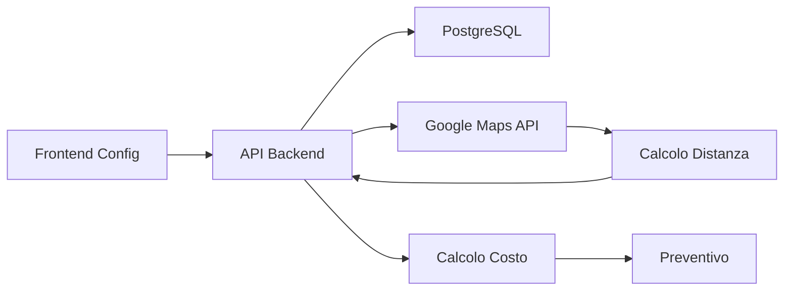

# 📋 SISTEMA TARIFFE E COSTI DI VIAGGIO - DOCUMENTAZIONE COMPLETA

## Indice
1. [Panoramica](#panoramica)
2. [Funzionalità Principali](#funzionalità-principali)
3. [Architettura Tecnica](#architettura-tecnica)
4. [API Endpoints](#api-endpoints)
5. [Componenti Frontend](#componenti-frontend)
6. [Database Schema](#database-schema)
7. [Calcolo Costi](#calcolo-costi)
8. [Integrazione Preventivi](#integrazione-preventivi)
9. [Esempi Pratici](#esempi-pratici)

---

## 📌 Panoramica

Il **Sistema di Tariffe e Costi di Viaggio** è una funzionalità avanzata che permette ai professionisti di configurare le proprie tariffe in modo flessibile, inclusi scaglioni chilometrici differenziati per ottimizzare i costi di trasferimento.

### Caratteristiche Principali:
- ✅ **Tariffe Base Configurabili** (oraria, minima, costo base chiamata)
- ✅ **Scaglioni Chilometrici Dinamici** con tariffe progressive
- ✅ **Km Gratuiti** inclusi nel servizio
- ✅ **Supplementi Personalizzabili** (weekend, notturno, festivi, urgenze)
- ✅ **Calcolo Automatico** nei preventivi
- ✅ **Integrazione Google Maps** per distanze reali

---

## 🎯 Funzionalità Principali

### 1. Configurazione Tariffe Base
```javascript
{
  hourlyRate: 60,        // €60/ora
  minimumRate: 35,       // Minimo €35
  baseCost: 15,          // Costo base chiamata €15
  freeKm: 10            // Primi 10km gratuiti
}
```

### 2. Scaglioni Chilometrici
Il sistema supporta due modalità:

#### **Tariffa Semplice**
- Un costo fisso per km (es: €0.50/km)
- Applicato dopo i km gratuiti

#### **Scaglioni Differenziati**
```javascript
costRanges: [
  { fromKm: 0, toKm: 10, costPerKm: 100 },    // €1.00/km (in centesimi)
  { fromKm: 10, toKm: 50, costPerKm: 80 },    // €0.80/km
  { fromKm: 50, toKm: null, costPerKm: 60 }   // €0.60/km oltre 50km
]
```

### 3. Supplementi
```javascript
supplements: [
  { type: 'weekend', name: 'Weekend', percentage: 25, fixedAmount: 0, isActive: true },
  { type: 'notturno', name: 'Notturno', percentage: 30, fixedAmount: 0, isActive: true },
  { type: 'festivo', name: 'Festivi', percentage: 50, fixedAmount: 0, isActive: true },
  { type: 'urgente', name: 'Urgente', percentage: 0, fixedAmount: 2500, isActive: true } // €25
]
```

---

## 🏗️ Architettura Tecnica

### Stack Tecnologico
- **Backend**: Node.js + Express + TypeScript
- **Database**: PostgreSQL con Prisma ORM
- **Frontend**: React + TypeScript + TailwindCSS
- **API Esterne**: Google Maps Distance Matrix API
- **State Management**: React Query

### Flusso Dati



---

## 🔌 API Endpoints

### GET /api/professionals/:id/pricing
Recupera le tariffe di un professionista

**Response:**
```json
{
  "success": true,
  "data": {
    "hourlyRate": 60,
    "minimumRate": 35,
    "baseCost": 15,
    "freeKm": 10,
    "costRanges": [
      { "fromKm": 0, "toKm": 10, "costPerKm": 100 },
      { "fromKm": 10, "toKm": 50, "costPerKm": 80 },
      { "fromKm": 50, "toKm": null, "costPerKm": 60 }
    ],
    "supplements": [...]
  }
}
```

### PUT /api/professionals/:id/pricing
Aggiorna le tariffe

**Request Body:**
```json
{
  "hourlyRate": 60,
  "minimumRate": 35,
  "baseCost": 15,
  "freeKm": 10,
  "costRanges": [...],
  "supplements": [...]
}
```

### GET /api/travel/request/:id/travel-info
Calcola informazioni di viaggio per una richiesta

**Response:**
```json
{
  "success": true,
  "data": {
    "distance": 347476,      // metri
    "distanceKm": 347,       // chilometri
    "duration": 14400,       // secondi
    "distanceText": "347 km",
    "durationText": "4 ore",
    "freeKm": 10,
    "billableKm": 337,
    "baseCost": 15,
    "cost": 24200,           // €242.00 in centesimi
    "pricingDetails": {
      "baseCost": 15,
      "freeKm": 10,
      "costRanges": [...]
    }
  }
}
```

---

## 🎨 Componenti Frontend

### ProfessionalPricingPage
Componente principale per la gestione tariffe

```typescript
// src/components/professional/ProfessionalPricingPage.tsx
interface PricingData {
  hourlyRate: number;
  minimumRate: number;
  baseCost: number;
  freeKm: number;
  costPerKm?: number;
  costRanges?: CostRange[];
  supplements: Supplement[];
}
```

### Funzionalità UI:
- **Toggle Scaglioni**: Switch tra tariffa semplice e scaglioni
- **Gestione Dinamica**: Aggiungi/rimuovi scaglioni
- **Calcolo Real-time**: Esempi aggiornati istantaneamente
- **Validazione**: Controlli su valori inseriti

### NewQuotePage - Integrazione Costi Viaggio
```typescript
// Calcolo automatico costi di trasferimento
const response = await api.get(`/travel/request/${selectedRequestId}/travel-info`);
const distanceInKm = Math.round(travelData.distanceKm || (travelData.distance / 1000));
const travelCostInEuro = Math.round((travelData.cost / 100) * 100) / 100;

// Aggiunta automatica al preventivo
const travelItem = {
  description: `Costi di trasferimento (${distanceInKm} km)`,
  quantity: 1,
  unitPrice: travelCostInEuro,
  taxRate: 0.22
};
```

---

## 💾 Database Schema

### Modello User (esteso)
```prisma
model User {
  // ... campi esistenti
  hourlyRate       Decimal?  @db.Decimal(10, 2)
  travelRatePerKm  Decimal?  @db.Decimal(10, 2)
  pricingData      Json?     // Configurazione completa tariffe
  
  // Indirizzi lavoro
  workAddress      String?
  workCity         String?
  workProvince     String?
  workPostalCode   String?
  workLatitude     Float?
  workLongitude    Float?
}
```

### Struttura pricingData (JSON)
```json
{
  "hourlyRate": 60,
  "minimumRate": 35,
  "baseCost": 15,
  "freeKm": 10,
  "costRanges": [
    { "fromKm": 0, "toKm": 10, "costPerKm": 100 },
    { "fromKm": 10, "toKm": 50, "costPerKm": 80 },
    { "fromKm": 50, "toKm": null, "costPerKm": 60 }
  ],
  "supplements": [
    {
      "type": "weekend",
      "name": "Weekend (Sab-Dom)",
      "percentage": 25,
      "fixedAmount": 0,
      "isActive": true
    }
  ]
}
```

---

## 🧮 Calcolo Costi

### Algoritmo Scaglioni Chilometrici

```typescript
function calculateTravelCost(distanceKm: number, pricingData: PricingData): number {
  // 1. Calcola km da fatturare
  const billableKm = Math.max(0, distanceKm - pricingData.freeKm);
  
  // 2. Se tutti i km sono gratuiti, ritorna solo costo base
  if (billableKm <= 0) {
    return pricingData.baseCost;
  }
  
  // 3. Parti dal costo base
  let totalCost = pricingData.baseCost;
  
  // 4. Se ci sono scaglioni, applicali
  if (pricingData.costRanges && pricingData.costRanges.length > 0) {
    let remainingKm = billableKm;
    
    for (const range of pricingData.costRanges) {
      if (remainingKm <= 0) break;
      
      // Calcola km in questo scaglione
      let rangeKm = 0;
      if (range.toKm === null) {
        // Ultimo scaglione senza limite
        rangeKm = remainingKm;
      } else {
        // Scaglione con limite superiore
        const rangeSize = range.toKm - range.fromKm;
        rangeKm = Math.min(remainingKm, rangeSize);
      }
      
      // Aggiungi costo (costPerKm è in centesimi)
      const costPerKm = range.costPerKm / 100;
      totalCost += rangeKm * costPerKm;
      remainingKm -= rangeKm;
    }
  } else {
    // Tariffa semplice
    totalCost += billableKm * (pricingData.costPerKm || 0.50);
  }
  
  return Math.round(totalCost * 100) / 100; // Arrotonda a 2 decimali
}
```

### Esempio Calcolo Pratico

**Configurazione:**
- Costo base: €15
- Km gratuiti: 10
- Scaglioni:
  - 0-10 km: €1.00/km
  - 10-50 km: €0.80/km
  - Oltre 50 km: €0.60/km

**Distanza: 75 km**

1. Km gratuiti: 10 km → €0
2. Costo base: €15
3. Scaglione 1 (0-10): 10 km × €1.00 = €10.00
4. Scaglione 2 (10-50): 40 km × €0.80 = €32.00
5. Scaglione 3 (50+): 15 km × €0.60 = €9.00

**Totale: €15 + €10 + €32 + €9 = €66.00**

---

## 🔗 Integrazione Preventivi

### Flusso Creazione Preventivo

1. **Selezione Richiesta**: Il professionista seleziona una richiesta
2. **Calcolo Automatico Distanza**: Sistema interroga Google Maps
3. **Applicazione Tariffe**: Usa configurazione del professionista
4. **Aggiunta al Preventivo**: Voce automatica con dettagli
5. **Trasparenza Cliente**: Mostra breakdown costi

### Codice Integrazione

```typescript
// In NewQuotePage.tsx
if (checked && selectedRequestId) {
  setLoadingTravelCost(true);
  try {
    const response = await api.get(`/travel/request/${selectedRequestId}/travel-info`);
    if (response.data.success && response.data.data) {
      const travelData = response.data.data;
      
      // Conversione corretta metri -> km
      const distanceInKm = Math.round(travelData.distanceKm || (travelData.distance / 1000));
      setTravelDistance(distanceInKm);
      
      // Conversione centesimi -> euro
      const travelCostInEuro = Math.round((travelData.cost / 100) * 100) / 100;
      setTravelCostAmount(travelCostInEuro);
      
      // Aggiunta automatica voce preventivo
      const travelItem = {
        description: `Costi di trasferimento (${distanceInKm} km)`,
        quantity: 1,
        unitPrice: travelCostInEuro,
        taxRate: 0.22
      };
      
      // Rimuovi voci esistenti e aggiungi nuova
      const filteredItems = items.filter(item => !item.description.includes('Costi di trasferimento'));
      setItems([...filteredItems, travelItem]);
      
      toast.success('Costi di viaggio calcolati e aggiunti');
    }
  } catch (error) {
    console.error('Error calculating travel cost:', error);
    toast.error('Errore nel calcolo dei costi di viaggio');
  }
}
```

---

## 📚 Esempi Pratici

### Caso 1: Idraulico Milano
**Configurazione:**
- Tariffa oraria: €45/ora
- Costo base: €20
- Km gratuiti: 5
- Tariffa semplice: €0.60/km

**Intervento a 15 km:**
- Costo base: €20
- Km fatturabili: 10 km
- Costo viaggio: 10 × €0.60 = €6
- **Totale trasferimento: €26**

### Caso 2: Elettricista con Scaglioni
**Configurazione:**
- Tariffa oraria: €55/ora
- Costo base: €15
- Km gratuiti: 10
- Scaglioni:
  - 0-20 km: €0.90/km
  - 20-60 km: €0.70/km
  - Oltre 60 km: €0.50/km

**Intervento a 45 km:**
- Costo base: €15
- Km fatturabili: 35 km
- Scaglione 1 (0-20): 20 × €0.90 = €18
- Scaglione 2 (20-35): 15 × €0.70 = €10.50
- **Totale trasferimento: €43.50**

### Caso 3: Intervento Urgente Weekend
**Base:**
- Lavoro: 2 ore × €50/ora = €100
- Trasferimento: €30

**Supplementi:**
- Weekend: +25% = €32.50
- Urgente: +€25 fisso

**Totale: €100 + €30 + €32.50 + €25 = €187.50**

---

## 🚀 Best Practices

### Per Professionisti
1. **Configura km gratuiti** ragionevoli (5-15 km)
2. **Usa scaglioni** per viaggi lunghi (più equo)
3. **Bilancia tariffe** con mercato locale
4. **Attiva supplementi** solo se necessari

### Per Amministratori
1. **Monitora configurazioni** estreme
2. **Suggerisci tariffe** di mercato
3. **Verifica calcoli** periodicamente
4. **Forma professionisti** su uso sistema

### Per Sviluppatori
1. **Cache calcoli** distanza (5 min)
2. **Valida input** tariffe (min/max)
3. **Log modifiche** per audit
4. **Test scaglioni** edge cases

---

## 🐛 Troubleshooting

### Problema: Km mostrati errati nei preventivi
**Causa**: Conversione metri/km
**Soluzione**: Usare `distanceKm` dal backend o dividere `distance` per 1000

### Problema: Campo pricingData non trovato
**Causa**: Migrazione DB non eseguita
**Soluzione**: 
```bash
npx prisma db push
npx prisma generate
```

### Problema: Calcolo costi non corretto
**Causa**: Scaglioni configurati male
**Soluzione**: Verificare che:
- Gli scaglioni siano contigui
- L'ultimo abbia `toKm: null`
- I `costPerKm` siano in centesimi

---

## 📝 Note di Rilascio

### Versione 2.0.0 (Settembre 2024)
- ✅ Implementazione scaglioni chilometrici
- ✅ Toggle tariffa semplice/scaglioni
- ✅ Integrazione Google Maps per distanze reali
- ✅ Calcolo automatico nei preventivi
- ✅ Fix conversione metri/km
- ✅ UI componente tariffe completo
- ✅ Supplementi configurabili
- ✅ Esempi calcolo real-time

### Prossimi Sviluppi
- [ ] Report analytics su tariffe applicate
- [ ] Template tariffe per categoria
- [ ] Importazione/esportazione configurazioni
- [ ] API pubblica per calcolo tariffe
- [ ] Storico modifiche tariffe

---

## 📞 Supporto

Per problemi o domande sul sistema tariffe:
- **Email**: support@richiesta-assistenza.it
- **Documentazione**: `/docs/tariffe`
- **API Reference**: `/api-docs#tariffe`
