# Sistema Auto-assegnazione Professionisti - Documentazione Tecnica

## Panoramica
Il sistema di auto-assegnazione permette ai professionisti autorizzati di prendere in carico autonomamente le richieste disponibili per le loro sottocategorie di competenza.

## Architettura

### Database Schema
```prisma
model User {
  // ... altri campi
  canSelfAssign    Boolean    @default(true)  // Permesso auto-assegnazione
  // ... altri campi
}
```

### Flusso di Autorizzazione

```mermaid
graph TD
    A[Professionista accede a Richieste Disponibili] --> B{canSelfAssign?}
    B -->|true| C[Mostra richieste disponibili]
    B -->|false| D[Errore 403: Non autorizzato]
    C --> E[Professionista seleziona richiesta]
    E --> F[Self-assign API]
    F --> G{Verifica disponibilità}
    G -->|OK| H[Assegna richiesta]
    G -->|KO| I[Errore: Già assegnata]
```


## API Reference

### 1. Toggle Auto-assegnazione (Admin Only)

**Endpoint:** `POST /api/professionals/toggle-self-assign/:professionalId`

**Headers:**
```json
{
  "Authorization": "Bearer <token>",
  "Content-Type": "application/json"
}
```

**Request Body:**
```json
{
  "canSelfAssign": true
}
```

**Response Success (200):**
```json
{
  "success": true,
  "message": "Auto-assegnazione abilitata",
  "data": {
    "id": "uuid",
    "fullName": "Mario Rossi",
    "canSelfAssign": true
  }
}
```

**Response Error (404):**
```json
{
  "success": false,
  "message": "Professionista non trovato",
  "error": {
    "code": "PROFESSIONAL_NOT_FOUND"
  }
}
```

### 2. Get Available Requests

**Endpoint:** `GET /api/professionals/available-requests`

**Response Success (200):**
```json
{
  "success": true,
  "message": "Richieste disponibili caricate",
  "data": {
    "requests": [
      {
        "id": "uuid",
        "title": "Installazione prese",
        "description": "...",
        "status": "pending",
        "priority": "medium",
        "category": {
          "id": 1,
          "name": "Elettricità"
        },
        "subcategory": {
          "id": 5,
          "name": "Installazione prese"
        },
        "address": "Via Roma 1",
        "city": "Milano",
        "province": "MI",
        "distance": 15.5,
        "distanceText": "15.5 km",
        "duration": 25,
        "durationText": "25 min",
        "client": {
          "id": "uuid",
          "fullName": "Luigi Bianchi"
        }
      }
    ],
    "total": 1
  }
}
```

**Response Error (403) - Non autorizzato:**
```json
{
  "success": false,
  "message": "Non sei autorizzato ad auto-assegnarti richieste",
  "error": {
    "code": "SELF_ASSIGN_DISABLED"
  }
}
```

### 3. Self-Assign Request

**Endpoint:** `POST /api/professionals/self-assign/:requestId`

**Response Success (200):**
```json
{
  "success": true,
  "message": "Richiesta assegnata con successo",
  "data": {
    "id": "uuid",
    "title": "Installazione prese",
    "status": "assigned",
    "professionalId": "uuid",
    "assignmentType": "self",
    "assignedAt": "2025-01-03T10:30:00Z"
  }
}
```

## Frontend Implementation

### Admin Toggle Component
```typescript
// src/pages/admin/ProfessionalsManagementPage.tsx
const handleToggleSelfAssign = async (professionalId: string, currentStatus: boolean) => {
  try {
    const response = await api.post(
      `/professionals/toggle-self-assign/${professionalId}`,
      { canSelfAssign: !currentStatus }
    );
    
    if (response.data.success) {
      // Update UI
      queryClient.invalidateQueries(['professionals']);
      toast.success(response.data.message);
    }
  } catch (error) {
    toast.error('Errore nell\'aggiornamento del permesso');
  }
};
```

### Professional Check Permission
```typescript
// src/pages/professional/AvailableRequests.tsx
const { data, error } = useQuery({
  queryKey: ['available-requests'],
  queryFn: async () => {
    const response = await api.get('/professionals/available-requests');
    return response.data?.data || { requests: [], total: 0 };
  },
  retry: (failureCount, error) => {
    // Don't retry on 403
    if (error?.response?.status === 403) return false;
    return failureCount < 3;
  }
});

// Handle permission error
if (error?.response?.status === 403) {
  return (
    <div className="error-container">
      <h2>Accesso Negato</h2>
      <p>Non sei autorizzato ad auto-assegnarti richieste.</p>
      <p>Contatta l'amministratore per abilitare questa funzione.</p>
    </div>
  );
}
```

## Calcolo Distanze con Google Maps

### Backend Implementation
```typescript
// backend/src/routes/professional.routes.ts
import GoogleMapsService from '../services/googleMaps.service';

// Determina indirizzo professionista
let professionalAddress = '';
if (!professional.useResidenceAsWorkAddress && professional.workAddress) {
  professionalAddress = `${professional.workAddress}, ${professional.workCity} ${professional.workProvince}`;
} else if (professional.address) {
  professionalAddress = `${professional.address}, ${professional.city} ${professional.province}`;
}

// Calcola distanze per ogni richiesta
const requestsWithDistance = await Promise.all(
  requests.map(async (request) => {
    const requestAddress = `${request.address}, ${request.city} ${request.province}`;
    
    const distanceData = await GoogleMapsService.calculateDistance(
      professionalAddress,
      requestAddress
    );
    
    return {
      ...request,
      distance: distanceData.distance,      // in km
      distanceText: distanceData.distanceText, // "15.5 km"
      duration: distanceData.duration,      // in minuti
      durationText: distanceData.durationText // "25 min"
    };
  })
);

// Ordina per distanza
requestsWithDistance.sort((a, b) => (a.distance || 999) - (b.distance || 999));
```

### Frontend Display
```tsx
// Visualizzazione distanza nella card richiesta
<div className="flex items-start gap-2 text-sm">
  <MapPinIcon className="h-4 w-4 text-gray-400" />
  <div className="flex-1">
    <span className="text-gray-600">{formatAddress(request)}</span>
    {request.distanceText && (
      <span className="ml-3 text-blue-600 font-medium">
        📍 {request.distanceText}
        {request.durationText && (
          <span className="ml-2 text-gray-500">({request.durationText})</span>
        )}
      </span>
    )}
  </div>
</div>
```

## Testing

### Test Cases

#### 1. Toggle Auto-assegnazione
```javascript
describe('Toggle Self-Assign Permission', () => {
  it('should toggle canSelfAssign for professional', async () => {
    // Given: Admin user and professional with canSelfAssign = true
    const adminToken = await loginAsAdmin();
    const professionalId = 'test-professional-id';
    
    // When: Toggle to false
    const response = await request(app)
      .post(`/api/professionals/toggle-self-assign/${professionalId}`)
      .set('Authorization', `Bearer ${adminToken}`)
      .send({ canSelfAssign: false });
    
    // Then: Should update successfully
    expect(response.status).toBe(200);
    expect(response.body.data.canSelfAssign).toBe(false);
    
    // And: Professional should not see available requests
    const professionalToken = await loginAsProfessional(professionalId);
    const requestsResponse = await request(app)
      .get('/api/professionals/available-requests')
      .set('Authorization', `Bearer ${professionalToken}`);
    
    expect(requestsResponse.status).toBe(403);
  });
});
```

#### 2. Distance Calculation
```javascript
describe('Distance Calculation', () => {
  it('should calculate and sort by distance', async () => {
    // Given: Professional in Rome
    const professional = {
      city: 'Roma',
      province: 'RM',
      address: 'Via del Corso 1'
    };
    
    // And: Multiple requests
    const requests = [
      { city: 'Milano', province: 'MI', address: 'Duomo 1' },
      { city: 'Roma', province: 'RM', address: 'Via Appia 100' },
      { city: 'Napoli', province: 'NA', address: 'Via Toledo 1' }
    ];
    
    // When: Get available requests
    const response = await getAvailableRequests();
    
    // Then: Should be sorted by distance
    expect(response.data.requests[0].city).toBe('Roma');
    expect(response.data.requests[0].distance).toBeLessThan(20);
    expect(response.data.requests[1].city).toBe('Napoli');
    expect(response.data.requests[2].city).toBe('Milano');
  });
});
```

## Performance Considerations

### Optimization Strategies

1. **Distance Calculation Limiting:**
   - Max 20 requests calculated per call
   - Remaining requests shown without distance

2. **Caching:**
   ```typescript
   // Consider implementing cache for distance calculations
   const cacheKey = `${origin}-${destination}`;
   const cached = distanceCache.get(cacheKey);
   if (cached && cached.timestamp > Date.now() - CACHE_TTL) {
     return cached.data;
   }
   ```

3. **Database Indexing:**
   ```sql
   CREATE INDEX idx_requests_status_professional 
   ON "AssistanceRequest"(status, "professionalId");
   
   CREATE INDEX idx_professional_subcategory_active 
   ON "ProfessionalUserSubcategory"("userId", "isActive");
   ```

## Security Considerations

### Authorization Checks
1. **Role-based access:** Only PROFESSIONAL role can access available requests
2. **Permission check:** canSelfAssign must be true
3. **Subcategory validation:** Professional must have active subcategories
4. **Request availability:** Cannot self-assign already assigned requests

### Rate Limiting
```typescript
// Consider implementing rate limiting
const rateLimiter = rateLimit({
  windowMs: 15 * 60 * 1000, // 15 minutes
  max: 10, // limit each professional to 10 self-assigns per window
  message: 'Troppe richieste di auto-assegnazione'
});

router.post('/self-assign/:requestId', rateLimiter, ...);
```

## Monitoring & Logging

### Key Metrics to Track
- Number of self-assignments per professional
- Average distance of self-assigned requests
- Success/failure rate of self-assignments
- Time between request creation and self-assignment

### Logging Examples
```typescript
logger.info('Professional self-assign attempt', {
  professionalId: req.user.id,
  requestId: req.params.requestId,
  canSelfAssign: professional.canSelfAssign,
  distance: distanceData?.distance
});

logger.warn('Self-assign denied', {
  professionalId: req.user.id,
  reason: 'SELF_ASSIGN_DISABLED'
});
```

## Troubleshooting

### Common Issues

1. **Professional sees "Non autorizzato" message:**
   - Check `canSelfAssign` field in database
   - Verify professional has active subcategories
   - Check professional role is PROFESSIONAL

2. **Distances not showing:**
   - Verify Google Maps API key is valid
   - Check professional has address configured
   - Review Google Maps API quota

3. **Toggle not persisting:**
   - Check database connection
   - Verify UPDATE permissions on User table
   - Check for transaction rollbacks

### Debug Queries
```sql
-- Check professional permission
SELECT id, "fullName", "canSelfAssign", role 
FROM "User" 
WHERE id = 'professional-id';

-- Check professional subcategories
SELECT pus.*, s.name 
FROM "ProfessionalUserSubcategory" pus
JOIN "Subcategory" s ON pus."subcategoryId" = s.id
WHERE pus."userId" = 'professional-id' 
  AND pus."isActive" = true;

-- Check available requests for subcategories
SELECT ar.*, s.name as subcategory_name
FROM "AssistanceRequest" ar
JOIN "Subcategory" s ON ar."subcategoryId" = s.id
WHERE ar.status = 'PENDING' 
  AND ar."professionalId" IS NULL
  AND ar."subcategoryId" IN (
    SELECT "subcategoryId" 
    FROM "ProfessionalUserSubcategory" 
    WHERE "userId" = 'professional-id' 
      AND "isActive" = true
  );
```

## Future Enhancements

1. **Auto-assign Rules Engine:**
   - Max distance preference
   - Time availability matching
   - Skill level requirements
   - Automatic assignment based on criteria

2. **Notification System:**
   - Real-time notification for new requests in area
   - Email digest of available requests
   - Push notifications for mobile app

3. **Analytics Dashboard:**
   - Self-assignment statistics
   - Average response time
   - Success rate metrics
   - Geographic heat maps

4. **Gamification:**
   - Points for quick assignments
   - Badges for reliability
   - Leaderboard for professionals
