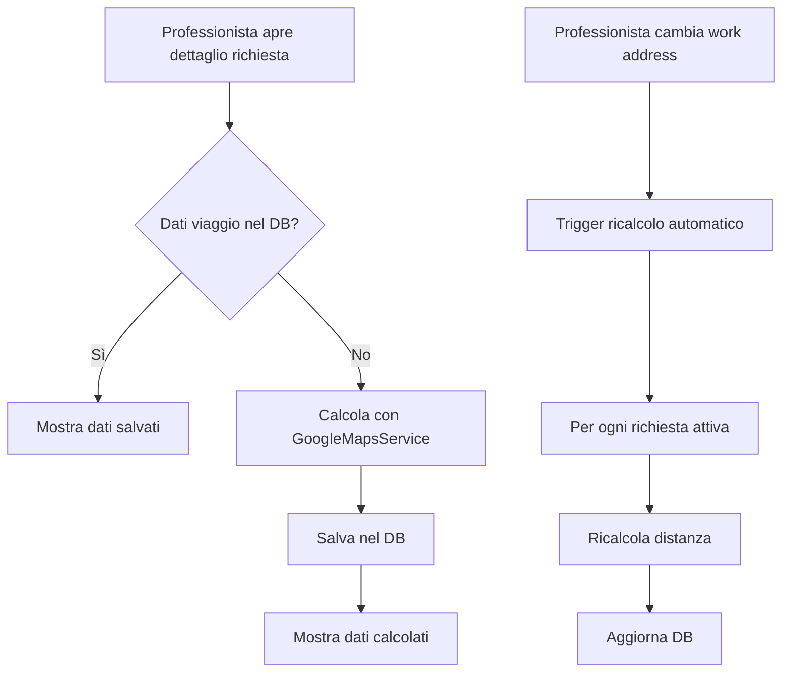

# 📋 FIX COMPLETO SISTEMA TRAVEL INFO - 03 OTTOBRE 2025

## 🎯 OBIETTIVI

1. ✅ **Fix calcolo distanza nel dettaglio richiesta**
2. ✅ **Implementare ricalcolo automatico quando cambia work address**
3. ✅ **Utilizzare GoogleMapsService centralizzato ovunque**
4. ✅ **Salvare i dati nel database per performance**

## 🔧 MODIFICHE NECESSARIE

### 1. Backend - travel.routes.ts (GIÀ FATTO ✅)
- Usa GoogleMapsService invece di chiamate dirette
- Cache Redis per performance
- Fallback automatico

### 2. Backend - travelCalculation.service.ts (DA FARE)
```typescript
// MODIFICARE per usare GoogleMapsService
import GoogleMapsService from '../services/googleMaps.service';

// Invece di mapsClient.directions, usa:
const result = await GoogleMapsService.calculateDistance(origin, destination);
```

### 3. Frontend - AutoTravelInfo.tsx (DA MIGLIORARE)
- Gestire meglio i dati salvati nel DB
- Mostrare sempre se ci sono dati salvati
- Ricalcolare solo se necessario

### 4. Backend - Nuovo endpoint per ricalcolo (DA CREARE)
```typescript
// POST /api/travel/recalculate-all
// Ricalcola tutte le distanze quando cambia work address
```

## 📊 FLUSSO COMPLETO



## 🚀 IMPLEMENTAZIONE STEP BY STEP

### STEP 1: Fix travelCalculation.service.ts
```typescript
import GoogleMapsService from '../services/googleMaps.service';

async calculateTravelInfo(requestId: string, professionalId: string) {
  // ... recupera dati ...
  
  // USA GoogleMapsService con cache!
  const result = await GoogleMapsService.calculateDistance(
    origin, 
    destination,
    { mode: 'driving', units: 'metric' }
  );
  
  if (result) {
    return {
      distance: result.distance * 1000, // km -> metri
      duration: result.duration * 60,   // min -> secondi
      distanceText: result.distanceText,
      durationText: result.durationText,
      cost: this.calculateCost(result.distance)
    };
  }
  
  return null;
}
```

### STEP 2: Aggiungere hook per ricalcolo in travel.routes.ts (GIÀ PRESENTE ✅)
Il codice è già presente e funzionante!

### STEP 3: Fix AutoTravelInfo per usare dati DB
```typescript
// Se abbiamo dati nel DB, usiamoli direttamente
if (travelDistance && travelDuration) {
  // Mostra dati salvati
  return <TravelInfoDisplay data={savedData} />;
}

// Altrimenti calcola on-demand (ma salva nel DB!)
```

## 📈 VANTAGGI

1. **Performance**: Dati pronti dal DB, no calcolo ogni volta
2. **Costi**: Meno chiamate Google Maps API 
3. **Affidabilità**: Dati sempre disponibili anche offline
4. **Consistenza**: Tutti vedono gli stessi dati
5. **Automazione**: Ricalcolo automatico quando serve

## ⚠️ PROBLEMI ATTUALI

1. **"Impossibile calcolare la distanza"** - L'endpoint non usa il servizio centralizzato
2. **Nessun ricalcolo automatico** - Quando cambia work address i dati restano vecchi
3. **Performance** - Calcola ogni volta invece di usare DB

## ✅ CHECKLIST FINALE

- [ ] travelCalculation.service.ts usa GoogleMapsService
- [ ] AutoTravelInfo mostra dati da DB se presenti
- [ ] Ricalcolo automatico quando cambia work address
- [ ] Logging dettagliato per debug
- [ ] Test con Mario Rossi e Francesco Russo
- [ ] Documentazione aggiornata

## 🧪 TEST

1. Login come Mario Rossi (mario.rossi@assistenza.it / password123)
2. Apri una richiesta assegnata
3. Verifica che mostri distanza e costo
4. Cambia work address in profilo
5. Verifica che ricalcoli automaticamente

## 📝 NOTE

- Il sistema è già parzialmente implementato
- travel.routes.ts ha già il codice per ricalcolo
- Manca solo collegare i pezzi correttamente