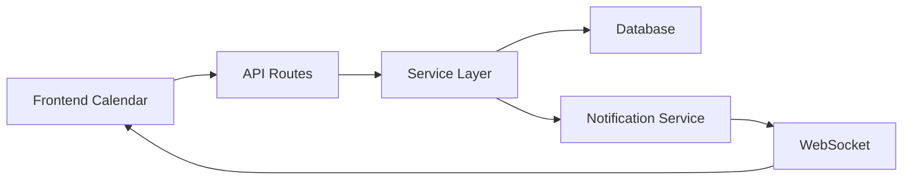

# 📅 SISTEMA CALENDARIO PROFESSIONALE - Documentazione Completa

**Versione**: 2.0.0  
**Ultimo Aggiornamento**: 03 Ottobre 2025  
**Stato**: ✅ Completamente Operativo

## 📋 INDICE

1. [Overview](#overview)
2. [Architettura](#architettura)
3. [Componenti Frontend](#componenti-frontend)
4. [API Backend](#api-backend)
5. [Database Schema](#database-schema)
6. [Funzionalità](#funzionalità)
7. [Integrazione con Altri Moduli](#integrazione-con-altri-moduli)
8. [Configurazione](#configurazione)
9. [Testing](#testing)
10. [Troubleshooting](#troubleshooting)

---

## 🎯 OVERVIEW

Il Sistema Calendario Professionale è un modulo completo per la gestione degli interventi programmati nel sistema Richiesta Assistenza. Permette ai professionisti di visualizzare, creare e gestire i propri interventi in un'interfaccia calendario intuitiva.

### Caratteristiche Principali
- 📅 Visualizzazione calendario mensile/settimanale/giornaliera
- ➕ Creazione interventi con drag & drop
- 🔄 Sincronizzazione real-time con WebSocket
- 🚫 Gestione conflitti orari automatica
- 📱 Responsive design per mobile
- 🔔 Notifiche automatiche per nuovi interventi
- 📊 Statistiche e report interventi
- 🎨 Colori personalizzati per stato

### Stack Tecnologico
- **Frontend**: React 18 + FullCalendar v6
- **Backend**: Express + TypeScript
- **Database**: PostgreSQL con Prisma ORM
- **Real-time**: Socket.io
- **Validazione**: Zod

---

## 🏗️ ARCHITETTURA

### Struttura File

```
src/components/professional/calendar/
├── ProfessionalCalendar.tsx       # Componente principale calendario
├── InterventionModal.tsx          # Modal creazione/modifica interventi
├── CalendarFilters.tsx            # Filtri per visualizzazione
├── CalendarSettings.tsx           # Impostazioni calendario
├── AvailabilityManager.tsx        # Gestione disponibilità
├── InterventionDetails.tsx        # Dettagli intervento
├── CalendarStatistics.tsx        # Statistiche e report
└── ConflictResolutionModal.tsx   # Risoluzione conflitti

backend/src/
├── routes/
│   ├── calendar.routes.ts        # Route principali calendario
│   └── calendar-simple.routes.ts # Route semplificate (fallback)
├── services/
│   └── scheduledInterventionService.ts # Business logic interventi
└── validators/
    └── calendar.validators.ts    # Validazione con Zod
```

### Flusso Dati



---

## 🎨 COMPONENTI FRONTEND

### ProfessionalCalendar.tsx

Componente principale che gestisce la visualizzazione del calendario.

```typescript
interface ProfessionalCalendarProps {
  userId: string;
  filters?: CalendarFilters;
  onInterventionCreate?: (intervention: Intervention) => void;
}
```

**Caratteristiche**:
- Integrazione FullCalendar con plugin dayGrid, timeGrid, interaction
- Gestione eventi drag & drop
- Visualizzazione multi-vista (mese/settimana/giorno)
- Colorazione dinamica per stato intervento
- Refresh automatico ogni 2 minuti

### InterventionModal.tsx

Modal per creazione e modifica interventi.

```typescript
interface InterventionModalProps {
  isOpen: boolean;
  onClose: () => void;
  onSave: (data: InterventionData) => void;
  intervention?: Intervention; // Per modifica
  requests?: Request[];        // Lista richieste disponibili
  selectedDate?: Date;
}
```

**Validazioni**:
- Data/ora non nel passato
- Durata minima 15 minuti, massima 8 ore
- Descrizione opzionale ma consigliata
- Controllo conflitti orari real-time

### CalendarFilters.tsx

Gestisce i filtri di visualizzazione.

```typescript
interface FilterOptions {
  dateRange: { start: Date; end: Date };
  status: InterventionStatus[];
  category: string;
  search: string;
}
```

---

## 🔌 API BACKEND

### Endpoints Principali

#### GET /api/calendar/interventions
Recupera tutti gli interventi del professionista.

**Query Parameters**:
- `startDate`: Data inizio (ISO 8601)
- `endDate`: Data fine (ISO 8601)
- `status`: Filtro per stato (PROPOSED, ACCEPTED, etc.)
- `category`: Filtro per categoria

**Response**:
```json
{
  "success": true,
  "data": [
    {
      "id": "uuid",
      "title": "Mario Rossi - Riparazione",
      "start": "2025-10-15T10:00:00Z",
      "end": "2025-10-15T12:00:00Z",
      "status": "ACCEPTED",
      "color": "#10B981",
      "extendedProps": {
        "requestId": "req-123",
        "client": { ... },
        "category": { ... },
        "notes": "...",
        "price": 150.00
      }
    }
  ]
}
```

#### POST /api/scheduled-interventions
Crea nuovo intervento programmato.

**Request Body**:
```json
{
  "requestId": "req-123",
  "interventions": [
    {
      "proposedDate": "2025-10-15T10:00:00Z",
      "description": "Installazione impianto",
      "estimatedDuration": 120
    }
  ]
}
```

#### GET /api/calendar/check-conflicts
Verifica conflitti orari.

**Query Parameters**:
- `professionalId`: ID professionista
- `startDate`: Data/ora inizio
- `endDate`: Data/ora fine
- `excludeId`: ID intervento da escludere (per modifica)

**Response**:
```json
{
  "hasConflict": false,
  "conflicts": []
}
```

#### PUT /api/scheduled-interventions/:id
Modifica intervento esistente.

#### DELETE /api/scheduled-interventions/:id
Cancella intervento.

---

## 💾 DATABASE SCHEMA

### Tabella: ScheduledIntervention

```sql
CREATE TABLE "ScheduledIntervention" (
  "id" TEXT PRIMARY KEY DEFAULT gen_random_uuid(),
  "requestId" TEXT NOT NULL,
  "professionalId" TEXT NOT NULL,
  "proposedDate" TIMESTAMP NOT NULL,
  "confirmedDate" TIMESTAMP,
  "completedDate" TIMESTAMP,
  "description" TEXT,
  "estimatedDuration" INTEGER DEFAULT 60,
  "actualDuration" INTEGER,
  "status" TEXT DEFAULT 'PROPOSED',
  "clientConfirmed" BOOLEAN DEFAULT false,
  "clientDeclineReason" TEXT,
  "notes" TEXT,
  "createdBy" TEXT NOT NULL,
  "createdAt" TIMESTAMP DEFAULT CURRENT_TIMESTAMP,
  "updatedAt" TIMESTAMP DEFAULT CURRENT_TIMESTAMP,
  
  FOREIGN KEY ("requestId") REFERENCES "Request"("id"),
  FOREIGN KEY ("professionalId") REFERENCES "User"("id"),
  FOREIGN KEY ("createdBy") REFERENCES "User"("id")
);

CREATE INDEX "idx_intervention_professional" ON "ScheduledIntervention"("professionalId");
CREATE INDEX "idx_intervention_date" ON "ScheduledIntervention"("proposedDate");
CREATE INDEX "idx_intervention_status" ON "ScheduledIntervention"("status");
```

### Stati Intervento

- **PROPOSED**: Proposto dal professionista, in attesa conferma
- **ACCEPTED**: Accettato dal cliente
- **REJECTED**: Rifiutato dal cliente
- **IN_PROGRESS**: Intervento in corso
- **COMPLETED**: Intervento completato
- **CANCELLED**: Intervento cancellato

---

## ⚙️ FUNZIONALITÀ

### 1. Creazione Interventi

**Modalità di creazione**:
- Click su giorno/ora nel calendario
- Drag & drop per definire durata
- Da dettaglio richiesta
- Import da calendario esterno

**Processo**:
1. Selezione data/ora
2. Selezione richiesta associata
3. Inserimento dettagli (descrizione, durata stimata)
4. Verifica conflitti orari
5. Salvataggio e notifica cliente

### 2. Gestione Conflitti

Il sistema verifica automaticamente:
- Sovrapposizioni con altri interventi
- Orari di disponibilità del professionista
- Tempo di trasferimento tra interventi
- Giorni festivi e chiusure

### 3. Notifiche Real-time

Eventi notificati via WebSocket:
- `intervention:proposed` - Nuovo intervento proposto
- `intervention:accepted` - Intervento accettato dal cliente
- `intervention:rejected` - Intervento rifiutato
- `intervention:updated` - Modifica intervento
- `intervention:cancelled` - Cancellazione

### 4. Visualizzazioni

**Vista Mensile**: Overview completo del mese
**Vista Settimanale**: Dettaglio settimana con orari
**Vista Giornaliera**: Timeline dettagliata del giorno
**Vista Lista**: Elenco interventi ordinati

### 5. Statistiche

- Numero interventi per periodo
- Tasso accettazione/rifiuto
- Durata media interventi
- Ricavi per periodo
- Clienti più frequenti
- Categorie più richieste

---

## 🔗 INTEGRAZIONE CON ALTRI MODULI

### Sistema Richieste
- Ogni intervento è collegato a una richiesta
- Aggiornamento stato richiesta automatico
- Visualizzazione interventi nel dettaglio richiesta

### Sistema Notifiche
- Notifiche email automatiche
- Push notification su mobile
- Notifiche in-app real-time

### Sistema Pagamenti
- Calcolo automatico preventivi
- Tracciamento pagamenti interventi
- Report fatturazione

### Google Calendar (Futuro)
- Sincronizzazione bidirezionale
- Import/export eventi
- Gestione disponibilità

---

## 🔧 CONFIGURAZIONE

### Variabili Ambiente

```env
# Calendar Settings
CALENDAR_DEFAULT_VIEW=month
CALENDAR_START_HOUR=8
CALENDAR_END_HOUR=20
CALENDAR_SLOT_DURATION=30
CALENDAR_MIN_DURATION=15
CALENDAR_MAX_DURATION=480

# Notification Settings
CALENDAR_NOTIFICATION_ADVANCE=24 # ore prima
CALENDAR_REMINDER_ENABLED=true

# Conflict Detection
CALENDAR_BUFFER_TIME=15 # minuti tra interventi
CALENDAR_CHECK_CONFLICTS=true
```

### Personalizzazione Colori

```typescript
const statusColors = {
  PROPOSED: '#FFA500',   // Arancione
  ACCEPTED: '#10B981',   // Verde
  REJECTED: '#EF4444',   // Rosso
  IN_PROGRESS: '#3B82F6', // Blu
  COMPLETED: '#6B7280',  // Grigio
  CANCELLED: '#991B1B'   // Rosso scuro
};
```

---

## 🧪 TESTING

### Test Unitari

```bash
# Test componenti React
npm run test:calendar-components

# Test service backend
npm run test:intervention-service

# Test API endpoints
npm run test:calendar-api
```

### Test E2E

```typescript
describe('Calendar E2E', () => {
  it('should create new intervention', async () => {
    // Login come professionista
    await loginAsProfessional();
    
    // Naviga al calendario
    await page.goto('/professional/calendar');
    
    // Clicca su una data
    await page.click('[data-date="2025-10-15"]');
    
    // Compila form
    await page.fill('#request-select', 'req-123');
    await page.fill('#description', 'Test intervento');
    
    // Salva
    await page.click('#save-intervention');
    
    // Verifica creazione
    await expect(page).toHaveText('Intervento salvato');
  });
});
```

---

## 🐛 TROUBLESHOOTING

### Problemi Comuni

#### Interventi non visibili
**Causa**: Query errata o permessi
**Soluzione**: Verificare professionalId nel token JWT

#### Errore 500 creazione interventi
**Causa**: Problema notificationService
**Soluzione**: Verificare che Socket.io sia inizializzato

#### Conflitti non rilevati
**Causa**: Timezone errato
**Soluzione**: Usare sempre UTC nel database

#### Calendar non si aggiorna
**Causa**: Cache React Query
**Soluzione**: Invalidare query dopo modifiche

### Log Diagnostici

```typescript
// Abilitare debug calendario
localStorage.setItem('DEBUG_CALENDAR', 'true');

// Verificare WebSocket
console.log('Socket connected:', socket.connected);

// Check interventi caricati
console.log('Interventions:', queryClient.getQueryData(['professional-interventions']));
```

---

## 📈 PERFORMANCE

### Ottimizzazioni Implementate
- Lazy loading componenti calendario
- Virtualizzazione lista interventi lunghe
- Cache React Query 5 minuti
- Debouncing ricerca
- Pagination lato server

### Metriche Target
- Caricamento iniziale: < 2s
- Creazione intervento: < 500ms
- Cambio vista: < 100ms
- Update real-time: < 50ms

---

## 🚀 ROADMAP FUTURA

### Q4 2025
- [ ] Sincronizzazione Google Calendar
- [ ] Vista agenda multi-professionista
- [ ] Recurring interventions (interventi ricorrenti)
- [ ] Template interventi predefiniti

### Q1 2026
- [ ] App mobile nativa
- [ ] Integrazione Outlook Calendar
- [ ] AI per suggerimenti scheduling
- [ ] Report avanzati con grafici

---

## 📚 RIFERIMENTI

- [FullCalendar Documentation](https://fullcalendar.io/docs)
- [Prisma Schema Reference](https://www.prisma.io/docs/reference)
- [Socket.io Events](https://socket.io/docs/v4/events/)
- [React Query Patterns](https://tanstack.com/query/latest)

---

**Documento mantenuto da**: Team Sviluppo  
**Ultima revisione**: 03 Ottobre 2025  
**Versione Sistema**: 5.2.0
