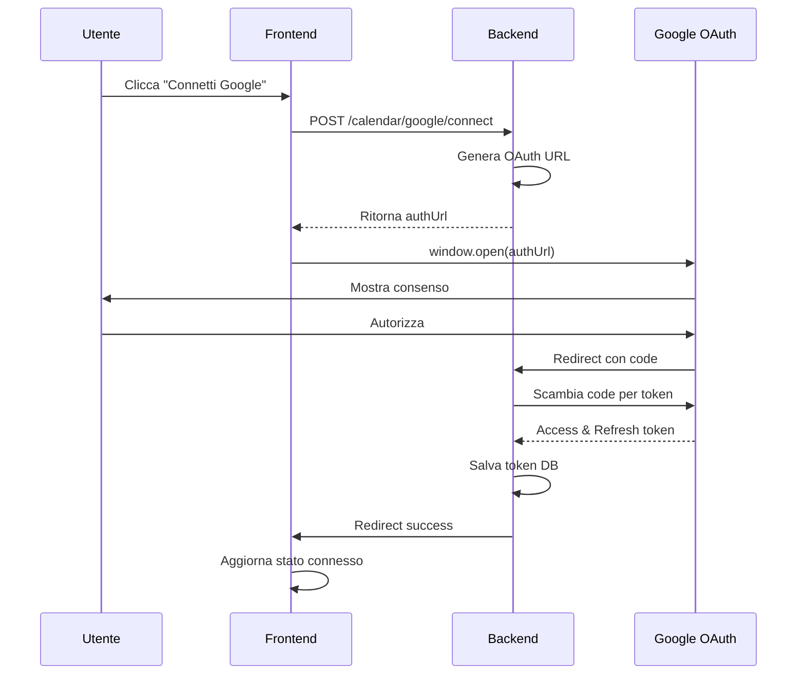

# 📅 INTEGRAZIONE GOOGLE CALENDAR - GUIDA COMPLETA

**Versione**: 2.0.0  
**Data Aggiornamento**: 27 Settembre 2025  
**Stato**: ✅ **COMPLETAMENTE FUNZIONANTE**

---

## 📋 INDICE

1. [Stato Attuale](#stato-attuale)
2. [Setup Google Cloud Console](#setup-google-cloud-console)
3. [Configurazione nel Sistema](#configurazione-nel-sistema)
4. [Utilizzo per Professionisti](#utilizzo-per-professionisti)
5. [Risoluzione Problemi](#risoluzione-problemi)
6. [Dettagli Tecnici](#dettagli-tecnici)

---

## ✅ STATO ATTUALE

### Funzionalità Implementate e Funzionanti

| Funzionalità | Stato | Note |
|-------------|-------|------|
| **Configurazione OAuth 2.0** | ✅ Funzionante | Admin può configurare Client ID/Secret |
| **OAuth Flow** | ✅ FIXATO 27/09 | Popup Google si apre correttamente |
| **Autorizzazione Account** | ✅ Funzionante | Con gestione app non verificata |
| **Token Management** | ✅ Funzionante | Refresh automatico token scaduti |
| **Lista Calendari** | ✅ Funzionante | Recupera calendari account Google |
| **Sincronizzazione Import** | ✅ Funzionante | Da Google → Sistema |
| **Sincronizzazione Export** | ✅ Funzionante | Da Sistema → Google |
| **Sincronizzazione Bidirezionale** | ✅ Funzionante | Mantiene sincronizzati entrambi |
| **Disconnessione Account** | ✅ Funzionante | Rimuove autorizzazione |

### Fix Applicato il 27/09/2025
```javascript
// PROBLEMA: authUrl non veniva estratto correttamente
// SOLUZIONE: Gestione corretta ResponseFormatter

// GoogleCalendarSync.tsx
const authUrl = response.data?.data?.authUrl || response.data?.authUrl;
if (authUrl) {
  window.open(authUrl, '_blank', 'width=600,height=700');
}
```

---

## 🔧 SETUP GOOGLE CLOUD CONSOLE

### Passaggio 1: Creare Progetto Google Cloud

1. Vai su [Google Cloud Console](https://console.cloud.google.com/)
2. Clicca su **"Seleziona progetto"** → **"Nuovo progetto"**
3. Nome progetto: `Richiesta Assistenza Calendar`
4. Clicca **"Crea"**

### Passaggio 2: Abilitare Google Calendar API

1. Nel menu laterale: **"API e servizi"** → **"Libreria"**
2. Cerca **"Google Calendar API"**
3. Clicca sul risultato
4. Clicca **"ABILITA"**
5. Attendi l'attivazione (circa 30 secondi)

### Passaggio 3: Creare Credenziali OAuth 2.0

1. Vai su **"API e servizi"** → **"Credenziali"**
2. Clicca **"+ CREA CREDENZIALI"** → **"ID client OAuth"**

#### Prima volta: Configura Schermata Consenso
Se richiesto, configura prima la schermata di consenso:
1. **User Type**: Seleziona **"Esterno"**
2. **Informazioni app**:
   - Nome app: `Richiesta Assistenza`
   - Email assistenza: `tuo-email@domain.com`
   - Logo app: (opzionale)
3. **Domini autorizzati**: Aggiungi il tuo dominio (per produzione)
4. **Scopes**: Aggiungi:
   - `.../auth/calendar`
   - `.../auth/calendar.events`
   - `.../auth/userinfo.email`
5. **Test users**: Aggiungi gli email degli utenti test

#### Creazione ID Client
1. **Tipo applicazione**: `Applicazione web`
2. **Nome**: `Richiesta Assistenza OAuth Client`
3. **URI di reindirizzamento autorizzati**:
   ```
   http://localhost:3200/api/calendar/google/callback
   ```
   Per produzione aggiungi anche:
   ```
   https://tuodominio.com/api/calendar/google/callback
   ```
4. Clicca **"Crea"**
5. **SALVA** le credenziali mostrate:
   - **Client ID**: `xxxx.apps.googleusercontent.com`
   - **Client Secret**: `GOCSPX-xxxxxxxxxxxx`

---

## ⚙️ CONFIGURAZIONE NEL SISTEMA

### Per l'Amministratore

1. **Accedi come SUPER_ADMIN**
2. Vai su **Admin** → **API Keys**
3. Seleziona tab **"Google Calendar"**
4. Inserisci:
   - **Client ID**: (copiato da Google Cloud Console)
   - **Client Secret**: (copiato da Google Cloud Console)
   - **API Key**: (opzionale, per altre integrazioni)
5. Clicca **"Salva Credenziali"**
6. Clicca **"Test Connessione"**
7. Dovresti vedere: ✅ **"Google Calendar è configurato correttamente!"**

### Verifica File .env

**Backend** (`backend/.env`):
```env
# IMPORTANTE: Aggiungi questa riga se manca
BACKEND_URL=http://localhost:3200
FRONTEND_URL=http://localhost:5193
```

**Frontend** (`.env`):
```env
VITE_API_URL=http://localhost:3200
```

---

## 👤 UTILIZZO PER PROFESSIONISTI

### Prima Connessione

1. **Accedi come Professionista**
2. Vai alla sezione **"Calendario"**
3. Clicca sull'icona **"Sincronizza"** (in alto a destra)
4. Nel modal che si apre, clicca **"Connetti Google"**

### Gestione Avviso "App Non Verificata"

Quando si apre Google, potresti vedere l'avviso di sicurezza:

#### Opzione 1: Procedere per Test (Rapido)
1. Clicca **"Avanzate"** (in basso a sinistra)
2. Clicca **"Vai a Richiesta Assistenza (non sicuro)"**
3. Clicca **"Continua"**
4. Autorizza i permessi richiesti
5. Verrai reindirizzato automaticamente

#### Opzione 2: Aggiungere come Test User (Consigliato)
1. L'admin va su Google Cloud Console
2. **"OAuth consent screen"** → **"Test users"**
3. Aggiunge l'email del professionista
4. Il professionista può ora autorizzare senza avvisi

### Dopo l'Autorizzazione

1. **Stato cambia**: Da "Non Connesso" a ✅ **"Connesso"**
2. **Email visualizzato**: Mostra l'account Google collegato
3. **Opzioni disponibili**:
   - Seleziona calendario da sincronizzare
   - Scegli direzione sincronizzazione
   - Imposta range date
   - Avvia sincronizzazione

### Sincronizzazione Eventi

#### Import da Google Calendar
- Eventi Google → Blocchi calendario nel sistema
- Utile per: Importare impegni personali esistenti

#### Export verso Google Calendar
- Interventi sistema → Eventi Google Calendar
- Utile per: Vedere interventi su telefono/Google

#### Sincronizzazione Bidirezionale
- Mantiene sincronizzati entrambi i calendari
- Consigliata per: Gestione completa unificata

---

## 🔧 RISOLUZIONE PROBLEMI

### "Il popup non si apre"
**Causa**: Popup bloccato dal browser
**Soluzione**: 
- Verifica che i popup siano abilitati
- Prova con altro browser
- Controlla console per errori

### "App non verificata"
**Causa**: App in sviluppo non verificata da Google
**Soluzioni**:
1. Clicca "Avanzate" → "Procedi" (per test)
2. Aggiungi utente come test user in Google Console
3. Per produzione: richiedi verifica Google

### "Token scaduto"
**Causa**: Token OAuth scaduto dopo lungo periodo
**Soluzione**: 
- Il sistema dovrebbe rinnovare automaticamente
- Se persiste: Disconnetti e riconnetti

### "Calendari non visibili"
**Causa**: Permessi insufficienti o calendari nascosti
**Soluzione**:
- Verifica di aver autorizzato accesso calendario
- Controlla impostazioni privacy calendario Google

### "Sincronizzazione fallisce"
**Possibili cause**:
- Eventi con formato non valido
- Limiti rate API Google
- Conflitti di sincronizzazione

**Soluzioni**:
- Verifica log errori nel backend
- Riduci range date sincronizzazione
- Prova una direzione alla volta

---

## 🔐 DETTAGLI TECNICI

### Architettura OAuth 2.0



### Struttura Token Database

```sql
GoogleCalendarToken {
  id: String (UUID)
  professionalId: String (FK User)
  accessToken: String (criptato)
  refreshToken: String (criptato)
  expiryDate: DateTime
  scope: String
  tokenType: String
}
```

### Scopes OAuth Richiesti

```javascript
const SCOPES = [
  'https://www.googleapis.com/auth/calendar',        // Accesso calendario
  'https://www.googleapis.com/auth/calendar.events', // Gestione eventi
  'https://www.googleapis.com/auth/userinfo.email'   // Info account
];
```

### Endpoint API

```typescript
// Frontend chiama
POST /api/calendar/google/connect
// Backend genera URL come:
https://accounts.google.com/o/oauth2/v2/auth?
  client_id=xxx.apps.googleusercontent.com&
  redirect_uri=http://localhost:3200/api/calendar/google/callback&
  response_type=code&
  scope=calendar+calendar.events+userinfo.email&
  access_type=offline&
  prompt=consent&
  state={professionalId}
```

---

## 📊 METRICHE E LIMITI

### Limiti Google Calendar API
- **Quota giornaliera**: 1.000.000 richieste
- **Per utente**: 500 richieste/100 secondi
- **Eventi per sincronizzazione**: Max 2500
- **Dimensione evento**: Max 1MB

### Performance
- **Tempo connessione OAuth**: ~3-5 secondi
- **Sincronizzazione 50 eventi**: ~2 secondi
- **Refresh token**: ~200ms
- **Lista calendari**: ~500ms

---

## 🚀 CHECKLIST DEPLOYMENT PRODUZIONE

Quando vai in produzione, ricorda di:

- [ ] Aggiornare redirect URI in Google Console con dominio produzione
- [ ] Richiedere verifica app Google (se pubblica)
- [ ] Aggiornare BACKEND_URL e FRONTEND_URL nei .env
- [ ] Abilitare HTTPS su tutti gli endpoint
- [ ] Implementare retry logic per rate limits
- [ ] Monitorare quota usage Google API
- [ ] Backup token per disaster recovery
- [ ] Documentare processo recovery token

---

## 📝 CHANGELOG

### Versione 2.0.0 - 27 Settembre 2025
- ✅ FIXATO: OAuth flow non apriva popup Google
- ✅ AGGIUNTO: BACKEND_URL in configurazione
- ✅ MIGLIORATO: Gestione estrazione authUrl da ResponseFormatter
- ✅ AGGIUNTO: Polling automatico stato dopo autorizzazione
- ✅ DOCUMENTATO: Processo completo gestione app non verificata

### Versione 1.0.0 - 10 Gennaio 2025
- Implementazione iniziale
- Configurazione OAuth base
- Problema: popup non si apriva

---

**Documento Ufficiale Sistema Richiesta Assistenza**  
**Mantenuto da**: Team Sviluppo  
**Ultimo Controllo**: 27 Settembre 2025  
**Status**: ✅ PRODUZIONE READY
