# 🔔 INTEGRAZIONE SISTEMA NOTIFICHE CENTRALIZZATO - DOCUMENTI LEGALI
## Data: 19 Settembre 2025
## Versione: 2.0 - CORRETTA

---

## ✅ SISTEMA NOTIFICHE CORRETTAMENTE INTEGRATO

### 🎯 APPROCCIO UTILIZZATO

Invece di inviare notifiche direttamente, il sistema documenti legali ora utilizza:

1. **NotificationService Centralizzato** (`notification.service.ts`)
   - Gestisce WebSocket, Email, SMS, Push
   - Tracciamento nel database
   - Preferenze utente rispettate
   - Audit log automatico

2. **NotificationTemplateService** (`notificationTemplate.service.ts`)
   - Template professionali riutilizzabili
   - Variabili dinamiche con Handlebars
   - Multi-canale configurabile
   - Versionamento template

---

## 📋 IMPLEMENTAZIONE CORRETTA

### 1. METODO `notifyUsersNewVersion`

```typescript
// ✅ CORRETTO - Usa il sistema centralizzato
private async notifyUsersNewVersion(document: LegalDocument, version: LegalDocumentVersion) {
  // 1. Cerca il template registrato
  const template = await notificationTemplateService.getTemplateByCode('LEGAL_DOCUMENT_UPDATE');
  
  // 2. Per ogni utente
  for (const user of users) {
    if (template) {
      // Usa il template service
      await notificationTemplateService.sendNotification({
        templateCode: 'LEGAL_DOCUMENT_UPDATE',
        recipientId: user.id,
        variables: { ... },
        channels: ['websocket', 'email'],
        priority: 'HIGH'
      });
    } else {
      // Fallback al notification service base
      await notificationService.sendToUser({
        userId: user.id,
        type: 'LEGAL_UPDATE',
        title: '...',
        message: '...',
        channels: ['websocket', 'email']
      });
    }
  }
}
```

### 2. TEMPLATE NOTIFICA REGISTRATO

**Codice**: `LEGAL_DOCUMENT_UPDATE`
**Categoria**: `LEGAL`
**Canali**: WebSocket + Email
**Priorità**: HIGH

#### Variabili Supportate:
- `userName` - Nome utente
- `documentName` - Nome documento
- `documentVersion` - Versione
- `documentUrl` - Link diretto
- `summary` - Riepilogo modifiche
- `effectiveDate` - Data efficacia
- `actionUrl` - URL azione
- `actionText` - Testo bottone

---

## 🔄 FLUSSO NOTIFICHE

```mermaid
graph TD
    A[Admin Pubblica Versione] --> B{Notifica Utenti?}
    B -->|Sì| C[publishVersion con notifyUsers=true]
    C --> D[notifyUsersNewVersion]
    D --> E{Template Exists?}
    E -->|Sì| F[NotificationTemplateService.sendNotification]
    E -->|No| G[NotificationService.sendToUser]
    F --> H[Crea record in DB]
    G --> H
    H --> I[Invia WebSocket]
    H --> J[Invia Email]
    I --> K[Utente riceve notifica in-app]
    J --> L[Utente riceve email]
```



---

## 💾 DATABASE INTEGRATION

### Tabella `Notification`
Ogni notifica crea un record con:
- `id` - UUID generato
- `type` - LEGAL_UPDATE
- `title` - Titolo notifica
- `content` - Messaggio (non `message`!)
- `recipientId` - ID utente
- `priority` - HIGH/NORMAL/LOW
- `isRead` - Stato lettura
- `metadata` - Dati extra JSON

### Tabella `NotificationTemplate`
Template registrato con:
- `code` - LEGAL_DOCUMENT_UPDATE
- `htmlContent` - Template HTML email
- `textContent` - Template testo
- `variables` - Variabili richieste
- `channels` - Canali abilitati

---

## 🚀 VANTAGGI APPROCCIO CENTRALIZZATO

### ✅ Consistenza
- Stesso formato per tutte le notifiche
- ResponseFormatter integrato
- Logging centralizzato

### ✅ Tracciabilità
- Ogni notifica salvata in DB
- Audit log automatico
- Metriche di consegna

### ✅ Configurabilità
- Template modificabili da admin
- Canali configurabili per utente
- Priorità gestite centralmente

### ✅ Scalabilità
- Queue per invio massivo
- Retry automatici
- Rate limiting integrato

---

## 🔧 CORREZIONI APPLICATE

### Prima (ERRATO ❌)
```typescript
// Invio diretto senza sistema centralizzato
await notificationService.sendToUser(userId, {
  title: '...',
  type: 'legal_update',  // tipo errato
  priority: 'HIGH',      // formato errato
  ...
});

// Email manuale
await emailService.sendEmail({...});
```

### Dopo (CORRETTO ✅)
```typescript
// Usa il sistema centralizzato
await notificationService.sendToUser({
  userId: userId,
  type: 'LEGAL_UPDATE',  // formato corretto
  priority: 'high',      // lowercase
  channels: ['websocket', 'email'],
  ...
});

// O meglio ancora, con template
await notificationTemplateService.sendNotification({
  templateCode: 'LEGAL_DOCUMENT_UPDATE',
  recipientId: userId,
  variables: {...},
  channels: ['websocket', 'email']
});
```

---

## 📝 CHECKLIST INTEGRAZIONE

- ✅ Usa `NotificationService` centralizzato
- ✅ Formato dati corretto (`content` non `message`)
- ✅ Priority in lowercase (`high` non `HIGH`) 
- ✅ UUID generato per ogni notifica
- ✅ Template registrato nel database
- ✅ Canali configurati correttamente
- ✅ Audit log automatico
- ✅ Fallback se template mancante
- ✅ Error handling non blocca pubblicazione
- ✅ Logger per debug

---

## 🎯 TESTING

### Come Testare:
1. **Crea documento** in `/admin/legal-documents`
2. **Crea versione** del documento
3. **Approva versione** nel workflow
4. **Pubblica con notifiche**:
   - ✅ "Notifica utenti" selezionato
   - Click "Pubblica"
5. **Verifica**:
   - Record in tabella `Notification`
   - WebSocket inviato (check console browser)
   - Email inviata (se Brevo configurato)
   - Audit log creato

### Query Verifica:
```sql
-- Verifica template
SELECT * FROM "NotificationTemplate" WHERE code = 'LEGAL_DOCUMENT_UPDATE';

-- Verifica notifiche inviate
SELECT * FROM "Notification" 
WHERE type = 'LEGAL_UPDATE' 
ORDER BY "createdAt" DESC;

-- Verifica audit log
SELECT * FROM "AuditLog" 
WHERE action = 'LEGAL_VERSION_PUBLISHED'
ORDER BY "createdAt" DESC;
```

---

## ✅ CONCLUSIONE

Il sistema di notifiche per documenti legali è ora:
- **100% integrato** con il sistema centralizzato
- **Tracciabile** nel database
- **Configurabile** tramite template
- **Scalabile** per grandi volumi
- **GDPR compliant** con audit trail

Non utilizza più invii diretti ma si appoggia completamente all'infrastruttura esistente di notifiche, garantendo consistenza e affidabilità.
