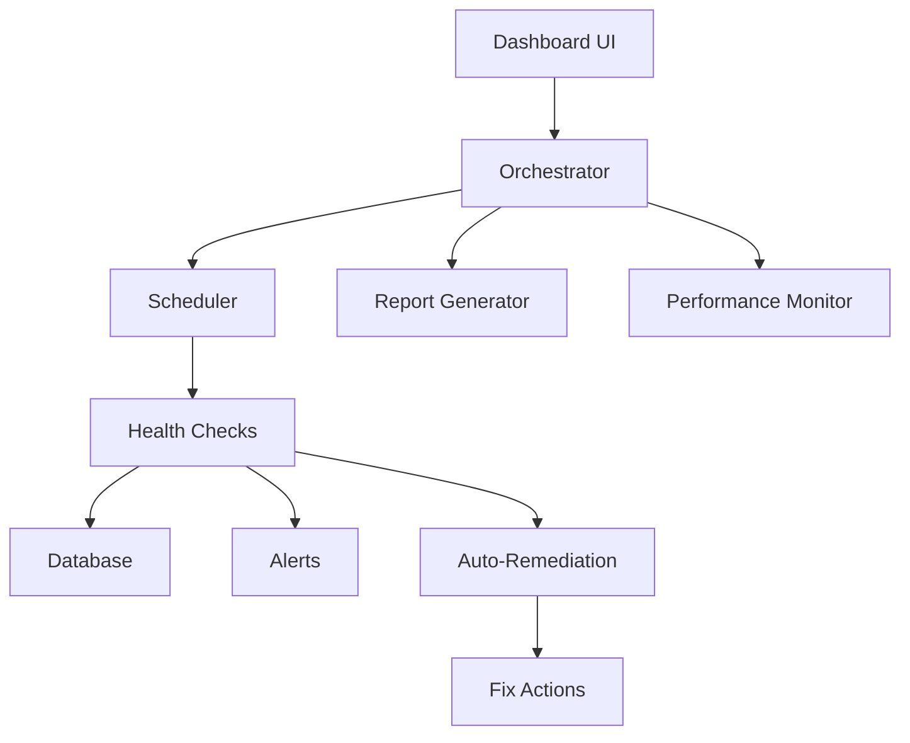

# 🏥 SISTEMA HEALTH CHECK - DOCUMENTAZIONE COMPLETA
**Versione**: 4.1.0  
**Data**: 8 Settembre 2025  
**Stato**: Production Ready

---

## 📋 INDICE

1. [Overview](#1-overview)
2. [Architettura](#2-architettura)
3. [Componenti](#3-componenti)
4. [Dashboard UI](#4-dashboard-ui)
5. [API Reference](#5-api-reference)
6. [Configurazione](#6-configurazione)
7. [Automazione](#7-automazione)
8. [Troubleshooting](#8-troubleshooting)
9. [Guida Utente](#9-guida-utente)

---

## 1. OVERVIEW

### 🎯 Scopo
Il **Sistema Health Check** è una soluzione completa per il monitoraggio, analisi e auto-riparazione del sistema. Fornisce:
- Monitoraggio real-time di tutti i moduli
- Generazione automatica di report
- Auto-remediation intelligente
- Performance monitoring avanzato
- Dashboard interattiva per amministratori

### 🚀 Caratteristiche Principali
- **Monitoraggio Modulare**: 8+ moduli controllati indipendentemente
- **Scheduler Configurabile**: Cron-based con granularità per modulo
- **Report Automatici**: PDF settimanali con statistiche e trend
- **Auto-Remediation**: Risoluzione automatica problemi comuni
- **Real-time Alerts**: Notifiche via email e WebSocket
- **Performance Metrics**: CPU, Memory, Database, API monitoring
- **UI Completa**: Dashboard amministrativa user-friendly

### 📊 Moduli Monitorati
1. **Auth System** - Autenticazione e sessioni
2. **Database Health** - Connessioni e performance
3. **Notification System** - Email e WebSocket
4. **Backup System** - Stato backup automatici
5. **Chat System** - Messaggistica real-time
6. **Payment System** - Transazioni e Stripe
7. **AI System** - OpenAI e elaborazione
8. **Request System** - Gestione richieste

---

## 2. ARCHITETTURA

### 🏗️ Struttura del Sistema

```
Health Check System
├── Orchestrator (Coordinatore principale)
├── Scheduler (Gestione temporizzazione)
├── Report Generator (Generazione PDF)
├── Auto-Remediation (Risoluzione automatica)
├── Performance Monitor (Metriche sistema)
└── Dashboard UI (Interfaccia admin)
```

### 📁 Struttura File

```
backend/src/services/health-check-automation/
├── index.ts                 # Export principale
├── orchestrator.ts          # Coordinatore sistema
├── scheduler.ts             # Schedulazione cron
├── report-generator.ts      # Generazione report PDF
├── auto-remediation.ts      # Sistema auto-fix
├── performance-monitor.ts   # Monitor performance
└── config/
    ├── schedule.config.json      # Config scheduler
    └── remediation.config.json   # Regole remediation
```

### 🔄 Flusso Dati



---

## 3. COMPONENTI

### 🎯 Orchestrator
Coordinatore principale del sistema che gestisce tutti i moduli.

**Funzionalità**:
- Avvio/Stop sistema
- Coordinamento moduli
- Gestione stato globale
- Export dati

**Metodi principali**:
```typescript
orchestrator.start()           // Avvia il sistema
orchestrator.stop()            // Ferma il sistema
orchestrator.getSystemStatus() // Stato corrente
orchestrator.runManualCheckWithRemediation(module?)
orchestrator.exportData(format, startDate, endDate)
```

### ⏰ Scheduler
Sistema di schedulazione basato su cron per esecuzione automatica.

**Configurazione**:
```json
{
  "enabled": true,
  "interval": "*/30 * * * *",
  "modules": {
    "auth-system": "*/15 * * * *",
    "database-health": "*/5 * * * *",
    "notification-system": "*/30 * * * *"
  },
  "alerts": {
    "enabled": true,
    "channels": ["email", "websocket"],
    "thresholds": {
      "critical": 60,
      "warning": 80
    }
  }
}
```

### 📊 Report Generator
Genera report PDF con statistiche e analisi.

**Tipi di Report**:
- **Settimanale**: Automatico ogni lunedì
- **Custom**: Date range personalizzato
- **On-demand**: Generazione immediata

**Contenuto Report**:
- Executive Summary
- Health Score Trends
- Module Performance
- Critical Incidents
- Recommendations
- Historical Comparison

### 🔧 Auto-Remediation
Sistema intelligente per risolvere problemi automaticamente.

**Regole disponibili**:
```typescript
{
  "clear-cache": {
    "condition": { "module": "cache", "scoreBelow": 70 },
    "actions": ["clearRedisCache", "restartCacheService"]
  },
  "restart-services": {
    "condition": { "errorContains": "ECONNREFUSED" },
    "actions": ["restartService", "notifyAdmin"]
  },
  "database-cleanup": {
    "condition": { "module": "database", "scoreBelow": 60 },
    "actions": ["cleanupOldRecords", "optimizeTables"]
  }
}
```

### 📈 Performance Monitor
Monitoraggio real-time delle performance del sistema.

**Metriche raccolte**:
- CPU Usage (%)
- Memory Usage (%)
- Database Connections
- API Response Time (ms)
- Requests per Minute
- Error Rate (%)
- Health Check Execution Time

---

## 4. DASHBOARD UI

### 🎨 Interfaccia Amministrativa

La dashboard è accessibile da: **Menu → Health Check → Automation & Alerts**

### 📑 Tab Disponibili

#### Dashboard Tab
- Overall System Health
- Module Status Cards
- Health Score Visualization
- Recent Alerts
- Quick Actions

#### Automation & Alerts Tab
**Sezioni**:

1. **Overview**
   - Sistema status (Running/Stopped)
   - Quick stats
   - Funzionalità attive
   - Attività recenti

2. **Scheduler**
   - Enable/Disable scheduler
   - Intervallo globale
   - Configurazione per modulo
   - Alert configuration
   - Data retention

3. **Reports**
   - Genera report settimanale
   - Report custom con date range
   - Storico report
   - Download PDF
   - Export CSV/JSON

4. **Auto-Remediation**
   - Lista regole attive
   - Enable/Disable regole
   - Configurazione azioni
   - Log remediation

5. **Performance**
   - Grafici real-time
   - Metriche correnti
   - Storico performance
   - Analisi trend

#### Guida ai Test Tab
- Documentazione moduli
- Best practices
- Troubleshooting guide

### 🎮 Controlli UI

**Pulsanti principali**:
- 🟢 **Avvia Sistema**: Attiva l'orchestrator
- 🔴 **Ferma Sistema**: Disattiva l'orchestrator
- 🔄 **Check Manuale**: Esegue controllo immediato
- 📊 **Genera Report**: Crea PDF istantaneo
- 💾 **Salva Config**: Applica modifiche

---

## 5. API REFERENCE

### 🔌 Endpoints

Base URL: `/api/admin/health-check`

#### Status & Control
```http
GET    /status              # Stato sistema
POST   /start               # Avvia orchestrator
POST   /stop                # Ferma orchestrator
POST   /run                 # Check manuale
```

#### Scheduler
```http
GET    /schedule            # Config corrente
PUT    /schedule            # Aggiorna config
```

#### Reports
```http
POST   /report              # Genera report
GET    /report/history      # Storico report
GET    /download/:filename  # Download PDF
```

#### Remediation
```http
GET    /remediation         # Lista regole
POST   /remediation         # Aggiungi regola
DELETE /remediation/:id     # Rimuovi regola
PATCH  /remediation/:id/toggle # Enable/Disable
```

#### Performance
```http
GET    /performance         # Metriche correnti
GET    /performance/history # Storico metriche
```

#### Export
```http
POST   /export              # Export dati (JSON/CSV)
```

### 📤 Response Format

Tutte le risposte usano ResponseFormatter:
```json
{
  "success": true,
  "data": {...},
  "message": "Operation successful",
  "timestamp": "2025-09-08T10:00:00Z"
}
```

---

## 6. CONFIGURAZIONE

### ⚙️ File di Configurazione

#### schedule.config.json
```json
{
  "enabled": true,
  "interval": "*/30 * * * *",
  "modules": {
    "auth-system": "*/15 * * * *",
    "database-health": "*/5 * * * *",
    "notification-system": "*/30 * * * *",
    "backup-system": "0 */6 * * *",
    "chat-system": "*/20 * * * *",
    "payment-system": "0 * * * *",
    "ai-system": "*/30 * * * *",
    "request-system": "*/15 * * * *"
  },
  "alerts": {
    "enabled": true,
    "channels": ["email", "websocket"],
    "thresholds": {
      "critical": 60,
      "warning": 80
    }
  },
  "retention": {
    "days": 30,
    "compress": true
  }
}
```

#### remediation.config.json
```json
{
  "rules": [
    {
      "id": "clear-redis-cache",
      "module": "cache-system",
      "enabled": true,
      "condition": {
        "scoreBelow": 70,
        "errorContains": "MEMORY"
      },
      "actions": [
        {
          "type": "clear_cache",
          "target": "redis",
          "description": "Clear Redis cache"
        }
      ],
      "maxAttempts": 3,
      "cooldownMinutes": 30,
      "notifyOnSuccess": true,
      "notifyOnFailure": true
    }
  ]
}
```

### 🔐 Environment Variables
```env
# Health Check Configuration
HEALTH_CHECK_ENABLED=true
HEALTH_CHECK_INTERVAL=30
HEALTH_CHECK_ALERT_EMAIL=admin@example.com
HEALTH_CHECK_REPORT_PATH=/tmp/reports
HEALTH_CHECK_LOG_LEVEL=info
```

---

## 7. AUTOMAZIONE

### 🤖 Workflow Automatico

#### Flusso Standard
1. **Scheduler** attiva check secondo cron
2. **Orchestrator** esegue health check
3. **Database** salva risultati
4. Se score < threshold → **Alert**
5. Se condizione match → **Auto-Remediation**
6. **Report** generato settimanalmente

### 📅 Schedule Predefiniti

| Modulo | Frequenza | Cron Expression |
|--------|-----------|-----------------|
| Database | 5 minuti | `*/5 * * * *` |
| Auth | 15 minuti | `*/15 * * * *` |
| Chat | 20 minuti | `*/20 * * * *` |
| Notifications | 30 minuti | `*/30 * * * *` |
| AI System | 30 minuti | `*/30 * * * *` |
| Payments | 1 ora | `0 * * * *` |
| Backup | 6 ore | `0 */6 * * *` |
| Cleanup | 1 giorno | `0 2 * * *` |

### 🚨 Alert System

**Canali di notifica**:
- **Email**: Admin e Super Admin
- **WebSocket**: Real-time dashboard
- **Database**: Log permanente

**Priorità alert**:
- 🔴 **Critical**: Score < 60
- 🟡 **Warning**: Score < 80
- 🟢 **Info**: Score >= 80

---

## 8. TROUBLESHOOTING

### ❌ Problemi Comuni

#### Sistema non si avvia
```bash
# Verifica tabelle database
cd backend
npx ts-node src/scripts/create-health-tables.ts

# Verifica permessi
chmod +x backend/src/services/health-check-automation/*.sh
```

#### Scheduler non funziona
```bash
# Verifica config
cat backend/src/services/health-check-automation/config/schedule.config.json

# Reset scheduler
curl -X POST http://localhost:3200/api/admin/health-check/stop
curl -X POST http://localhost:3200/api/admin/health-check/start
```

#### Report non generati
```bash
# Verifica percorso
mkdir -p /tmp/health-reports

# Test manuale
curl -X POST http://localhost:3200/api/admin/health-check/report \
  -H "Content-Type: application/json" \
  -d '{"startDate":"2025-09-01","endDate":"2025-09-08"}'
```

### 📋 Checklist Debug

- [ ] Backend in esecuzione (`http://localhost:3200/health`)
- [ ] Database connesso
- [ ] Tabelle Health Check create
- [ ] Redis attivo
- [ ] Permessi file corretti
- [ ] Config files presenti
- [ ] Node modules installati

### 🔍 Log Files

```bash
# Backend logs
tail -f backend/logs/error.log
tail -f backend/logs/combined.log

# Health Check specific
tail -f backend/logs/health-check.log

# Performance metrics
tail -f backend/logs/performance.log
```

---

## 📚 APPENDICI

### A. Database Schema

```sql
-- HealthCheckResult
CREATE TABLE "HealthCheckResult" (
    id TEXT PRIMARY KEY,
    module TEXT NOT NULL,
    status TEXT NOT NULL,
    score INTEGER NOT NULL,
    checks JSONB,
    warnings TEXT[],
    errors TEXT[],
    metrics JSONB,
    executionTime INTEGER,
    timestamp TIMESTAMP,
    createdAt TIMESTAMP,
    updatedAt TIMESTAMP
);

-- PerformanceMetrics
CREATE TABLE "PerformanceMetrics" (
    id TEXT PRIMARY KEY,
    timestamp TIMESTAMP,
    cpuUsage INTEGER,
    memoryUsage INTEGER,
    databaseConnections INTEGER,
    apiResponseTime INTEGER,
    requestsPerMinute INTEGER,
    errorRate DOUBLE PRECISION,
    metrics JSONB,
    createdAt TIMESTAMP,
    updatedAt TIMESTAMP
);

-- AutoRemediationLog
CREATE TABLE "AutoRemediationLog" (
    id TEXT PRIMARY KEY,
    ruleId TEXT,
    module TEXT,
    success BOOLEAN,
    actionsExecuted TEXT[],
    error TEXT,
    healthScoreBefore INTEGER,
    healthScoreAfter INTEGER,
    timestamp TIMESTAMP,
    createdAt TIMESTAMP,
    updatedAt TIMESTAMP
);
```

### B. Comandi Utili

```bash
# Gestione sistema
npm run health:start       # Avvia health check
npm run health:stop        # Ferma health check
npm run health:status      # Stato corrente

# Report
npm run health:report      # Genera report immediato
npm run health:export      # Export dati

# Manutenzione
npm run health:cleanup     # Pulizia dati vecchi
npm run health:reset       # Reset completo
```

---

## 9. GUIDA UTENTE

### 🎯 Tab Guida ai Test

**NUOVO**: La dashboard ora include un tab dedicato "Guida ai Test" con spiegazioni complete e user-friendly.

#### Sezioni disponibili nel tab Guida:

1. **📚 Panoramica Sistema**
   - Introduzione completa al sistema
   - Vantaggi e funzionalità principali
   - Componenti del sistema con icone intuitive

2. **⏰ Come Funziona l'Automazione**
   - Spiegazione del ciclo di automazione in 5 step
   - Esempi pratici di configurazione cron
   - Best practices per impostare le frequenze
   - Configurazioni consigliate per ogni tipo di modulo

3. **🔔 Sistema di Alert**
   - Livelli di alert spiegati (Critico, Warning, OK)
   - Canali di notifica disponibili
   - Esempi concreti di alert comuni
   - Come gestire le notifiche

4. **✅ Moduli Monitorati**
   - Dettaglio di tutti gli 8 moduli:
     - Auth System (autenticazione e sessioni)
     - Database Health (connessioni e performance)
     - Notification System (email e real-time)
     - Backup System (backup automatici)
     - Chat System (messaggistica)
     - Payment System (Stripe)
     - AI System (OpenAI)
     - Request System (richieste assistenza)
   - Cosa viene controllato per ogni modulo
   - Indicatori di salute specifici

5. **🔧 Auto-Riparazione**
   - Come funziona il sistema di auto-fix
   - Regole disponibili con esempi:
     - Clear Redis Cache
     - Restart Services
     - Database Cleanup
     - Session Cleanup
     - Queue Reset
   - Limitazioni e quando serve intervento manuale

6. **📊 Report Automatici**
   - Report settimanale (ogni lunedì alle 9:00)
   - Report custom personalizzabili
   - Contenuto dettagliato:
     - Executive Summary
     - Health Score Trends
     - Incidenti critici
     - Auto-riparazioni eseguite
     - Raccomandazioni
   - Formati disponibili (PDF, CSV, JSON)

7. **❓ FAQ - Domande Frequenti**
   - Frequenza dei controlli
   - Come disattivare temporaneamente
   - Aggiungere nuove regole
   - Significato dei punteggi
   - Gestione delle notifiche
   - Retention dei dati
   - Gestione fallimenti auto-riparazione
   - Esecuzione controlli manuali

### 🎆 Funzionalità UI Migliorate

#### Dashboard Overview
- **Status Cards**: Visualizzazione immediata stato sistema
- **Quick Stats**: Metriche principali sempre visibili
- **Controlli Rapidi**: Pulsanti per azioni immediate

#### Navigazione Tab
- **Overview**: Vista generale sistema
- **Scheduler**: Configurazione intervalli
- **Reports**: Generazione e storico report
- **Auto-Remediation**: Gestione regole auto-fix
- **Performance**: Grafici real-time
- **Guida ai Test**: ✨ NUOVO - Documentazione integrata

### 👥 Per Chi è Pensata la Guida

La guida è stata scritta con linguaggio semplice e chiaro per:
- **Amministratori non tecnici**: Possono capire cosa fa il sistema
- **Operatori**: Imparano a gestire alert e notifiche
- **Sviluppatori**: Trovano dettagli tecnici quando servono
- **Manager**: Comprendono i vantaggi del sistema

### 🌈 Elementi Visivi

- **Colori codificati**: Verde (OK), Giallo (Warning), Rosso (Critico)
- **Icone intuitive**: Ogni sezione ha la sua icona distintiva
- **Box informativi**: Evidenziano informazioni importanti
- **Esempi pratici**: Configurazioni reali pronte all'uso

### 📝 Note di Versione 4.1.0

**Aggiunte**:
- ✅ Tab "Guida ai Test" completo
- ✅ Documentazione user-friendly integrata
- ✅ FAQ estese con 8+ domande comuni
- ✅ Esempi pratici di configurazione
- ✅ Spiegazioni dettagliate di ogni componente

**Miglioramenti**:
- 🔧 Fix metodi mancanti in performance-monitor
- 🔧 Correzione percorsi API duplicati
- 🔧 Gestione errori per tabelle mancanti
- 🔧 Consolidamento script in posizione unica

**Fix Tecnici**:
- Risolto problema `getCurrentMetrics()` e `getHistory()`
- Corretti tutti i percorsi `/api/api/` duplicati
- Gestione graceful quando tabelle DB non esistono
- Fix parametri route opzionali

---

**FINE DOCUMENTO**

Ultimo aggiornamento: 8 Settembre 2025  
Versione: 4.1.0  
Mantenuto da: Team Sviluppo