# 🔔 CENTRO NOTIFICHE UNIFICATO - DOCUMENTAZIONE COMPLETA

## Sistema Multi-Canale con Email, SMS, WhatsApp, PEC, Push e WebSocket

---

## 🎯 PANORAMICA SISTEMA COMPLETO

Il **Centro Notifiche Unificato** gestisce TUTTE le comunicazioni della piattaforma attraverso:

### 📡 7 CANALI DI COMUNICAZIONE
1. **EMAIL** - Via SMTP/Brevo per comunicazioni standard
2. **SMS** - Via Twilio per urgenze e OTP
3. **WHATSAPP** - Integrato con sistema AI esistente
4. **PEC** - Posta Certificata per comunicazioni legali
5. **PUSH NOTIFICATIONS** - Web Push API per browser/mobile
6. **WEBSOCKET** - Real-time in-app notifications
7. **IN-APP** - Centro notifiche interno con badge

### 🎚️ 5 LIVELLI DI PRIORITÀ
- **CRITICAL** → Tutti i canali + alert sonori
- **URGENT** → Push + WebSocket + SMS + WhatsApp
- **HIGH** → Canali preferiti + Email backup
- **MEDIUM** → Solo canale preferito utente
- **LOW** → Solo In-App + Email opzionale

---

## 🏗️ ARCHITETTURA SISTEMA

```
┌─────────────────────────────────────────────────────────────┐
│                     NOTIFICATION CENTER                      │
├─────────────────────────────────────────────────────────────┤
│                                                              │
│  ┌──────────────────────────────────────────────────────┐  │
│  │              UNIFIED NOTIFICATION SERVICE             │  │
│  │                                                       │  │
│  │  Priority Engine → Channel Selector → Delivery Queue │  │
│  └──────────────────────────────────────────────────────┘  │
│                            │                                │
│  ┌────────────────────────┴─────────────────────────────┐  │
│  │                   DELIVERY CHANNELS                   │  │
│  ├──────────┬──────────┬──────────┬──────────┬─────────┤  │
│  │  EMAIL   │   SMS    │ WHATSAPP │   PEC    │  PUSH   │  │
│  │  SMTP    │  Twilio  │ SendApp  │ Aruba    │ WebPush │  │
│  └──────────┴──────────┴──────────┴──────────┴─────────┘  │
│                                                              │
│  ┌──────────────────────────────────────────────────────┐  │
│  │                  REAL-TIME LAYER                      │  │
│  │     WebSocket (Socket.io) + Redis Pub/Sub             │  │
│  └──────────────────────────────────────────────────────┘  │
│                                                              │
│  ┌──────────────────────────────────────────────────────┐  │
│  │                   PERSISTENCE LAYER                   │  │
│  │   PostgreSQL (Notifications, Templates, Preferences)  │  │
│  │            Redis (Queue, Cache, Sessions)             │  │
│  └──────────────────────────────────────────────────────┘  │
│                                                              │
│  ┌──────────────────────────────────────────────────────┐  │
│  │                     AUDIT & TRACKING                  │  │
│  │    Delivery Status, Read Receipts, Analytics, Logs    │  │
│  └──────────────────────────────────────────────────────┘  │
└─────────────────────────────────────────────────────────────┘
```

---

## 💾 DATABASE SCHEMA

```sql
-- Tabella principale notifiche
CREATE TABLE notifications (
  id UUID PRIMARY KEY DEFAULT gen_random_uuid(),
  user_id UUID NOT NULL REFERENCES users(id),
  type VARCHAR(50) NOT NULL,
  priority VARCHAR(20) NOT NULL,
  title VARCHAR(255) NOT NULL,
  message TEXT NOT NULL,
  data JSONB DEFAULT '{}',
  requires_action BOOLEAN DEFAULT FALSE,
  action_url VARCHAR(500),
  action_label VARCHAR(100),
  template_id UUID REFERENCES notification_templates(id),
  status VARCHAR(20) DEFAULT 'PENDING',
  sent_at TIMESTAMP,
  read_at TIMESTAMP,
  expires_at TIMESTAMP,
  metadata JSONB DEFAULT '{}',
  created_at TIMESTAMP DEFAULT NOW(),
  
  INDEX idx_user_status (user_id, status),
  INDEX idx_created_at (created_at DESC),
  INDEX idx_priority (priority)
);

-- Tracking consegna per canale
CREATE TABLE notification_deliveries (
  id UUID PRIMARY KEY DEFAULT gen_random_uuid(),
  notification_id UUID NOT NULL REFERENCES notifications(id),
  channel VARCHAR(20) NOT NULL,
  status VARCHAR(20) DEFAULT 'PENDING',
  message_id VARCHAR(255),
  delivered_at TIMESTAMP,
  read_at TIMESTAMP,
  error TEXT,
  failed_at TIMESTAMP,
  created_at TIMESTAMP DEFAULT NOW(),
  
  INDEX idx_notification_channel (notification_id, channel)
);

-- Preferenze utente
CREATE TABLE user_notification_preferences (
  user_id UUID PRIMARY KEY REFERENCES users(id),
  channels JSONB DEFAULT '{"email": true, "sms": true, "whatsapp": true, "push": true, "inApp": true}',
  quiet_hours JSONB DEFAULT '{"enabled": false, "start": "22:00", "end": "08:00"}',
  blocked_types TEXT[] DEFAULT '{}',
  preferred_channel VARCHAR(20) DEFAULT 'EMAIL',
  created_at TIMESTAMP DEFAULT NOW(),
  updated_at TIMESTAMP DEFAULT NOW()
);

-- Subscription Push Notifications
CREATE TABLE push_subscriptions (
  id UUID PRIMARY KEY DEFAULT gen_random_uuid(),
  user_id UUID NOT NULL REFERENCES users(id),
  endpoint TEXT NOT NULL UNIQUE,
  subscription JSONB NOT NULL,
  user_agent TEXT,
  is_active BOOLEAN DEFAULT TRUE,
  created_at TIMESTAMP DEFAULT NOW(),
  unsubscribed_at TIMESTAMP,
  
  INDEX idx_user_active (user_id, is_active)
);

-- Template notifiche
CREATE TABLE notification_templates (
  id UUID PRIMARY KEY DEFAULT gen_random_uuid(),
  key VARCHAR(100) UNIQUE NOT NULL,
  name VARCHAR(255) NOT NULL,
  category VARCHAR(50) NOT NULL,
  email_subject VARCHAR(500),
  email_body TEXT,
  sms_body VARCHAR(500),
  whatsapp_body TEXT,
  pec_subject VARCHAR(500),
  pec_body TEXT,
  push_title VARCHAR(100),
  push_body VARCHAR(255),
  channels TEXT[] DEFAULT '{}',
  priority VARCHAR(20) DEFAULT 'MEDIUM',
  variables JSONB DEFAULT '{}',
  is_active BOOLEAN DEFAULT TRUE,
  created_at TIMESTAMP DEFAULT NOW(),
  updated_at TIMESTAMP DEFAULT NOW()
);

-- Notifiche schedulate
CREATE TABLE scheduled_notifications (
  id UUID PRIMARY KEY DEFAULT gen_random_uuid(),
  user_id UUID REFERENCES users(id),
  template_id UUID REFERENCES notification_templates(id),
  scheduled_at TIMESTAMP NOT NULL,
  payload JSONB NOT NULL,
  status VARCHAR(20) DEFAULT 'SCHEDULED',
  sent_at TIMESTAMP,
  error TEXT,
  created_at TIMESTAMP DEFAULT NOW(),
  
  INDEX idx_scheduled_status (scheduled_at, status)
);
```

---

## 🚀 IMPLEMENTAZIONE

### 1. Setup Servizi

```typescript
// backend/src/services/unified-notification-center.service.ts

import { notificationCenter } from './unified-notification-center.service';
import { io } from './websocket';

// Inizializza centro notifiche
notificationCenter.setSocketServer(io);

// Esempio invio notifica multi-canale
await notificationCenter.send({
  userId: 'user-123',
  type: NotificationType.REQUEST_CREATED,
  priority: NotificationPriority.HIGH,
  title: 'Nuova Richiesta Assistenza',
  message: 'La tua richiesta #REQ-2025-001 è stata creata',
  requiresAction: true,
  actionUrl: '/requests/REQ-2025-001',
  actionLabel: 'Visualizza Richiesta',
  data: {
    requestId: 'REQ-2025-001',
    category: 'Idraulica'
  }
});
```

### 2. Configurazione Environment

```env
# === EMAIL ===
SMTP_HOST=smtp-relay.brevo.com
SMTP_PORT=587
SMTP_SECURE=false
SMTP_USER=your-smtp-user
SMTP_PASS=your-smtp-password
SMTP_FROM=noreply@assistenza.it

# === SMS (Twilio) ===
TWILIO_ACCOUNT_SID=ACxxxxxxxxxxxxxxxxx
TWILIO_AUTH_TOKEN=xxxxxxxxxxxxxxxxx
TWILIO_PHONE_NUMBER=+1234567890
TWILIO_WHATSAPP_NUMBER=whatsapp:+1234567890

# === WHATSAPP (SendApp) ===
SENDAPP_BASE_URL=https://app.sendapp.cloud/api
SENDAPP_ACCESS_TOKEN=your-token
SENDAPP_WEBHOOK_URL=https://yourdomain.com/api/whatsapp/webhook

# === PEC ===
PEC_ENABLED=true
PEC_PROVIDER=aruba
PEC_EMAIL=azienda@pec.it
PEC_PASSWORD=pec-password

# === PUSH NOTIFICATIONS ===
VAPID_PUBLIC_KEY=your-public-key
VAPID_PRIVATE_KEY=your-private-key
VAPID_SUBJECT=mailto:admin@assistenza.it

# === WEBSOCKET ===
WEBSOCKET_ENABLED=true
WEBSOCKET_PORT=3200
REDIS_URL=redis://localhost:6379
```

### 3. Service Worker per Push

```javascript
// public/service-worker.js

self.addEventListener('push', function(event) {
  const data = event.data.json();
  
  const options = {
    body: data.body,
    icon: data.icon || '/icon-192x192.png',
    badge: data.badge || '/badge-72x72.png',
    vibrate: data.vibrate || [200, 100, 200],
    data: data.data,
    actions: data.actions,
    requireInteraction: data.requireInteraction || false,
    tag: data.tag,
    renotify: data.renotify || false
  };
  
  event.waitUntil(
    self.registration.showNotification(data.title, options)
  );
});

self.addEventListener('notificationclick', function(event) {
  event.notification.close();
  
  if (event.action === 'open' || !event.action) {
    const urlToOpen = event.notification.data?.actionUrl || '/';
    
    event.waitUntil(
      clients.openWindow(urlToOpen)
    );
  }
});
```

---

## 📱 COMPONENTE REACT UI

### Centro Notifiche Component

```typescript
// src/components/NotificationCenter/NotificationCenter.tsx

import { NotificationCenter } from '@/components/NotificationCenter';

// Uso nel layout principale
function AppLayout() {
  return (
    <header>
      <nav>
        {/* Altri elementi nav */}
        <NotificationCenter />  {/* Icona campanella con badge */}
      </nav>
    </header>
  );
}
```

### Features UI:
- **Badge dinamico** con count notifiche non lette
- **Dropdown panel** con lista notifiche
- **Filtri** (Tutte/Non lette)
- **Azioni rapide** (marca come letta, elimina)
- **Preferenze utente** configurabili
- **Toast notifications** per urgenti
- **Sound alerts** per critiche
- **Vibrazione** su mobile

---

## 📊 API ENDPOINTS

### Notifiche

```typescript
// Invia notifica
POST /api/notifications/send
{
  userId: string,
  type: string,
  priority: string,
  title: string,
  message: string,
  channels?: string[],
  data?: any
}

// Lista notifiche utente
GET /api/notifications
Query: ?read=boolean&type=string&priority=string&limit=number&offset=number

// Marca come letta
POST /api/notifications/:id/read

// Marca tutte come lette  
POST /api/notifications/read-all

// Elimina notifica
DELETE /api/notifications/:id

// Preferenze utente
GET /api/notifications/preferences
PUT /api/notifications/preferences

// Subscribe push
POST /api/notifications/push-subscribe
{
  subscription: PushSubscription,
  userAgent: string
}

// Unsubscribe push
POST /api/notifications/push-unsubscribe
{
  endpoint: string
}
```

---

## 🔄 FLUSSI OPERATIVI

### Flusso Invio Notifica

```mermaid
graph TD
    A[Trigger Evento] --> B{Determina Priorità}
    B -->|CRITICAL| C[Tutti i Canali]
    B -->|URGENT| D[Push + SMS + WS]
    B -->|HIGH| E[Preferito + Email]
    B -->|MEDIUM| F[Solo Preferito]
    B -->|LOW| G[In-App Only]
    
    C --> H[Check Quiet Hours]
    D --> H
    E --> H
    F --> H
    G --> H
    
    H -->|Quiet + Non Urgente| I[Schedule Later]
    H -->|OK| J[Send to Channels]
    
    J --> K[Email Queue]
    J --> L[SMS Queue]
    J --> M[WhatsApp Queue]
    J --> N[Push Queue]
    J --> O[WebSocket]
    
    K --> P[Track Delivery]
    L --> P
    M --> P
    N --> P
    O --> P
    
    P --> Q[Update Status]
    Q --> R[Audit Log]
```



### Priorità e Canali

| Priorità | Email | SMS | WhatsApp | PEC | Push | WebSocket | In-App | Audio | Vibrazione |
|----------|-------|-----|----------|-----|------|-----------|--------|-------|------------|
| **CRITICAL** | ✅ | ✅ | ✅ | ✅ | ✅ | ✅ | ✅ | ✅ | ✅ |
| **URGENT** | ✅ | ✅ | ✅ | ❌ | ✅ | ✅ | ✅ | ❌ | ✅ |
| **HIGH** | ✅ | ❌ | ✅* | ❌ | ✅ | ✅ | ✅ | ❌ | ❌ |
| **MEDIUM** | ✅* | ❌ | ✅* | ❌ | ✅* | ✅ | ✅ | ❌ | ❌ |
| **LOW** | ✅* | ❌ | ❌ | ❌ | ❌ | ❌ | ✅ | ❌ | ❌ |

*Solo se è il canale preferito dell'utente

---

## 🎯 USE CASES

### 1. Emergenza Sistema (CRITICAL)

```typescript
// Blackout servizio
await notificationCenter.send({
  userId: 'all-users',
  type: NotificationType.SYSTEM_ALERT,
  priority: NotificationPriority.CRITICAL,
  title: '🚨 EMERGENZA SISTEMA',
  message: 'Servizio temporaneamente non disponibile. Stiamo lavorando per risolvere.',
  channels: ['EMAIL', 'SMS', 'WHATSAPP', 'PUSH', 'WEBSOCKET'],
  requiresAction: false
});

// Risultato:
// - Email inviata immediatamente
// - SMS a tutti i numeri verificati
// - WhatsApp broadcast
// - Push notification con audio
// - WebSocket real-time update
// - Toast persistente in UI
```

### 2. Nuovo Preventivo (HIGH)

```typescript
// Preventivo ricevuto
await notificationCenter.send({
  userId: request.clientId,
  type: NotificationType.QUOTE_RECEIVED,
  priority: NotificationPriority.HIGH,
  title: '💰 Nuovo Preventivo Ricevuto',
  message: `Hai ricevuto un preventivo di €${quote.amount} per la tua richiesta`,
  requiresAction: true,
  actionUrl: `/quotes/${quote.id}`,
  actionLabel: 'Visualizza Preventivo',
  data: {
    quoteId: quote.id,
    amount: quote.amount,
    professionalName: professional.name
  }
});

// Risultato:
// - Notifica push immediata
// - Email di backup
// - WhatsApp se preferito
// - Badge +1 nel centro notifiche
```

### 3. Reclamo PEC (URGENT + Legal)

```typescript
// Conferma invio reclamo
await notificationCenter.send({
  userId: complaint.userId,
  type: NotificationType.COMPLAINT_SENT,
  priority: NotificationPriority.URGENT,
  title: '📧 Reclamo PEC Inviato',
  message: `Il tuo reclamo formale è stato inviato a ${complaint.company}`,
  channels: ['EMAIL', 'WHATSAPP', 'PEC'],
  data: {
    complaintId: complaint.id,
    company: complaint.company,
    pecMessageId: pecResult.messageId
  }
});

// Risultato:
// - PEC con ricevuta di ritorno
// - Email di conferma
// - WhatsApp con dettagli
// - Audit log completo
```

---

## 📈 MONITORING & ANALYTICS

### Dashboard Metriche

```typescript
// Endpoint analytics
GET /api/notifications/analytics

Response:
{
  summary: {
    sent: 15420,
    delivered: 14890,
    read: 12340,
    failed: 530
  },
  byChannel: {
    EMAIL: { sent: 5000, delivered: 4800, read: 3200 },
    SMS: { sent: 1000, delivered: 980, read: 950 },
    WHATSAPP: { sent: 3000, delivered: 2950, read: 2800 },
    PUSH: { sent: 4000, delivered: 3800, clicked: 2000 },
    WEBSOCKET: { sent: 2420, delivered: 2360, read: 2390 }
  },
  byPriority: {
    CRITICAL: 50,
    URGENT: 420,
    HIGH: 3850,
    MEDIUM: 8100,
    LOW: 3000
  },
  avgDeliveryTime: {
    EMAIL: 2.3,
    SMS: 0.8,
    WHATSAPP: 1.2,
    PUSH: 0.3,
    WEBSOCKET: 0.1
  },
  topFailureReasons: [
    { reason: 'Invalid phone number', count: 230 },
    { reason: 'Email bounced', count: 180 },
    { reason: 'Push subscription expired', count: 120 }
  ]
}
```

---

## 🔒 SICUREZZA

### Best Practices Implementate

1. **Rate Limiting** per canale e utente
2. **Validation** input con Zod
3. **Sanitization** contenuti HTML
4. **Encryption** dati sensibili
5. **Audit Trail** completo
6. **GDPR Compliance** con opt-in/out
7. **Quiet Hours** rispetto privacy
8. **Unsubscribe** links in email
9. **Token rotation** per push
10. **WebSocket authentication** con JWT

---

## 🎉 SISTEMA COMPLETAMENTE INTEGRATO!

Il Centro Notifiche Unificato ora gestisce:

### ✅ CANALI IMPLEMENTATI
- **Email** via SMTP/Brevo ✅
- **SMS** via Twilio ✅
- **WhatsApp** via SendApp ✅
- **PEC** via Aruba/Poste ✅
- **Push Notifications** via Web Push API ✅
- **WebSocket** via Socket.io ✅
- **In-App** con badge e centro notifiche ✅

### ✅ FEATURES COMPLETE
- **Multi-channel routing** intelligente ✅
- **Priority-based delivery** ✅
- **User preferences** management ✅
- **Quiet hours** rispetto ✅
- **Template system** ✅
- **Delivery tracking** ✅
- **Read receipts** ✅
- **Retry logic** ✅
- **Batch sending** ✅
- **Scheduled notifications** ✅
- **Real-time updates** ✅
- **Audit logging** ✅

### 📊 RISULTATI ATTESI
- **Delivery rate**: >95%
- **Open rate**: >70%
- **Response time**: <2s
- **User satisfaction**: ⭐⭐⭐⭐⭐

**IL SISTEMA È PRODUCTION READY!** 🚀

---

*Centro Notifiche Unificato v1.0*
*Sistema Multi-Canale Completo*
*© LM Tecnologie - Settembre 2025*
