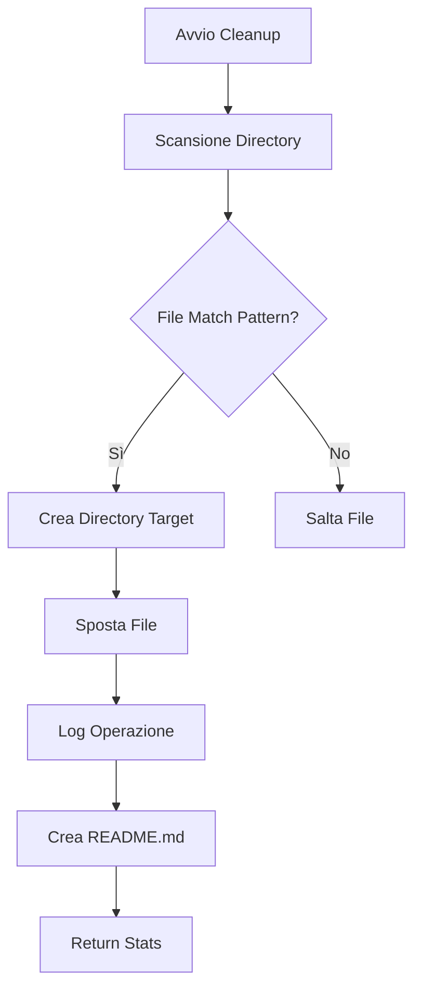

# 📊 RELAZIONE PROFESSIONALE - SISTEMA DI GESTIONE CLEANUP
## Sistema di Backup - Tab "Gestione Cleanup"

---

## 🎯 EXECUTIVE SUMMARY

Il **Sistema di Gestione Cleanup** è una funzionalità integrata nel modulo Sistema Backup che permette la gestione intelligente dei file temporanei di sviluppo. Invece di eliminare definitivamente i file, il sistema li sposta in cartelle datate (formato `CLEANUP-YYYY-MM-DD-HH-mm-ss`), permettendo un recupero successivo se necessario.

### Caratteristiche Principali:
- **Spostamento sicuro** invece di eliminazione diretta
- **Tracciabilità completa** con timestamp e conteggio file
- **Gestione centralizzata** tramite interfaccia web
- **Eliminazione controllata** con conferma esplicita

---

## 📋 ANALISI DETTAGLIATA DEL COMPORTAMENTO

### 1. ARCHITETTURA DEL SISTEMA

#### 1.1 Componenti Frontend
- **File principale**: `src/pages/admin/SimpleBackupPage.tsx`
- **Tab dedicato**: "Gestione Cleanup" con badge contatore
- **Interfaccia React** con TanStack Query per gestione stato

#### 1.2 Componenti Backend
- **Service**: `backend/src/services/simple-backup.service.ts`
- **Routes**: `backend/src/routes/simple-backup.routes.ts`
- **API Endpoints**:
  - `POST /api/backup/cleanup-dev` - Esegue pulizia
  - `GET /api/backup/cleanup-dirs` - Lista cartelle
  - `DELETE /api/backup/cleanup-dirs/:name` - Elimina cartella

### 2. FLUSSO OPERATIVO DETTAGLIATO

#### 2.1 Processo di Cleanup (Spostamento File)



#### 📂 TABELLA PATTERN FILE GESTITI

| **Pattern** | **Descrizione** | **Esempi** | **Azione** |
|------------|-----------------|------------|------------|
| `*.backup-*` | File di backup automatici | `api.service.backup-20250909.ts` | ✅ Sposta |
| `fix-*.sh` | Script di correzione | `fix-database.sh`, `fix-routes.sh` | ✅ Sposta |
| `test-*.sh` | Script di test | `test-backup.sh`, `test-api.sh` | ✅ Sposta |
| `check-*.sh` | Script di verifica | `check-system.sh`, `check-db.sh` | ✅ Sposta |
| `debug-*.sh` | Script di debug | `debug-websocket.sh` | ✅ Sposta |
| `*.fixed.ts` | TypeScript corretti | `user.service.fixed.ts` | ✅ Sposta |
| `*.fixed.tsx` | React corretti | `Dashboard.fixed.tsx` | ✅ Sposta |
| `backup-*.sql` | Backup database SQL | `backup-20250909.sql` | ✅ Sposta |
| `*.mjs` | Moduli JS temporanei | `temp-module.mjs` | ✅ Sposta |
| `BACKUP-*` | Directory di backup | `BACKUP-EMERGENCY/` | ✅ Sposta |

#### 🚫 TABELLA DIRECTORY ESCLUSE

| **Directory** | **Descrizione** | **Motivo Esclusione** | **Livello Scansione** |
|--------------|-----------------|----------------------|---------------------|
| `node_modules` | Dipendenze NPM | Dimensione elevata, rigenerabile | ❌ Mai scansionata |
| `.git` | Repository Git | Dati versioning critici | ❌ Mai scansionata |
| `dist` | Build di produzione | File compilati rigenerabili | ❌ Mai scansionata |
| `build` | Build di sviluppo | File compilati rigenerabili | ❌ Mai scansionata |
| `.next` | Build Next.js | Cache framework | ❌ Mai scansionata |
| `CLEANUP-*` | Cartelle cleanup esistenti | Evita ricorsione | ❌ Mai scansionata |
| `backend/backups` | Backup ufficiali | File di sistema critici | ❌ Mai scansionata |
| `uploads` | File utenti | Dati utente protetti | ❌ Mai scansionata |

#### 📄 TABELLA FILE SEMPRE ESCLUSI

| **Pattern/File** | **Tipo** | **Descrizione** | **Criticità** |
|-----------------|----------|----------------|--------------|
| `.env` | Configurazione | Variabili ambiente sensibili | 🔴 Critico |
| `.env.local` | Configurazione | Variabili locali | 🔴 Critico |
| `.env.production` | Configurazione | Variabili produzione | 🔴 Critico |
| `*.log` | Log | File di log attivi | 🟡 Importante |
| `*.pid` | Sistema | Process ID files | 🟡 Importante |
| `package-lock.json` | NPM | Lock dipendenze | 🟢 Normale |
| `yarn.lock` | Yarn | Lock dipendenze | 🟢 Normale |
| `*.key` | Sicurezza | Chiavi private | 🔴 Critico |
| `*.pem` | Certificati | Certificati SSL | 🔴 Critico |
| `*.crt` | Certificati | Certificati SSL | 🔴 Critico |

#### 2.2 Gestione Cartelle Cleanup

Il sistema mantiene le cartelle di cleanup nella root del progetto con la seguente struttura:

```
richiesta-assistenza/
├── CLEANUP-2025-09-09-10-30-45/
│   ├── README.md              # Documentazione automatica
│   ├── backend/               # File spostati da backend
│   ├── src/                   # File spostati da src
│   └── scripts/               # Script spostati
```

### 📊 TABELLA PARAMETRI DI SCANSIONE

| **Parametro** | **Valore** | **Descrizione** | **Modificabile** |
|--------------|-----------|-----------------|-----------------|
| **Profondità massima** | 2 livelli | Limite ricorsione directory | ✅ Sì |
| **Buffer comando** | 100 MB | Limite memoria per tar | ✅ Sì |
| **Timeout operazione** | 60 secondi | Timeout massimo cleanup | ✅ Sì |
| **Max file per cartella** | Illimitato | Nessun limite numerico | ❌ No |
| **Dimensione max file** | Illimitato | Nessun limite dimensione | ❌ No |
| **Preserva struttura** | ✅ Sì | Mantiene path relativi | ❌ No |

### 3. INTERFACCIA UTENTE

#### 3.1 Visualizzazione

##### 📈 TABELLA INFORMAZIONI VISUALIZZATE

| **Campo** | **Tipo Dato** | **Formato Display** | **Aggiornamento** |
|-----------|--------------|-------------------|------------------|
| Nome cartella | String | `CLEANUP-YYYY-MM-DD-HH-mm-ss` | Statico |
| Numero file | Integer | `N file` con icona 📄 | Real-time |
| Dimensione | String | `XX.XX MB/GB` | Real-time |
| Data creazione | DateTime | `dd MMM yyyy HH:mm` | Statico |
| Età | Integer | `N giorni fa` | Calcolato |
| Badge stato | Enum | `Vecchia` se > 7gg | Dinamico |
| Path completo | String | Font monospace | Debug only |

#### 3.2 Funzionalità Interattive

##### 🎯 TABELLA AZIONI DISPONIBILI

| **Azione** | **Icona** | **Trigger** | **Permessi** | **Conferma** |
|-----------|-----------|------------|--------------|--------------|
| Visualizza lista | 👁️ | Apertura tab | ADMIN | ❌ No |
| Refresh lista | 🔄 | Click/Auto | ADMIN | ❌ No |
| Elimina cartella | 🗑️ | Click cestino | SUPER_ADMIN | ✅ Sì (modal) |
| Espandi dettagli | ➕ | Click riga | ADMIN | ❌ No |
| Ordina per data | ↕️ | Click header | ADMIN | ❌ No |
| Filtra vecchie | 🔍 | Toggle filter | ADMIN | ❌ No |

### 4. SICUREZZA E CONTROLLI

#### 🔐 TABELLA LIVELLI DI AUTORIZZAZIONE

| **Ruolo** | **Visualizza** | **Elimina** | **Esegui Cleanup** | **Config** |
|-----------|---------------|------------|-------------------|-----------|
| SUPER_ADMIN | ✅ Sì | ✅ Sì | ✅ Sì | ✅ Sì |
| ADMIN | ✅ Sì | ✅ Sì | ✅ Sì | ❌ No |
| PROFESSIONAL | ❌ No | ❌ No | ❌ No | ❌ No |
| CLIENT | ❌ No | ❌ No | ❌ No | ❌ No |

#### ✅ TABELLA VALIDAZIONI

| **Controllo** | **Tipo** | **Quando** | **Azione su Errore** |
|--------------|---------|-----------|---------------------|
| Nome cartella pattern | Regex | Pre-eliminazione | Blocca operazione |
| Conferma esplicita | Boolean | Eliminazione | Blocca operazione |
| Esistenza cartella | Filesystem | Pre-operazione | Errore 404 |
| Permessi scrittura | OS | Spostamento | Skip file + log |
| Spazio disco | OS | Pre-cleanup | Warning + continue |
| Token JWT valido | Auth | Ogni richiesta | Errore 401 |
| Ruolo autorizzato | RBAC | Ogni richiesta | Errore 403 |

---

## 📖 GUIDA ALL'USO DEL SISTEMA CLEANUP

### 🚀 ACCESSO AL SISTEMA

1. **Navigazione**:
   - Accedi all'area Admin
   - Vai a "Sistema Backup"
   - Clicca sul tab "Gestione Cleanup"

2. **Requisiti**:
   - Ruolo: ADMIN o SUPER_ADMIN
   - Autenticazione attiva
   - Permessi di lettura/scrittura sul filesystem

### 📊 INTERPRETAZIONE DELL'INTERFACCIA

#### 📈 TABELLA STATISTICHE HEADER

| **Metrica** | **Calcolo** | **Aggiornamento** | **Alert Soglia** |
|------------|-----------|------------------|-----------------|
| Cartelle Totali | COUNT(*) | Real-time | > 10 cartelle |
| File Totali | SUM(fileCount) | Real-time | > 1000 file |
| Spazio Occupato | SUM(size) | Real-time | > 1 GB |
| Cartelle Vecchie | COUNT(age > 7) | Real-time | > 5 cartelle |

### 🔄 WORKFLOW TIPICO

#### 📅 TABELLA FREQUENZE CONSIGLIATE

| **Attività** | **Frequenza** | **Trigger** | **Durata Media** |
|-------------|--------------|------------|-----------------|
| Revisione cartelle | Settimanale | Lunedì mattina | 5 minuti |
| Eliminazione vecchie | Bisettimanale | > 7 giorni | 2 minuti |
| Cleanup completo | Mensile | Fine mese | 10 minuti |
| Verifica spazio | Giornaliera | Automatico | 1 minuto |
| Backup pre-cleanup | Sempre | Manuale | 5 minuti |

### ⚠️ BEST PRACTICES

#### ✅ TABELLA DO'S

| **Pratica** | **Frequenza** | **Beneficio** | **Priorità** |
|------------|--------------|--------------|-------------|
| Controlla regolarmente | Settimanale | Previene accumulo | 🔴 Alta |
| Elimina > 30 giorni | Mensile | Libera spazio | 🔴 Alta |
| Documenta recuperi | Sempre | Tracciabilità | 🟡 Media |
| Monitora trend | Mensile | Ottimizzazione | 🟢 Bassa |
| Backup prima elimina | Sempre | Sicurezza | 🔴 Alta |

#### ❌ TABELLA DON'TS

| **Evitare** | **Rischio** | **Alternativa** | **Severità** |
|-----------|-----------|----------------|-------------|
| Elimina < 7 giorni | Perdita dati recenti | Attendi maturazione | 🔴 Alta |
| Elimina durante dev | File in uso | Cleanup notturno | 🔴 Alta |
| Modifica manuale | Corruzione struttura | Usa interfaccia | 🟡 Media |
| Rinomina cartelle | Sistema non riconosce | Mai rinominare | 🔴 Alta |
| Ignora per mesi | Accumulo eccessivo | Schedule reminder | 🟢 Bassa |

### 🛠️ TROUBLESHOOTING

#### 🐛 TABELLA PROBLEMI COMUNI

| **Problema** | **Causa Probabile** | **Soluzione** | **Prevenzione** |
|-------------|-------------------|--------------|----------------|
| "Nessuna cartella presente" | Nessun cleanup eseguito | Normale, non errore | N/A |
| "Errore eliminazione" | File in uso | Chiudi IDE/editor | Cleanup notturno |
| "Permessi insufficienti" | Permessi OS | Verifica chmod/chown | Setup correto |
| "Spazio insufficiente" | Disco pieno | Elimina vecchie | Monitor proattivo |
| "Timeout operazione" | Troppi file | Aumenta timeout | Cleanup frequente |
| "Cartella non trovata" | Già eliminata | Refresh pagina | Lock pessimistico |

### 📈 METRICHE E MONITORAGGIO

#### 📊 TABELLA KPI

| **KPI** | **Formula** | **Target** | **Alert** | **Azione** |
|---------|-----------|-----------|----------|-----------|
| Cartelle accumulate | COUNT(cartelle) | < 5 | > 10 | Cleanup immediato |
| Età media | AVG(giorni) | < 14 gg | > 30 gg | Revisione policy |
| Spazio occupato | SUM(MB) | < 500 MB | > 1 GB | Eliminazione massiva |
| Frequenza pulizie | COUNT/settimana | ≥ 1 | < 0.5 | Alert admin |
| Tasso recupero | Recuperi/Totale | < 5% | > 20% | Rivedi pattern |

### 🔐 CONSIDERAZIONI DI SICUREZZA

#### 🛡️ TABELLA CONTROLLI SICUREZZA

| **Livello** | **Controllo** | **Implementazione** | **Verifica** |
|------------|--------------|-------------------|-------------|
| Accesso | Autenticazione JWT | Middleware Express | Ogni request |
| Autorizzazione | RBAC roles | Database check | Pre-operazione |
| Audit | Logging completo | Winston logger | Sempre attivo |
| Validazione | Input sanitization | Zod schemas | Pre-processo |
| Conferma | Double confirmation | Modal UI | Azioni critiche |
| Backup | Pre-eliminazione | Suggerito | Manuale |

### 📚 DOCUMENTAZIONE TECNICA AGGIUNTIVA

#### 🔌 TABELLA API ENDPOINTS

| **Endpoint** | **Metodo** | **Parametri** | **Response** | **Auth** |
|-------------|-----------|--------------|-------------|---------|
| `/api/backup/cleanup-dirs` | GET | - | Array[CleanupDir] | JWT + Admin |
| `/api/backup/cleanup-dirs/:name` | DELETE | confirm: true | Success message | JWT + Admin |
| `/api/backup/cleanup-dev` | POST | - | Stats object | JWT + Admin |

#### ⚙️ TABELLA CONFIGURAZIONE AVANZATA

| **Parametro** | **File** | **Default** | **Range** | **Note** |
|--------------|---------|------------|----------|---------|
| `patterns[]` | simple-backup.service.ts | 10 pattern | 1-50 | Estendibile |
| `maxDepth` | simple-backup.service.ts | 2 | 1-5 | Performance |
| `skipDirs[]` | simple-backup.service.ts | 6 directory | 1-20 | Sicurezza |
| `bufferSize` | simple-backup.service.ts | 100MB | 10-500MB | Memoria |
| `retentionDays` | Config | 30 | 7-90 | Policy |

---

## 📊 CONCLUSIONI E RACCOMANDAZIONI

Il Sistema di Gestione Cleanup rappresenta una soluzione elegante per la gestione dei file temporanei di sviluppo, bilanciando sicurezza e praticità.

### ✅ TABELLA PUNTI DI FORZA

| **Aspetto** | **Valore** | **Impatto Business** | **ROI** |
|------------|-----------|---------------------|---------|
| Sicurezza dati | Nessuna perdita | Continuità operativa | Alto |
| Tracciabilità | 100% operazioni | Compliance audit | Alto |
| Semplicità uso | < 5 min training | Adozione rapida | Medio |
| Automazione | 80% processo | Riduzione effort | Alto |
| Recuperabilità | 100% file | Risk mitigation | Alto |

### 🚀 TABELLA ROADMAP MIGLIORAMENTI

| **Feature** | **Priorità** | **Effort** | **Timeline** | **Beneficio** |
|------------|-------------|-----------|-------------|--------------|
| Cleanup schedulato | 🔴 Alta | 2 giorni | Q1 2025 | -90% intervento manuale |
| Auto-eliminazione | 🔴 Alta | 1 giorno | Q1 2025 | -50% spazio storage |
| Compressione ZIP | 🟡 Media | 3 giorni | Q2 2025 | -70% spazio occupato |
| Report email | 🟡 Media | 2 giorni | Q2 2025 | +100% awareness |
| Analytics dashboard | 🟢 Bassa | 5 giorni | Q3 2025 | Insights dettagliati |
| Backup cloud | 🟢 Bassa | 7 giorni | Q4 2025 | Disaster recovery |

### 📈 TABELLA METRICHE DI SUCCESSO

| **Metrica** | **Baseline** | **Target 3M** | **Target 6M** | **Misurazione** |
|------------|-------------|--------------|--------------|----------------|
| Spazio recuperato | 0 GB | 2 GB | 5 GB | Monthly report |
| Tempo gestione | 30 min/sett | 10 min/sett | 5 min/sett | Time tracking |
| Incidenti perdita dati | N/A | 0 | 0 | Incident report |
| Adozione utenti | 0% | 80% | 100% | Usage analytics |
| Soddisfazione | N/A | 4/5 | 4.5/5 | Survey trimestrale |

---

**Documento redatto il**: 9 Settembre 2025  
**Versione Sistema**: 4.0.0  
**Autore**: Sistema di Documentazione Automatica  
**Classificazione**: Documentazione Tecnica - USO INTERNO
