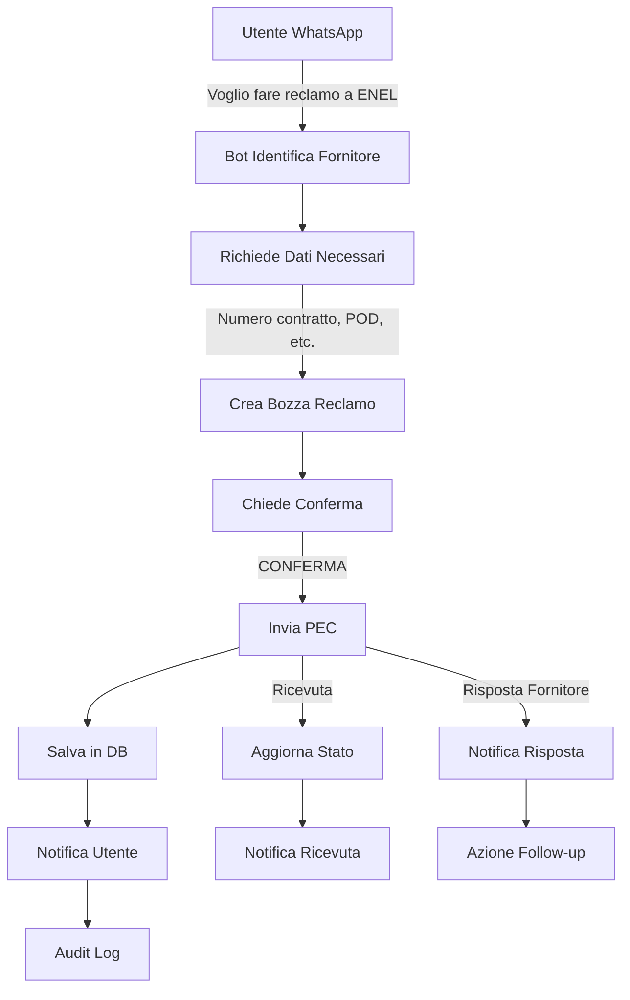

# 📚 DOCUMENTAZIONE INTEGRAZIONE AUDIT LOG + PEC + NOTIFICHE AVANZATE

## Sistema WhatsApp con Audit Trail Completo e Gestione Reclami PEC

---

## 🎯 PANORAMICA SISTEMA INTEGRATO

Il sistema WhatsApp è ora completamente integrato con:

1. **Audit Log System** - Tracciamento completo di ogni operazione
2. **PEC Service** - Invio reclami formali con valore legale
3. **Advanced Notification System** - Notifiche multi-canale con priorità
4. **Compliance GDPR** - Data retention e privacy policies

---

## 🔐 1. SISTEMA AUDIT LOG PER WHATSAPP

### Caratteristiche

- **Tracciamento Completo**: Ogni messaggio, comando, azione viene loggata
- **Compliance**: GDPR ready con retention policies
- **Anomaly Detection**: Rilevamento automatico comportamenti sospetti
- **Performance Tracking**: Metriche di risposta e utilizzo AI
- **Legal Trail**: Tracciamento specifico per azioni legali (PEC, reclami)

### Eventi Tracciati

```typescript
// Tutti gli eventi WhatsApp tracciati
enum WhatsAppAuditEvents {
  // Messaggi
  MESSAGE_RECEIVED = 'Messaggio ricevuto da utente',
  MESSAGE_SENT = 'Messaggio inviato a utente',
  MESSAGE_FAILED = 'Invio messaggio fallito',
  
  // Comandi
  COMMAND_EXECUTED = 'Comando eseguito',
  COMMAND_FAILED = 'Comando fallito',
  
  // Business
  REQUEST_CREATED = 'Richiesta assistenza creata',
  QUOTE_ACCEPTED = 'Preventivo accettato',
  QUOTE_REJECTED = 'Preventivo rifiutato',
  
  // Legal
  COMPLAINT_INITIATED = 'Reclamo iniziato',
  COMPLAINT_PEC_SENT = 'Reclamo PEC inviato',
  PEC_RECEIPT_RECEIVED = 'Ricevuta PEC ricevuta',
  
  // AI
  AI_RESPONSE = 'Risposta AI generata',
  AI_ERROR = 'Errore AI',
  KB_SEARCH = 'Ricerca Knowledge Base',
  
  // Security
  SUSPICIOUS_ACTIVITY = 'Attività sospetta rilevata',
  RATE_LIMIT_EXCEEDED = 'Rate limit superato',
  UNAUTHORIZED_ACCESS = 'Accesso non autorizzato'
}
```

### Dashboard Audit

```typescript
// Accesso: /admin/audit/whatsapp

interface WhatsAppAuditDashboard {
  // Filtri disponibili
  filters: {
    dateRange: [startDate, endDate],
    phoneNumber?: string,
    userId?: string,
    action?: string,
    success?: boolean,
    severity?: 'INFO' | 'WARNING' | 'ERROR' | 'CRITICAL'
  },
  
  // Metriche
  metrics: {
    totalEvents: number,
    successRate: number,
    avgResponseTime: number,
    uniqueUsers: number,
    pecComplaintsSent: number,
    anomaliesDetected: number
  },
  
  // Timeline eventi
  timeline: Array<{
    timestamp: Date,
    action: string,
    user: string,
    details: any,
    severity: string
  }>,
  
  // Anomalie rilevate
  anomalies: Array<{
    type: string,
    severity: string,
    message: string,
    detectedAt: Date,
    resolved: boolean
  }>
}
```

### Query Utili Audit

```sql
-- Trova tutti i reclami PEC inviati
SELECT 
  wa.phone_number,
  wa.action,
  wa.complaint_id,
  wa.timestamp,
  c.company,
  c.status
FROM whatsapp_audit wa
JOIN complaint c ON c.id = wa.complaint_id
WHERE wa.action = 'COMPLAINT_PEC_SENT'
ORDER BY wa.timestamp DESC;

-- Utenti con comportamento sospetto
SELECT 
  phone_number,
  COUNT(*) as message_count,
  COUNT(DISTINCT DATE(timestamp)) as active_days,
  AVG(response_time) as avg_response_time
FROM whatsapp_audit
WHERE timestamp > NOW() - INTERVAL '7 days'
GROUP BY phone_number
HAVING COUNT(*) > 100  -- Più di 100 messaggi in 7 giorni
ORDER BY message_count DESC;

-- Performance AI per categoria
SELECT 
  category,
  AVG(ai_tokens_used) as avg_tokens,
  AVG(response_time) as avg_time,
  COUNT(*) as total_requests,
  SUM(CASE WHEN kb_hit THEN 1 ELSE 0 END) * 100.0 / COUNT(*) as kb_hit_rate
FROM whatsapp_audit
WHERE action = 'AI_RESPONSE'
  AND timestamp > NOW() - INTERVAL '30 days'
GROUP BY category
ORDER BY total_requests DESC;
```

---

## 📧 2. SISTEMA PEC (POSTA ELETTRONICA CERTIFICATA)

### Funzionalità

- **Invio Reclami Formali**: Con valore legale
- **Template Predefiniti**: Per ENEL, TIM, Vodafone, etc.
- **Tracking Completo**: Dalla creazione alla risposta
- **Ricevute di Ritorno**: Gestione automatica
- **Allegati**: Supporto documenti PDF

### Flusso Reclamo via WhatsApp



### Configurazione PEC

```env
# .env configuration
PEC_ENABLED=true
PEC_PROVIDER=aruba  # aruba, poste, register
PEC_EMAIL=tuaazienda@pec.it
PEC_PASSWORD=your_pec_password

# Template settings
PEC_DEFAULT_TIMEOUT=48h  # Tempo attesa ricevuta
PEC_AUTO_RETRY=true
PEC_MAX_RETRIES=3
```

### Esempi Conversazione Reclamo

```
USER: Voglio fare un reclamo a ENEL

BOT: 📋 Per procedere con il reclamo ENEL, fornisci:
1. Numero Contratto (es: IT001234567)
2. Codice POD (es: IT001E12345678)
3. Descrizione dettagliata del problema

Scrivi tutto in un unico messaggio o ANNULLA per annullare.

USER: Contratto IT001234567, POD IT001E12345678. 
Bolletta di 500€ quando consumo normale è 50€. 
Richiedo verifica e rimborso.

BOT: 📝 Bozza reclamo creata per ENEL

Il reclamo verrà inviato via PEC (valore legale).

Vuoi procedere?
• CONFERMA per inviare
• MODIFICA per cambiare
• ANNULLA per annullare

ID Bozza: ABC123

USER: CONFERMA

BOT: ✅ RECLAMO INVIATO CON SUCCESSO!

📧 Destinatario: ENEL (enelenergia@pec.enel.it)
📨 Metodo: PEC (Posta Certificata)
🔖 ID Reclamo: REC-2025-0923
⏰ Risposta attesa: entro 30 giorni

Riceverai notifica quando arriverà la risposta.
Per lo stato: STATO RECLAMO 0923
```

### Template Reclami Disponibili

```typescript
const SUPPORTED_COMPANIES = {
  // Energia
  ENEL: {
    pec: 'enelenergia@pec.enel.it',
    responseTime: '30 giorni',
    requiredData: ['contractNumber', 'podCode']
  },
  ENI: {
    pec: 'eni@pec.eni.com',
    responseTime: '30 giorni',
    requiredData: ['contractNumber', 'pdrCode']
  },
  
  // Telecomunicazioni
  TIM: {
    pec: 'telecomitalia@pec.telecomitalia.it',
    responseTime: '30 giorni',
    requiredData: ['phoneNumber', 'customerCode']
  },
  VODAFONE: {
    pec: 'vodafoneomnitel@pocert.vodafone.it',
    responseTime: '30 giorni',
    requiredData: ['phoneNumber', 'accountNumber']
  },
  
  // Utilities
  ACEA: {
    pec: 'acea@pec.aceaspa.it',
    responseTime: '30 giorni',
    requiredData: ['contractNumber', 'meterNumber']
  }
};
```

---

## 🔔 3. SISTEMA NOTIFICHE AVANZATE

### Caratteristiche

- **Multi-canale**: Email, WhatsApp, SMS, PEC
- **Priorità Dinamiche**: CRITICAL, URGENT, HIGH, MEDIUM, LOW
- **Template Management**: Gestione centralizzata template
- **Batch Sending**: Invio massivo schedulato
- **Delivery Tracking**: Verifica consegna e lettura
- **Retry Logic**: Reinvio automatico fallimenti

### Matrice Canali per Priorità

| Priorità | Canali Utilizzati | Esempio Uso |
|----------|------------------|-------------|
| **CRITICAL** | PEC + WhatsApp + Email + SMS | Emergenze legali, sicurezza |
| **URGENT** | WhatsApp + Email + SMS | Emergenze tecniche |
| **HIGH** | Canale preferito + Email | Preventivi, conferme |
| **MEDIUM** | Canale preferito | Aggiornamenti normali |
| **LOW** | Email only | Newsletter, info |

### Configurazione Template

```typescript
// Esempio template multi-canale
const template = {
  key: 'service_emergency',
  name: 'Emergenza Servizio',
  
  // Canali e contenuti
  emailSubject: '🚨 URGENTE: {{SERVICE}} non disponibile',
  emailBody: '<html>...</html>',
  
  whatsappBody: `🚨 *URGENTE*
{{SERVICE}} non disponibile.
Stiamo lavorando per risolvere.
ETA: {{ESTIMATED_TIME}}`,
  
  smsBody: 'URGENTE: {{SERVICE}} down. ETA: {{ESTIMATED_TIME}}',
  
  pecSubject: 'COMUNICAZIONE URGENTE - Interruzione Servizio',
  pecBody: 'Comunicazione formale...',
  
  // Configurazione
  channels: ['EMAIL', 'WHATSAPP', 'SMS'],
  priority: 'URGENT',
  requiresConfirm: true,
  
  // Variabili richieste
  variables: {
    SERVICE: 'string',
    ESTIMATED_TIME: 'string',
    DETAILS: 'string'
  }
};
```

### API Invio Notifiche

```typescript
// Invio semplice
await notificationService.send({
  userId: 'user123',
  templateKey: 'request_created',
  priority: 'HIGH',
  variables: {
    REQUEST_ID: 'REQ-2025-001',
    CATEGORY: 'Idraulica'
  }
});

// Invio custom multi-canale
await notificationService.send({
  userId: 'user123',
  channel: 'ALL',  // Tutti i canali disponibili
  priority: 'CRITICAL',
  customContent: {
    subject: 'Emergenza Sistema',
    body: 'Richiesta intervento immediato...'
  },
  attachments: [
    {
      filename: 'report.pdf',
      content: pdfBuffer
    }
  ]
});

// Invio batch schedulato
const batchId = await notificationService.createBatch({
  name: 'Manutenzione Programmata',
  targetType: 'ROLE',
  targetRole: 'CLIENT',
  templateKey: 'maintenance_notice',
  scheduledAt: new Date('2025-09-15 08:00:00'),
  variables: {
    MAINTENANCE_DATE: '15/09/2025',
    DURATION: '2 ore'
  }
});
```

---

## 📊 4. DASHBOARD INTEGRATA

### Metriche Unificate

```typescript
// Accesso: /admin/dashboard/integrated

interface IntegratedDashboard {
  // WhatsApp Metrics
  whatsapp: {
    messagesReceived: number,
    messagesSent: number,
    activeConversations: number,
    avgResponseTime: number,
    aiTokensUsed: number,
    costToday: number
  },
  
  // PEC Metrics
  pec: {
    complaintsSent: number,
    receiptsReceived: number,
    pendingResponses: number,
    avgResponseTime: string,
    successRate: number
  },
  
  // Notifications
  notifications: {
    sent: {
      email: number,
      whatsapp: number,
      sms: number,
      pec: number
    },
    deliveryRate: number,
    failureRate: number,
    avgDeliveryTime: number
  },
  
  // Audit & Compliance
  audit: {
    totalEvents: number,
    anomaliesDetected: number,
    complianceScore: number,
    dataRetentionCompliant: boolean
  }
}
```

---

## 🔧 5. CONFIGURAZIONE SISTEMA

### Environment Variables Complete

```env
# === WHATSAPP ===
SENDAPP_BASE_URL=https://app.sendapp.cloud/api
SENDAPP_ACCESS_TOKEN=your_token
SENDAPP_WEBHOOK_URL=https://yourdomain.com/api/whatsapp/webhook

# === PEC ===
PEC_ENABLED=true
PEC_PROVIDER=aruba
PEC_EMAIL=azienda@pec.it
PEC_PASSWORD=pec_password
PEC_RETRY_ENABLED=true
PEC_MAX_RETRIES=3

# === NOTIFICATIONS ===
SMTP_HOST=smtp-relay.brevo.com
SMTP_PORT=587
SMTP_USER=your_smtp_user
SMTP_PASS=your_smtp_pass
SMTP_FROM=noreply@yourdomain.com

# SMS (Twilio)
TWILIO_ACCOUNT_SID=your_sid
TWILIO_AUTH_TOKEN=your_token
TWILIO_PHONE_NUMBER=+1234567890

# === AUDIT ===
AUDIT_ENABLED=true
AUDIT_RETENTION_DAYS=90
AUDIT_ANOMALY_DETECTION=true
AUDIT_ALERT_EMAIL=security@yourdomain.com

# === COMPLIANCE ===
GDPR_ENABLED=true
DATA_RETENTION_DAYS=90
PRIVACY_POLICY_VERSION=2.0
COOKIE_CONSENT_REQUIRED=true
```

### Database Migrations

```bash
# Applica nuove tabelle
cd backend
npx prisma migrate dev --name add-pec-audit-notifications

# Genera client
npx prisma generate

# Seed template iniziali
npx prisma db seed
```

---

## 🚀 6. ESEMPI PRATICI DI INTEGRAZIONE

### Esempio 1: Emergenza con Notifica Multi-canale

```typescript
// Rilevata emergenza sistema
async function handleSystemEmergency(issue: string) {
  // 1. Log audit critico
  await auditService.log({
    action: 'SYSTEM_EMERGENCY',
    severity: 'CRITICAL',
    details: { issue }
  });
  
  // 2. Notifica tutti gli admin su tutti i canali
  const admins = await getAdmins();
  
  for (const admin of admins) {
    await notificationService.send({
      userId: admin.id,
      channel: 'ALL',
      priority: 'CRITICAL',
      templateKey: 'system_emergency',
      variables: {
        ISSUE: issue,
        TIMESTAMP: new Date().toISOString()
      }
    });
  }
  
  // 3. Notifica WhatsApp a tutti i clienti attivi
  const activeRequests = await getActiveRequests();
  
  for (const request of activeRequests) {
    await whatsappService.sendMessage(
      request.client.whatsappNumber,
      `⚠️ AVVISO: Possibili rallentamenti del servizio. Ci scusiamo per il disagio.`
    );
  }
}
```

### Esempio 2: Processo Completo Reclamo

```typescript
// Gestione completa reclamo da WhatsApp a risoluzione
async function processComplaint(userId: string, company: string, details: string) {
  try {
    // 1. Crea reclamo
    const complaint = await createComplaint(userId, company, details);
    
    // 2. Audit log iniziale
    await auditService.log({
      action: 'COMPLAINT_INITIATED',
      entityType: 'Complaint',
      entityId: complaint.id,
      userId,
      severity: 'WARNING',
      category: 'LEGAL'
    });
    
    // 3. Invia PEC
    const pecResult = await pecService.sendComplaint({
      userId,
      company,
      type: company,
      details,
      templateData: await prepareTemplateData(userId, complaint)
    });
    
    // 4. Notifica multi-canale all'utente
    await notificationService.send({
      userId,
      templateKey: 'complaint_submitted',
      priority: 'HIGH',
      variables: {
        COMPANY: company,
        COMPLAINT_ID: complaint.id,
        SENT_DATE: new Date().toLocaleDateString()
      }
    });
    
    // 5. Schedule follow-up
    await scheduleFollowUp(complaint.id, 30); // 30 giorni
    
    // 6. Update audit trail
    await auditService.log({
      action: 'COMPLAINT_PROCESS_COMPLETED',
      entityType: 'Complaint',
      entityId: complaint.id,
      userId,
      details: {
        pecMessageId: pecResult.messageId,
        notificationsSent: true,
        followUpScheduled: true
      },
      severity: 'INFO',
      category: 'LEGAL'
    });
    
    return complaint;
    
  } catch (error) {
    // Error handling con notifiche
    await handleComplaintError(userId, error);
    throw error;
  }
}
```

---

## 📈 7. MONITORAGGIO E REPORT

### Report Automatici

```typescript
// Report giornaliero unificato
async function generateDailyReport() {
  const report = {
    date: new Date(),
    
    // WhatsApp stats
    whatsapp: await whatsappAuditService.generateAuditReport(
      startOfDay(new Date()),
      endOfDay(new Date())
    ),
    
    // PEC stats
    pec: {
      sent: await countPecSent(),
      receiptsReceived: await countPecReceipts(),
      pendingResponses: await countPendingPec()
    },
    
    // Notifications
    notifications: await notificationService.getStatistics(
      startOfDay(new Date()),
      endOfDay(new Date())
    ),
    
    // Anomalies
    anomalies: await whatsappAuditService.detectAnomalies(),
    
    // Compliance
    compliance: {
      gdprCompliant: await checkGdprCompliance(),
      dataRetention: await checkDataRetention(),
      auditComplete: true
    }
  };
  
  // Invia report agli admin
  await sendReportToAdmins(report);
  
  return report;
}
```

---

## ✅ 8. CHECKLIST IMPLEMENTAZIONE

### Setup Iniziale
- [ ] Configurare PEC provider nel .env
- [ ] Applicare migration database per nuove tabelle
- [ ] Configurare template notifiche iniziali
- [ ] Setup audit retention policy
- [ ] Configurare anomaly detection thresholds

### Testing
- [ ] Test invio PEC a indirizzo di test
- [ ] Test notifiche multi-canale
- [ ] Verificare audit log completo
- [ ] Test anomaly detection
- [ ] Verificare GDPR compliance

### Monitoring
- [ ] Dashboard audit funzionante
- [ ] Alert configurati per anomalie
- [ ] Report automatici schedulati
- [ ] Metriche performance visibili
- [ ] Backup audit log configurato

### Documentazione
- [ ] Procedura gestione reclami documentata
- [ ] Template PEC per ogni fornitore
- [ ] Guida operatore per audit trail
- [ ] Compliance documentation GDPR
- [ ] Disaster recovery plan

---

## 🎉 SISTEMA COMPLETAMENTE INTEGRATO!

Il sistema WhatsApp ora include:

✅ **Audit Trail Completo** - Ogni azione tracciata per compliance
✅ **PEC Integration** - Reclami formali con valore legale  
✅ **Multi-channel Notifications** - Comunicazione su ogni canale
✅ **GDPR Compliance** - Privacy e data retention
✅ **Anomaly Detection** - Sicurezza proattiva
✅ **Complete Monitoring** - Dashboard e report automatici

**Il sistema è PRODUCTION READY con compliance legale e audit completo!**

---

*Documentazione v1.0 - Settembre 2025*
*Sistema WhatsApp + Audit + PEC + Notifiche*
*© LM Tecnologie*
