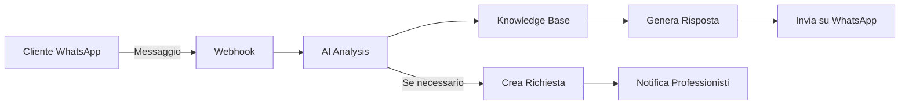

# 📱 INTEGRAZIONE WHATSAPP CON AI E KNOWLEDGE BASE

## 🚀 PANORAMICA

Il sistema ora include un'integrazione completa con WhatsApp che permette:
- **Comunicazione bidirezionale** via WhatsApp
- **AI Assistant** che risponde automaticamente ai messaggi
- **Knowledge Base** integrata per risposte immediate
- **Creazione automatica** di richieste di assistenza
- **Notifiche real-time** ai professionisti

## 🎯 FUNZIONALITÀ PRINCIPALI

### 1. WhatsApp Bot Intelligente
- Risponde automaticamente ai messaggi dei clienti
- Analizza il problema con AI (GPT-4)
- Cerca soluzioni nella Knowledge Base
- Crea richieste di assistenza quando necessario
- Supporta comandi rapidi (#STATO, #AIUTO, #MENU, etc.)

### 2. Knowledge Base
- Articoli di supporto categorizzati
- Ricerca semantica con AI embeddings
- Sistema di feedback (utile/non utile)
- Video e immagini tutorial
- Aggiornamento continuo da professionisti

### 3. Dashboard Admin
- Gestione connessione WhatsApp
- Invio messaggi singoli e broadcast
- Statistiche utilizzo
- Monitoraggio conversazioni

## 📋 CONFIGURAZIONE

### 1. Variabili d'Ambiente
Aggiungi nel file `.env`:

```env
# WhatsApp Integration (SendApp Cloud)
SENDAPP_BASE_URL=https://app.sendapp.cloud/api
SENDAPP_ACCESS_TOKEN=64833dfa0xxxx  # Il tuo access token
SENDAPP_INSTANCE_ID=                # Verrà generato automaticamente
SENDAPP_WEBHOOK_URL=http://your-domain.com/api/whatsapp/webhook

# OpenAI (per AI)
OPENAI_API_KEY=sk-...  # La tua API key OpenAI

# Support
SUPPORT_PHONE=800123456  # Numero supporto telefonico
```

### 2. Inizializzazione WhatsApp
1. Vai su `/admin/whatsapp` nel pannello admin
2. Clicca su "Inizializza WhatsApp"
3. Scansiona il QR Code con WhatsApp
4. Il sistema è pronto!

## 🤖 COMANDI WHATSAPP

Gli utenti possono usare questi comandi:

- **AIUTO** - Mostra il menu di aiuto
- **STATO** - Vedi le richieste attive
- **STATO [ID]** - Dettagli richiesta specifica
- **PREVENTIVO [ID]** - Stato del preventivo
- **ANNULLA [ID]** - Annulla una richiesta
- **MENU** - Menu principale dei servizi

## 🔄 FLUSSO DI FUNZIONAMENTO

### Messaggio Cliente → Risposta AI



### Esempio Conversazione

```
Cliente: "Ho una perdita d'acqua sotto il lavandino"

Bot: "🔧 Capisco il problema con la perdita d'acqua.

Prima di chiamare un tecnico, prova questi passaggi:
1. Chiudi il rubinetto generale dell'acqua
2. Metti un secchio sotto la perdita
3. Controlla se il tubo è allentato

Vuoi che ti mandi un idraulico? Risposta SI per creare una richiesta urgente."

Cliente: "SI"

Bot: "✅ Richiesta #REQ123 creata!
Un professionista ti contatterà entro 30 minuti.
Digita STATO 123 per aggiornamenti."
```

## 📊 API ENDPOINTS

### WhatsApp
- `GET /api/whatsapp/status` - Stato connessione
- `GET /api/whatsapp/qrcode` - Ottieni QR code
- `POST /api/whatsapp/initialize` - Inizializza istanza
- `POST /api/whatsapp/send` - Invia messaggio
- `POST /api/whatsapp/webhook` - Ricevi messaggi
- `POST /api/whatsapp/broadcast` - Invio multiplo
- `GET /api/whatsapp/stats` - Statistiche

### Knowledge Base
- `GET /api/kb/articles` - Lista articoli
- `GET /api/kb/articles/:id` - Dettaglio articolo
- `POST /api/kb/articles` - Crea articolo
- `PUT /api/kb/articles/:id` - Aggiorna articolo
- `DELETE /api/kb/articles/:id` - Elimina articolo
- `POST /api/kb/feedback` - Invia feedback
- `GET /api/kb/search` - Ricerca semantica
- `GET /api/kb/popular` - Articoli popolari
- `GET /api/kb/categories` - Lista categorie

## 🗄️ STRUTTURA DATABASE

### Nuove Tabelle

#### WhatsAppMessage
```prisma
model WhatsAppMessage {
  id           String   @id
  phoneNumber  String
  message      String
  type         WhatsAppMessageDirection
  status       String
  mediaUrl     String?
  userId       String?
  timestamp    DateTime
}
```

#### WhatsAppSession
```prisma
model WhatsAppSession {
  id           String   @id
  phoneNumber  String   @unique
  userId       String?
  context      Json?    // Contesto conversazione AI
  lastActivity DateTime
  isActive     Boolean
}
```

#### KnowledgeBaseArticle
```prisma
model KnowledgeBaseArticle {
  id           String   @id
  title        String
  content      String
  category     String?
  tags         String[]
  imageUrl     String?
  videoUrl     String?
  author       String?
  published    Boolean
  views        Int
  helpful      Int
  notHelpful   Int
  embedding    Json?    // Vector embedding per ricerca AI
}
```

## 🎨 COMPONENTI FRONTEND

### WhatsAppManager
Posizione: `/src/components/admin/whatsapp/WhatsAppManager.tsx`

Funzionalità:
- Gestione connessione WhatsApp
- Invio messaggi singoli
- Broadcast a più numeri
- Visualizzazione statistiche

### KnowledgeBase
Posizione: `/src/components/knowledgebase/KnowledgeBase.tsx`

Funzionalità:
- Visualizzazione articoli
- Ricerca e filtri
- Creazione/modifica articoli
- Sistema feedback

## 🚀 DEPLOYMENT

### Requisiti
- Node.js 18+
- PostgreSQL 14+
- Redis (per cache e sessioni)
- Account SendApp Cloud
- API Key OpenAI

### Setup Produzione

1. **Configura Webhook pubblico**
   ```
   SENDAPP_WEBHOOK_URL=https://tuodominio.com/api/whatsapp/webhook
   ```

2. **Configura SSL** (obbligatorio per webhook)

3. **Avvia servizi**
   ```bash
   npm run build
   npm start
   ```

## 🔧 TROUBLESHOOTING

### WhatsApp non si connette
1. Verifica che l'access token sia corretto
2. Controlla i log: `tail -f logs/whatsapp.log`
3. Rigenera il QR code

### AI non risponde
1. Verifica la API key OpenAI
2. Controlla il credito disponibile su OpenAI
3. Verifica i log: `tail -f logs/ai.log`

### Knowledge Base vuota
1. Crea articoli dal pannello admin
2. Importa articoli esistenti
3. Verifica permessi database

## 📈 METRICHE E MONITORING

Il sistema traccia automaticamente:
- Messaggi inviati/ricevuti
- Richieste create via WhatsApp
- Tempo risposta AI
- Articoli KB più consultati
- Feedback positivi/negativi

Visualizza le metriche in:
- `/admin/whatsapp` - Dashboard WhatsApp
- `/admin/analytics` - Analytics generale

## 🔒 SICUREZZA

- Tutti i messaggi sono criptati end-to-end da WhatsApp
- I dati sensibili non vengono salvati nei log
- Le sessioni WhatsApp scadono dopo 24h di inattività
- Rate limiting su tutte le API
- Validazione input con Zod

## 📝 NOTE IMPORTANTI

1. **GDPR Compliance**: Informare gli utenti che i messaggi vengono processati da AI
2. **Costi**: L'integrazione usa API a pagamento (SendApp, OpenAI)
3. **Limiti**: WhatsApp Business API ha limiti di messaggi/giorno
4. **Backup**: Eseguire backup regolari del database

## 🆘 SUPPORTO

Per problemi con l'integrazione:
- Email: support@lmtecnologie.it
- Documentazione: `/docs/whatsapp-integration`
- Logs: `/logs/whatsapp-*.log`

---

**Versione**: 1.0.0
**Ultimo aggiornamento**: 12 Settembre 2025
**Autore**: LM Tecnologie
