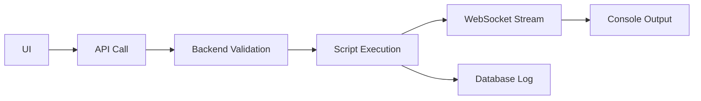

# 🛠️ SCRIPT MANAGER - DOCUMENTAZIONE COMPLETA
**Versione**: 2.0.0  
**Data**: 10 Gennaio 2025  
**Stato**: ✅ Produzione

---

## 📋 INDICE

1. [Overview](#overview)
2. [Architettura](#architettura)
3. [Funzionalità](#funzionalità)
4. [Database Schema](#database-schema)
5. [API Endpoints](#api-endpoints)
6. [Interfaccia Utente](#interfaccia-utente)
7. [Sicurezza](#sicurezza)
8. [Configurazione Script](#configurazione-script)
9. [Troubleshooting](#troubleshooting)

---

## 🎯 OVERVIEW

Il **Script Manager** è un sistema completo per la gestione, esecuzione e monitoraggio di script di sistema attraverso un'interfaccia web sicura e user-friendly.

### Caratteristiche Principali
- ✅ **Esecuzione sicura** di script dal browser
- ✅ **Gestione configurazioni** nel database
- ✅ **Documentazione integrata** per ogni script
- ✅ **Output real-time** con WebSocket
- ✅ **Console avanzata** con fullscreen
- ✅ **CRUD completo** per configurazioni
- ✅ **Categorizzazione** e livelli di rischio
- ✅ **Role-based access control**

---

## 🏗️ ARCHITETTURA

### Stack Tecnologico
```yaml
Frontend:
  - React con TypeScript
  - TanStack Query per API
  - WebSocket per output real-time
  - Tailwind CSS per styling
  - Heroicons per icone

Backend:
  - Node.js + Express
  - Prisma ORM
  - PostgreSQL database
  - Socket.io per WebSocket
  - Child Process per esecuzione script

Database:
  - Tabella ScriptConfiguration
  - Tabella ScriptExecution
  - Campi JSON per documentazione
```

### Flusso di Esecuzione


---

## 🚀 FUNZIONALITÀ

### 1. Esecuzione Script
- **Console interattiva** con output real-time
- **Fullscreen mode** per visualizzazione estesa
- **Resize dinamico** della console
- **Syntax highlighting** per output
- **Auto-scroll** durante esecuzione
- **Progress indicator** animato

### 2. Gestione Configurazioni
- **CRUD completo** via interfaccia web
- **3 Tab organizzate**:
  - Configurazione Base
  - Documentazione
  - Opzioni Avanzate
- **Toggle abilitazione** rapido
- **Ordinamento personalizzato**

### 3. Documentazione Integrata
- **Cosa controlla** lo script
- **Come interpretare** l'output
- **Problemi comuni** e soluzioni
- **Quando usarlo**
- **Scopo principale**

### 4. Categorizzazione
```typescript
enum ScriptCategory {
  DATABASE      // Script database
  MAINTENANCE   // Manutenzione sistema
  REPORT        // Generazione report
  SECURITY      // Controlli sicurezza
  UTILITY       // Utility generiche
  ANALYSIS      // Analisi dati
  TESTING       // Test sistema
}
```

### 5. Livelli di Rischio
```typescript
enum ScriptRisk {
  LOW       // Basso rischio (lettura)
  MEDIUM    // Medio rischio (modifica minori)
  HIGH      // Alto rischio (modifiche importanti)
  CRITICAL  // Critico (operazioni pericolose)
}
```

---

## 🗄️ DATABASE SCHEMA

### Tabella ScriptConfiguration
```prisma
model ScriptConfiguration {
  id                String           @id @default(cuid())
  scriptName        String           @unique
  displayName       String
  description       String           @db.Text
  category          ScriptCategory
  risk              ScriptRisk
  
  // Configurazione esecuzione
  filePath          String
  timeout           Int              @default(60000)
  requiresConfirmation Boolean      @default(false)
  allowedRoles      Role[]
  
  // UI Configuration
  icon              String?
  color             String?
  order             Int              @default(0)
  
  // Documentazione
  purpose           String?          @db.Text
  whenToUse         String?          @db.Text
  whatItChecks      Json?            // Array di controlli
  interpreteOutput  Json?            // Oggetto chiave-valore
  commonIssues      Json?            // Array di problemi
  sections          Json?            // Per script complessi
  
  // Flags
  hasQuickMode      Boolean          @default(false)
  isComplexScript   Boolean          @default(false)
  isEnabled         Boolean          @default(true)
  isVisible         Boolean          @default(true)
  isDangerous       Boolean          @default(false)
  
  // Metadata
  createdAt         DateTime         @default(now())
  updatedAt         DateTime         @updatedAt
  
  // Relazioni
  executions        ScriptExecution[]
}
```

### Tabella ScriptExecution
```prisma
model ScriptExecution {
  id              String          @id @default(cuid())
  scriptName      String
  scriptId        String?
  executedBy      String
  executedByUser  User            @relation(...)
  scriptConfig    ScriptConfiguration? @relation(...)
  startedAt       DateTime        @default(now())
  completedAt     DateTime?
  output          String?         @db.Text
  error           String?         @db.Text
  exitCode        Int?
  success         Boolean         @default(false)
  duration        Int?
  parameters      Json?
  createdAt       DateTime        @default(now())
  updatedAt       DateTime        @updatedAt
}
```

---

## 🔌 API ENDPOINTS

### Script Management
```typescript
// Lista configurazioni
GET    /api/admin/script-configs

// Crea nuova configurazione
POST   /api/admin/script-configs

// Aggiorna configurazione
PUT    /api/admin/script-configs/:id

// Elimina configurazione
DELETE /api/admin/script-configs/:id

// Toggle abilitazione
PATCH  /api/admin/script-configs/:id/toggle
```

### Script Execution
```typescript
// Lista script disponibili
GET    /api/admin/scripts

// Esegui script
POST   /api/admin/scripts/execute
Body: {
  scriptName: string,
  parameters?: any
}

// Storico esecuzioni
GET    /api/admin/scripts/history
```

---

## 💻 INTERFACCIA UTENTE

### 1. Pagina Principale (/admin/scripts)
```
┌─────────────────────────────────────┐
│  Script Manager                     │
│  ┌─────────────────────────────┐    │
│  │ [Gestione Script] button    │    │
│  └─────────────────────────────┘    │
│                                      │
│  Tabs: [Esegui] [Documentazione]    │
│                                      │
│  Script disponibili:                │
│  ┌──────────────────────────────┐   │
│  │ ○ Check System               │   │
│  │ ○ Pre-commit Check           │   │
│  │ ○ Validate Work              │   │
│  └──────────────────────────────┘   │
│                                      │
│  Console Output:                    │
│  ┌──────────────────────────────┐   │
│  │ $ executing script...         │   │
│  │ ✅ Check 1 passed             │   │
│  │ ⚠️ Warning found              │   │
│  └──────────────────────────────┘   │
└─────────────────────────────────────┘
```

### 2. Gestione Configurazioni (/admin/scripts/config)
```
┌─────────────────────────────────────┐
│  Gestione Configurazione Script     │
│  ┌─────────────────────────────┐    │
│  │ [+ Nuovo Script]            │    │
│  └─────────────────────────────┘    │
│                                      │
│  Tabella Script:                    │
│  ┌──────────────────────────────┐   │
│  │ Nome │ Cat │ Risk │ Doc │ ⚙️ │   │
│  ├──────────────────────────────┤   │
│  │ ... scrollable table ...     │   │
│  └──────────────────────────────┘   │
└─────────────────────────────────────┘
```

### 3. Modal Modifica (3 Tab)
```
Tab 1: Configurazione Base
  - Nome script
  - Descrizione
  - Categoria e rischio
  - Percorso file
  - Timeout

Tab 2: Documentazione
  - Scopo dello script
  - Quando usarlo
  - Cosa controlla (lista dinamica)
  - Interpretazione output (chiave-valore)
  - Problemi comuni (lista dinamica)

Tab 3: Opzioni Avanzate
  - Richiede conferma
  - Modalità veloce
  - Script complesso
  - Abilitato/Visibile
  - Script pericoloso
  - Icona e colore
```

---

## 🔒 SICUREZZA

### Controlli Implementati
1. **Autenticazione richiesta** per accesso
2. **Role-based access** (ADMIN, SUPER_ADMIN)
3. **Whitelist script** nel database
4. **Sandbox execution** con timeout
5. **Parameter validation** prima dell'esecuzione
6. **Audit log** di tutte le esecuzioni
7. **Confirmation dialog** per script pericolosi

### Best Practices
```javascript
// ✅ CORRETTO - Script whitelisted
const allowedScript = await prisma.scriptConfiguration.findUnique({
  where: { scriptName, isEnabled: true }
});

// ❌ EVITARE - Esecuzione diretta
exec(userInput); // MAI fare questo!
```

---

## ⚙️ CONFIGURAZIONE SCRIPT

### Esempio Configurazione Completa
```javascript
{
  scriptName: "check-system",
  displayName: "Controllo Sistema",
  description: "Verifica completa dello stato del sistema",
  category: "UTILITY",
  risk: "LOW",
  filePath: "/scripts/check-system.sh",
  timeout: 60000,
  requiresConfirmation: false,
  allowedRoles: ["ADMIN", "SUPER_ADMIN"],
  icon: "ArrowPathIcon",
  color: "blue",
  order: 1,
  
  // Documentazione
  purpose: "Verifica lo stato completo del sistema di sviluppo",
  whenToUse: "All'inizio di ogni sessione di lavoro",
  whatItChecks: [
    "Node.js e NPM installati",
    "Database PostgreSQL connesso",
    "Redis server attivo",
    "Porte libere o occupate",
    "File critici presenti"
  ],
  interpreteOutput: {
    "✅ Verde": "Tutto funziona correttamente",
    "⚠️ Giallo": "Attenzione, problema non bloccante",
    "❌ Rosso": "Errore che deve essere risolto"
  },
  commonIssues: [
    "Port already in use: Servizio già attivo su quella porta",
    "Database not connected: Verificare DATABASE_URL",
    "Redis not running: Avviare con redis-server"
  ],
  
  // Flags
  hasQuickMode: false,
  isComplexScript: false,
  isEnabled: true,
  isVisible: true,
  isDangerous: false
}
```

---

## 🔧 TROUBLESHOOTING

### Problemi Comuni

#### Script non appare nella lista
```bash
# Verificare nel database
SELECT * FROM "ScriptConfiguration" WHERE scriptName = 'nome-script';

# Controllare che sia abilitato e visibile
UPDATE "ScriptConfiguration" 
SET isEnabled = true, isVisible = true 
WHERE scriptName = 'nome-script';
```

#### Output non visibile
1. Verificare WebSocket connection
2. Controllare console browser per errori
3. Verificare che il backend stia streamando

#### Errore di timeout
```javascript
// Aumentare timeout per script lunghi
{
  timeout: 300000  // 5 minuti invece di 1 minuto
}
```

#### Permessi negati
1. Verificare ruolo utente
2. Controllare allowedRoles dello script
3. Verificare permessi file system

---

## 📝 CHANGELOG

### v2.0.0 - 10 Gennaio 2025
- ✨ Aggiunta gestione configurazioni CRUD completa
- ✨ Implementata documentazione nel database
- ✨ Creata interfaccia con 3 tab per editing
- ✨ Aggiunto scroll alla tabella configurazioni
- ✨ Migliorata console con fullscreen e resize
- 🐛 Fix navigazione con React Router
- 📚 Documentazione completa aggiornata

### v1.0.0 - 8 Gennaio 2025
- 🎉 Prima release
- ✨ Esecuzione script base
- ✨ Output real-time
- ✨ Categorizzazione script

---

## 🚀 PROSSIMI SVILUPPI

- [ ] Parametri dinamici con form builder
- [ ] Scheduling automatico script
- [ ] Export risultati in PDF
- [ ] Grafici performance script
- [ ] Notifiche email su errori
- [ ] Multi-language support
- [ ] Dark mode

---

**Fine Documento**

Questo documento rappresenta lo stato attuale del sistema Script Manager.
Ultimo aggiornamento: 10 Gennaio 2025
Mantenuto da: Team Sviluppo
