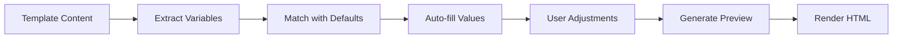

# 🔔 SISTEMA NOTIFICHE v4.0 - DOCUMENTAZIONE COMPLETA
**Data**: 12 Settembre 2025  
**Versione**: 4.0.0  
**Stato**: ✅ Production Ready

---

## 📋 INDICE

1. [Overview del Sistema](#overview-del-sistema)
2. [Architettura](#architettura)
3. [Template System](#template-system)
4. [Eventi Automatici](#eventi-automatici)
5. [Sistema di Anteprima](#sistema-di-anteprima)
6. [Audit Log Integration](#audit-log-integration)
7. [API Reference](#api-reference)
8. [Guida Utente](#guida-utente)

---

## 🎯 OVERVIEW DEL SISTEMA

Il Sistema Notifiche v4.0 è una soluzione enterprise completa per la gestione di notifiche multi-canale con template configurabili, eventi automatici e tracciabilità completa.

### Caratteristiche Principali
- **Multi-canale**: Email, WebSocket, SMS, WhatsApp
- **Template Editor**: Editor visuale con sintassi {{variabile}}
- **Eventi Automatici**: Trigger configurabili su azioni sistema
- **Anteprima Live**: Preview in tempo reale con dati auto-compilati
- **Audit Log**: Tracciabilità completa di ogni notifica
- **Smart Variables**: 40+ variabili predefinite con valori di default

---

## 🏗️ ARCHITETTURA

### Database Schema

```prisma
// Template di notifica
model NotificationTemplate {
  id              String    @id @default(cuid())
  code            String    @unique
  name            String
  description     String?
  category        String
  subject         String?   // Oggetto email
  htmlContent     String    @db.Text
  textContent     String?   @db.Text
  smsContent      String?   @db.Text
  whatsappContent String?   @db.Text
  variables       Json      // Array di definizioni variabili
  channels        Json      // ["email", "websocket", "sms", "whatsapp"]
  priority        NotificationPriority @default(NORMAL)
  isActive        Boolean   @default(true)
  isSystem        Boolean   @default(false)
  version         Int       @default(1)
  createdAt       DateTime  @default(now())
  updatedAt       DateTime  @updatedAt
  
  events          NotificationEvent[]
  logs            NotificationLog[]
}

// Eventi che triggherano notifiche
model NotificationEvent {
  id              String    @id @default(cuid())
  code            String    @unique
  name            String
  description     String?
  eventType       String    // "request_created", "quote_received", etc
  entityType      String?   // "request", "quote", "user"
  conditions      Json?     // Condizioni per il trigger
  templateId      String
  delay           Int?      // Delay in minuti
  retryPolicy     Json?
  isActive        Boolean   @default(true)
  
  NotificationTemplate NotificationTemplate @relation(fields: [templateId], references: [id])
}

// Log delle notifiche inviate
model NotificationLog {
  id              String    @id @default(cuid())
  templateId      String?
  recipientId     String
  channel         String
  status          String    // sent, delivered, failed, bounced
  subject         String?
  content         String?   @db.Text
  variables       Json?
  metadata        Json?
  sentAt          DateTime?
  deliveredAt     DateTime?
  readAt          DateTime?
  failureReason   String?
  retryCount      Int       @default(0)
  createdAt       DateTime  @default(now())
  
  template        NotificationTemplate? @relation(fields: [templateId], references: [id])
  recipient       User @relation("RecipientNotificationLogs", fields: [recipientId], references: [id])
}

// Coda di invio
model NotificationQueue {
  id              String    @id @default(cuid())
  templateCode    String
  recipientId     String
  variables       Json
  channels        Json
  priority        NotificationPriority @default(NORMAL)
  scheduledFor    DateTime?
  processedAt     DateTime?
  status          String    @default("pending")
  attempts        Int       @default(0)
  lastError       String?
  createdAt       DateTime  @default(now())
  
  recipient       User @relation("RecipientNotificationQueue", fields: [recipientId], references: [id])
}
```

---

## 📝 TEMPLATE SYSTEM

### Sintassi Variabili

Le variabili utilizzano la sintassi Mustache-like:
```
{{nomeVariabile}}
```

### Variabili Predefinite

Il sistema include 40+ variabili predefinite con valori di default intelligenti:

#### 👤 Variabili Utente
- `{{nome}}` → "Mario"
- `{{cognome}}` → "Rossi"
- `{{fullName}}` → "Mario Rossi"
- `{{email}}` → "mario.rossi@example.com"
- `{{telefono}}` → "+39 333 1234567"

#### 🏢 Variabili Sistema
- `{{appName}}` → "Sistema Assistenza"
- `{{companyName}}` → "LM Tecnologie"
- `{{siteUrl}}` → "https://assistenza.example.com"
- `{{supportEmail}}` → "support@assistenza.it"
- `{{supportPhone}}` → "+39 02 12345678"

#### 📋 Variabili Richieste
- `{{requestId}}` → "REQ-2025-001234"
- `{{requestTitle}}` → "Riparazione urgente impianto"
- `{{requestStatus}}` → "In attesa"
- `{{requestDate}}` → Data formattata
- `{{requestTime}}` → Ora formattata

#### 👷 Variabili Professionista
- `{{professionalName}}` → "Giovanni Bianchi"
- `{{professionalPhone}}` → "+39 335 9876543"
- `{{professionalEmail}}` → "g.bianchi@pro.it"

#### 💰 Variabili Preventivo
- `{{quoteId}}` → "QUO-2025-004567"
- `{{quoteAmount}}` → "€ 350,00"
- `{{quoteValidUntil}}` → Data di scadenza

#### 📅 Variabili Intervento
- `{{interventionDate}}` → Data intervento
- `{{interventionTime}}` → "14:30"
- `{{interventionAddress}}` → "Via Roma 123, Milano"

### Esempio Template Email

```html
<!DOCTYPE html>
<html>
<head>
    <style>
        .container { max-width: 600px; margin: 0 auto; }
        .header { background: #4F46E5; color: white; padding: 20px; }
        .content { padding: 20px; }
        .footer { background: #f3f4f6; padding: 10px; text-align: center; }
    </style>
</head>
<body>
    <div class="container">
        <div class="header">
            <h1>Ciao {{nome}}!</h1>
        </div>
        <div class="content">
            <p>La tua richiesta <strong>{{requestId}}</strong> è stata ricevuta.</p>
            <p>Un professionista ti contatterà entro 24 ore.</p>
            <p>Dettagli richiesta:</p>
            <ul>
                <li>Titolo: {{requestTitle}}</li>
                <li>Data: {{requestDate}}</li>
                <li>Stato: {{requestStatus}}</li>
            </ul>
        </div>
        <div class="footer">
            <p>{{companyName}} - {{supportEmail}}</p>
        </div>
    </div>
</body>
</html>
```

---

## ⚡ EVENTI AUTOMATICI

### Eventi Disponibili

Il sistema supporta i seguenti eventi trigger:

#### Richieste
- `request_created` - Nuova richiesta creata
- `request_assigned` - Richiesta assegnata
- `request_updated` - Richiesta aggiornata
- `request_completed` - Richiesta completata
- `request_cancelled` - Richiesta annullata

#### Preventivi
- `quote_received` - Preventivo ricevuto
- `quote_accepted` - Preventivo accettato
- `quote_rejected` - Preventivo rifiutato
- `quote_expiring` - Preventivo in scadenza

#### Pagamenti
- `payment_completed` - Pagamento completato
- `payment_failed` - Pagamento fallito
- `deposit_received` - Deposito ricevuto

#### Chat
- `message_received` - Messaggio ricevuto

#### Sistema
- `user_registered` - Nuovo utente registrato
- `password_reset` - Reset password richiesto
- `account_verified` - Account verificato

### Configurazione Eventi

```javascript
// Esempio configurazione evento
{
  code: "request_created_notification",
  name: "Notifica Nuova Richiesta",
  eventType: "request_created",
  entityType: "request",
  templateId: "template_welcome_request",
  delay: 0,  // Invio immediato
  conditions: {
    priority: ["HIGH", "URGENT"]  // Solo per priorità alta
  },
  retryPolicy: {
    maxAttempts: 3,
    delayMinutes: 5
  },
  isActive: true
}
```

---

## 👁️ SISTEMA DI ANTEPRIMA

### Auto-compilazione Intelligente

Il sistema analizza automaticamente il contenuto del template e:
1. **Estrae le variabili** usando regex pattern matching
2. **Assegna valori di default** dal dizionario predefinito
3. **Popola i campi** nell'interfaccia di preview
4. **Genera l'anteprima** con un click

### Flusso di Anteprima



### API Preview

```typescript
POST /api/notification-templates/preview
{
  htmlContent: string,
  textContent?: string,
  smsContent?: string,
  whatsappContent?: string,
  subject?: string,
  variables: {
    nome: "Mario",
    requestId: "REQ-2025-001234",
    // ... altre variabili
  }
}

// Response
{
  success: true,
  data: {
    html: "<h1>Ciao Mario!</h1>...",
    text: "Ciao Mario...",
    sms: "Mario, la tua richiesta...",
    whatsapp: "*Mario*, richiesta...",
    subject: "Richiesta REQ-2025-001234 ricevuta"
  }
}
```

---

## 📊 AUDIT LOG INTEGRATION

### Tracciamento Completo

Ogni operazione sul sistema notifiche viene tracciata:

```typescript
// Esempio log audit
{
  action: "NOTIFICATION_SENT",
  entityType: "Notification",
  entityId: "notif_123",
  userId: "user_456",
  oldValues: null,
  newValues: {
    templateCode: "welcome_email",
    recipient: "user@example.com",
    channel: "email",
    status: "sent"
  },
  success: true,
  severity: "INFO",
  category: "BUSINESS",
  ipAddress: "192.168.1.1",
  userAgent: "Mozilla/5.0...",
  createdAt: "2025-09-12T10:30:00Z"
}
```

### Eventi Tracciati
- Template creazione/modifica/eliminazione
- Invio notifiche (successo/fallimento)
- Eventi trigger attivati
- Modifiche configurazione
- Accesso preview template

---

## 🔌 API REFERENCE

### Template Endpoints

```typescript
// Lista template
GET /api/notification-templates/templates
Query params: category, isActive, search

// Crea template
POST /api/notification-templates/templates
Body: NotificationTemplate

// Aggiorna template
PUT /api/notification-templates/templates/:id
Body: Partial<NotificationTemplate>

// Elimina template
DELETE /api/notification-templates/templates/:id

// Preview template
POST /api/notification-templates/preview
Body: { htmlContent, variables, ... }
```

### Event Endpoints

```typescript
// Lista eventi
GET /api/notification-templates/events
Query params: eventType, isActive

// Crea evento
POST /api/notification-templates/events
Body: NotificationEvent

// Aggiorna evento
PUT /api/notification-templates/events/:id
Body: Partial<NotificationEvent>

// Elimina evento
DELETE /api/notification-templates/events/:id
```

### Statistics Endpoints

```typescript
// Statistiche generali
GET /api/notification-templates/statistics

// Log notifiche
GET /api/notification-templates/logs
Query params: channel, status, dateFrom, dateTo
```

---

## 📱 GUIDA UTENTE

### Creare un Nuovo Template

1. **Accedi al Sistema Notifiche**
   - Menu → Sistema Notifiche
   - Click su "Nuovo Template"

2. **Compila i Dettagli**
   - Codice univoco (es: `welcome_email`)
   - Nome descrittivo
   - Categoria (Sistema, Richieste, etc)
   - Canali di invio

3. **Scrivi il Contenuto**
   - Tab HTML per email
   - Tab SMS per messaggi brevi
   - Tab WhatsApp per messaggistica
   - Usa variabili con `{{nomeVariabile}}`

4. **Anteprima Automatica**
   - Vai alla tab Anteprima
   - Le variabili sono già compilate!
   - Modifica se necessario
   - Click "Genera Anteprima"

5. **Salva il Template**
   - Verifica tutto
   - Click "Crea Template"

### Configurare un Evento Automatico

1. **Tab Eventi**
   - Click su "Nuovo Evento"

2. **Seleziona Trigger**
   - Scegli tipo evento (es: request_created)
   - Seleziona template da inviare

3. **Configura Opzioni**
   - Delay (ritardo invio)
   - Condizioni (es: solo priorità alta)
   - Retry policy

4. **Attiva l'Evento**
   - Toggle "Attivo"
   - Salva configurazione

### Best Practices

✅ **DO:**
- Usa nomi variabili descrittivi
- Testa sempre con l'anteprima
- Configura retry per email critiche
- Usa priorità appropriate
- Mantieni template concisi per SMS

❌ **DON'T:**
- Non hardcodare valori nei template
- Non disabilitare l'audit log
- Non usare HTML complesso per email
- Non superare 160 caratteri per SMS
- Non dimenticare il fallback text

---

## 🚀 MIGLIORAMENTI FUTURI

### In Roadmap
- [ ] Template versioning con diff
- [ ] A/B testing templates
- [ ] Template marketplace
- [ ] Visual template builder
- [ ] Analytics dashboard avanzata
- [ ] Integrazione con più provider email
- [ ] Supporto per template multilingua
- [ ] Batch sending optimization
- [ ] Template scheduling calendar
- [ ] AI-powered content suggestions

---

## 📞 SUPPORTO

Per assistenza sul Sistema Notifiche:
- Email: support@lmtecnologie.it
- Documentazione: `/DOCUMENTAZIONE/ATTUALE/`
- Issues: GitHub repository

---

**Documento mantenuto da**: Team Sviluppo LM Tecnologie  
**Ultimo aggiornamento**: 12 Settembre 2025  
**Versione documento**: 1.0.0
