# 🤖 SISTEMA AI DUALE - DOCUMENTAZIONE TECNICA
**Versione**: 2.0  
**Data**: 16 Settembre 2025  
**Stato**: ✅ Completato e Funzionante

---

## 📋 INDICE
1. [Overview](#overview)
2. [Architettura](#architettura)
3. [Database Schema](#database-schema)
4. [API Endpoints](#api-endpoints)
5. [Frontend Components](#frontend-components)
6. [Flusso Operativo](#flusso-operativo)
7. [Testing](#testing)
8. [Troubleshooting](#troubleshooting)

---

## 🎯 OVERVIEW

Il Sistema AI Duale permette ai professionisti di configurare due diverse personalità AI:
- **Modalità Professionista**: Per supporto tecnico avanzato ai professionisti
- **Modalità Cliente**: Per assistenza semplificata ai clienti finali

### Caratteristiche Principali
- ✅ **Due tabelle database separate** per le configurazioni
- ✅ **Configurazione indipendente** per ogni modalità
- ✅ **Dashboard unificata** per gestire entrambe le modalità
- ✅ **Switching dinamico** tra le modalità nell'AI Test
- ✅ **Personalizzazione completa** di prompt, modello, temperatura, token

---

## 🏗️ ARCHITETTURA

### Stack Tecnologico
- **Backend**: Express.js + TypeScript + Prisma
- **Database**: PostgreSQL con 2 tabelle dedicate
- **Frontend**: React + TanStack Query + Tailwind CSS
- **AI**: OpenAI API (GPT-3.5/GPT-4)

### Struttura Database

```
┌─────────────────────────┐     ┌─────────────────────────┐
│ ProfessionalAiSettings  │     │   ClientAiSettings      │
├─────────────────────────┤     ├─────────────────────────┤
│ id                      │     │ id                      │
│ professionalId          │     │ professionalId          │
│ subcategoryId           │     │ subcategoryId           │
│ modelName               │     │ modelName               │
│ temperature             │     │ temperature             │
│ maxTokens               │     │ maxTokens               │
│ responseStyle           │     │ responseStyle           │
│ detailLevel             │     │ detailLevel             │
│ systemPrompt            │     │ systemPrompt            │
│ useKnowledgeBase        │     │ useKnowledgeBase        │
│ createdAt               │     │ createdAt               │
│ updatedAt               │     │ updatedAt               │
└─────────────────────────┘     └─────────────────────────┘
```

---

## 📊 DATABASE SCHEMA

### Tabella: ProfessionalAiSettings
Contiene le configurazioni AI per la modalità professionista.

```prisma
model ProfessionalAiSettings {
  id               String      @id @default(dbgenerated("gen_random_uuid()"))
  professionalId   String
  subcategoryId    String
  modelName        String      @default("gpt-3.5-turbo")
  temperature      Float       @default(0.7)
  maxTokens        Int         @default(2000)
  responseStyle    String      @default("formal")
  detailLevel      String      @default("intermediate")
  useKnowledgeBase Boolean     @default(true)
  systemPrompt     String?
  createdAt        DateTime    @default(now())
  updatedAt        DateTime    @updatedAt
  
  subcategory      Subcategory @relation(fields: [subcategoryId], references: [id])
  professional     User        @relation(fields: [professionalId], references: [id])
  
  @@unique([professionalId, subcategoryId])
}
```

### Tabella: ClientAiSettings
Contiene le configurazioni AI per la modalità cliente.

```prisma
model ClientAiSettings {
  id               String      @id @default(dbgenerated("gen_random_uuid()"))
  professionalId   String
  subcategoryId    String
  modelName        String      @default("gpt-3.5-turbo")
  temperature      Float       @default(0.7)
  maxTokens        Int         @default(1500)
  responseStyle    String      @default("friendly")
  detailLevel      String      @default("basic")
  useKnowledgeBase Boolean     @default(true)
  systemPrompt     String?
  createdAt        DateTime    @default(now())
  updatedAt        DateTime    @updatedAt
  
  subcategory      Subcategory @relation(fields: [subcategoryId], references: [id])
  professional     User        @relation("ClientAiSettings", fields: [professionalId], references: [id])
  
  @@unique([professionalId, subcategoryId])
}
```

---

## 🔌 API ENDPOINTS

### Endpoints Professionista

#### GET /api/professionals/:professionalId/ai-settings/:subcategoryId
Recupera le impostazioni AI per professionisti.

**Response:**
```json
{
  "success": true,
  "data": {
    "id": "...",
    "modelName": "gpt-4",
    "temperature": 0.3,
    "maxTokens": 3000,
    "responseStyle": "technical",
    "detailLevel": "advanced",
    "systemPrompt": "Sei un consulente tecnico esperto...",
    "useKnowledgeBase": true
  }
}
```

#### PUT /api/professionals/:professionalId/ai-settings/:subcategoryId
Aggiorna le impostazioni AI per professionisti.

### Endpoints Cliente

#### GET /api/client-settings/:professionalId/:subcategoryId
Recupera le impostazioni AI per clienti.

**Response:**
```json
{
  "success": true,
  "data": {
    "id": "...",
    "modelName": "gpt-3.5-turbo",
    "temperature": 0.7,
    "maxTokens": 1500,
    "responseStyle": "friendly",
    "detailLevel": "basic",
    "systemPrompt": "Sei un assistente cordiale...",
    "useKnowledgeBase": true
  }
}
```

#### PUT /api/client-settings/:professionalId/:subcategoryId
Aggiorna le impostazioni AI per clienti.

---

## 🎨 FRONTEND COMPONENTS

### Dashboard AI Duale
**Path**: `/admin/ai-dual-config`  
**Component**: `DualConfigManager.tsx`

#### Struttura Component Tree
```
DualConfigManager
├── TabSelector (Professional/Client)
├── SubcategorySelector
├── AIConfigForm
│   ├── ModelSelector
│   ├── ParametersConfig
│   └── SystemPromptEditor
└── SaveButton
```

### AI Test Interface
**Path**: `/admin/ai-test`  
**Component**: `ProfessionalAITestWithMode.tsx`

#### Features
- **Mode Selector**: Switch tra Professional/Client
- **Live Testing**: Test immediato delle configurazioni
- **Debug Info**: Visualizzazione prompt e parametri utilizzati

---

## 🔄 FLUSSO OPERATIVO

### 1. Configurazione (Admin Dashboard)

```mermaid
graph TD
    A[Admin apre Dashboard] --> B[Seleziona Sottocategoria]
    B --> C{Seleziona Modalità}
    C -->|Professional| D[Configura Settings Pro]
    C -->|Client| E[Configura Settings Client]
    D --> F[Salva in ProfessionalAiSettings]
    E --> G[Salva in ClientAiSettings]
```



### 2. Utilizzo (AI Service)


### 3. Service Logic (ai-professional.service.ts)

```typescript
// Pseudocodice del flusso
if (chatRequest.mode === 'client') {
  const settings = await prisma.clientAiSettings.findFirst({
    where: { professionalId, subcategoryId }
  });
  // Applica impostazioni cliente
} else {
  const settings = await prisma.professionalAiSettings.findFirst({
    where: { professionalId, subcategoryId }
  });
  // Applica impostazioni professionista
}
```

---

## 🧪 TESTING

### Test Case 1: Configurazione Professionista
1. Accedi come Admin
2. Vai a `/admin/ai-dual-config`
3. Seleziona sottocategoria "Assistenza Elettrodomestici"
4. Tab "Professionista"
5. Configura:
   - Model: GPT-4
   - Temperature: 0.3
   - Prompt: "Sei un tecnico esperto..."
6. Salva e verifica in DB

### Test Case 2: Configurazione Cliente
1. Stesso percorso
2. Tab "Cliente"
3. Configura:
   - Model: GPT-3.5
   - Temperature: 0.7
   - Prompt: "Pietro Costa risponde: ..."
4. Salva e verifica in DB

### Test Case 3: Verifica AI Response
1. Vai a `/admin/ai-test`
2. Seleziona sottocategoria
3. Modalità "Cliente"
4. Invia messaggio
5. Verifica che risponda con "Pietro Costa risponde:"

---

## 🔧 TROUBLESHOOTING

### Problema: "targetAudience" error
**Causa**: Campo rimasto dal vecchio schema  
**Soluzione**: Rimuovere tutti i riferimenti a `targetAudience`

### Problema: Settings non caricate per cliente
**Causa**: Service cerca nella tabella sbagliata  
**Soluzione**: Verificare che `mode === 'client'` usi `clientAiSettings`

### Problema: "updatedAt is missing"
**Causa**: Campo non ha `@updatedAt` automatico  
**Soluzione**: Aggiungere `@updatedAt` nel modello Prisma

### Debug Commands
```bash
# Verifica tabelle nel DB
psql -U lucamambelli -d assistenza_db
\dt "ClientAiSettings"
\dt "ProfessionalAiSettings"

# Check logs backend
tail -f backend/logs/combined.log | grep "AI SETTINGS"

# Reset e ricrea tabelle
cd backend
npx prisma migrate reset
npx prisma db push
```

---

## 📝 MIGRATION GUIDE

### Da Sistema Singolo a Duale

1. **Backup Database**
```sql
CREATE TABLE "ProfessionalAiSettings_backup" AS 
SELECT * FROM "ProfessionalAiSettings";
```

2. **Update Schema**
```bash
# Aggiungi ClientAiSettings al schema.prisma
npx prisma generate
npx prisma db push
```

3. **Update Routes**
- Crea `client-ai-settings.routes.ts`
- Registra in `server.ts`

4. **Update Service**
- Modifica `ai-professional.service.ts` per usare tabella corretta

5. **Update Frontend**
- Aggiorna endpoints in `DualConfigManager.tsx`

---

## 🚀 BEST PRACTICES

1. **Sempre salvare nelle tabelle corrette**
   - Professional settings → `ProfessionalAiSettings`
   - Client settings → `ClientAiSettings`

2. **Validazione Input**
   - Usa Zod schema per validare richieste
   - Controlla permessi utente

3. **Error Handling**
   - Gestisci caso di settings mancanti con defaults
   - Log errori per debugging

4. **Performance**
   - Cache settings in Redis per richieste frequenti
   - Usa indici su `professionalId` e `subcategoryId`

---

## 📚 FILE CORRELATI

### Backend
- `/backend/prisma/schema.prisma` - Database schema
- `/backend/src/routes/professional-ai-settings.routes.ts` - Routes professionisti
- `/backend/src/routes/client-ai-settings.routes.ts` - Routes clienti
- `/backend/src/services/ai-professional.service.ts` - AI service logic

### Frontend
- `/src/components/admin/ai-duale/DualConfigManager.tsx` - Dashboard config
- `/src/components/admin/ai-test/ProfessionalAITestWithMode.tsx` - Test interface
- `/src/services/api.ts` - API client

---

## ✅ CHECKLIST DEPLOYMENT

- [ ] Database migrato con entrambe le tabelle
- [ ] Backend routes registrate per entrambi gli endpoints
- [ ] Service AI aggiornato per usare tabelle corrette
- [ ] Frontend aggiornato con nuovi endpoints
- [ ] Test eseguiti per entrambe le modalità
- [ ] Documentazione aggiornata
- [ ] Backup database effettuato

---

**Ultimo aggiornamento**: 16 Settembre 2025  
**Autore**: Sistema Sviluppo  
**Versione**: 2.0
