# 🛠️ SCRIPT MANAGER - Documentazione Completa
**Versione**: 2.0.0  
**Data Aggiornamento**: 10 Gennaio 2025  
**Stato**: ✅ Production Ready

---

## 📋 INDICE

1. [Introduzione](#1-introduzione)
2. [Funzionalità Principali](#2-funzionalità-principali)
3. [Script Disponibili](#3-script-disponibili)
4. [Interfaccia Utente](#4-interfaccia-utente)
5. [Console Output Avanzata](#5-console-output-avanzata)
6. [Script di Analisi Completa](#6-script-di-analisi-completa)
7. [Script di Testing e Qualità](#7-script-di-testing-e-qualità) 🆕
8. [Guida all'Uso](#8-guida-alluso)
9. [Troubleshooting](#9-troubleshooting)

---

## 1. INTRODUZIONE

### 🎯 Cos'è Script Manager?

Script Manager è un'interfaccia web avanzata che permette di eseguire e monitorare gli script di sistema direttamente dal browser, senza dover aprire il terminale. È stato progettato per semplificare l'esecuzione di controlli complessi sul sistema, rendendo accessibili anche ai non sviluppatori funzionalità avanzate di diagnostica e manutenzione.

### ✨ Caratteristiche Principali

- **🖥️ Interfaccia Web Intuitiva**: Non serve conoscere comandi da terminale
- **📊 Console Output Avanzata**: Con resize, fullscreen, stampa ed export
- **⚡ Modalità Veloce**: Per script lunghi, salta controlli non essenziali
- **📚 Documentazione Integrata**: Ogni script ha documentazione dettagliata
- **🎨 Output Colorato**: Facile identificazione di errori, warning e successi
- **🔄 Real-time Updates**: Vedi l'output mentre lo script viene eseguito
- **📱 Responsive Design**: Funziona su desktop, tablet e mobile

### 🔐 Accesso

- **URL**: `/admin/script-manager`
- **Permessi**: Solo utenti con ruolo ADMIN o SUPER_ADMIN
- **Autenticazione**: Richiesta login con JWT valido

---

## 2. FUNZIONALITÀ PRINCIPALI

### 🎯 Tab Esecuzione Script

La schermata principale dove puoi:
- Vedere tutti gli script disponibili
- Eseguire script con un click
- Monitorare l'output in tempo reale
- Usare la modalità veloce per script complessi
- Vedere lo stato di esecuzione (in corso, completato, errore)

### 📚 Tab Documentazione

Documentazione completa per ogni script con:
- **Quando Usarlo**: Situazioni in cui lo script è utile
- **Cosa Controlla**: Lista dettagliata dei controlli eseguiti
- **Come Interpretare l'Output**: Significato di colori e simboli
- **Problemi Comuni**: Soluzioni ai problemi frequenti
- **17 Sezioni** (per script complessi): Dettaglio di ogni sezione di controllo

### 🖥️ Console Output Avanzata

#### 📏 Ridimensionabile
- **Maniglia di resize**: Barra grigia tra header e contenuto
- **Drag & Drop**: Trascina su/giù per cambiare altezza
- **Limiti**: Min 300px, Max altezza schermo - 200px
- **Feedback visivo**: La barra diventa blu quando ci passi sopra

#### 🖥️ Modalità Schermo Intero
- **Attivazione**: Click su icona con 4 frecce verso l'esterno
- **Overlay completo**: Console a tutto schermo con sfondo scuro
- **Toolbar dedicata**: Tutti i controlli disponibili
- **Uscita**: Click su icona con 4 frecce verso l'interno

#### 🖨️ Stampa Output
- **Formattazione automatica**: Rimuove codici colore per stampa pulita
- **Header informativo**: Nome script, timestamp, exit code
- **Layout ottimizzato**: Font monospace, margini corretti
- **Anteprima**: Si apre finestra di stampa del browser

#### 💾 Export come File
- **Formato**: File .txt pulito senza codici colore
- **Nome file**: `[nome-script]-output-[timestamp].txt`
- **Download automatico**: Si scarica immediatamente
- **Contenuto completo**: Include output, errori ed exit code

#### 🗑️ Pulizia Output
- **Reset rapido**: Cancella output dello script selezionato
- **Mantenimento storico**: Altri script mantengono il loro output
- **Disabilitato se vuoto**: Non attivo se non c'è output

---

## 3. SCRIPT DISPONIBILI

### 🔍 Script di Analisi Completa (17 Sezioni)

#### 📘 Analisi Completa Modulo Richieste
- **Nome**: `request-system-check-complete`
- **Durata**: 1-2 minuti (completo), 30 secondi (veloce)
- **Sezioni**: 17 controlli approfonditi
- **Health Score**: Percentuale di salute del modulo
- **Modalità Veloce**: Salta controlli TypeScript

#### 💰 Analisi Completa Modulo Preventivi
- **Nome**: `quote-system-check-complete`
- **Durata**: 1-2 minuti (completo), 30 secondi (veloce)
- **Sezioni**: 17 controlli specifici per preventivi
- **Focus**: Calcoli, versioning, workflow
- **Modalità Veloce**: Disponibile

#### 📋 Analisi Completa Modulo Rapporti
- **Nome**: `intervention-report-check-complete`
- **Durata**: 1-2 minuti (completo), 30 secondi (veloce)
- **Sezioni**: 17 controlli per rapporti intervento
- **Focus**: Firma digitale, materiali, PDF
- **Modalità Veloce**: Disponibile

#### ⚖️ Analisi Completa Sistema Audit
- **Nome**: `audit-system-check`
- **Durata**: 1-2 minuti (completo), 30 secondi (veloce)
- **Sezioni**: 17 controlli audit log
- **Focus**: Tracciamento, retention, compliance
- **Modalità Veloce**: Disponibile

### ⚡ Script di Controllo Rapido

#### 🔄 Controllo Sistema
- **Nome**: `check-system`
- **Durata**: 5-10 secondi
- **Cosa fa**: Verifica stato generale del sistema
- **Quando usarlo**: All'inizio di ogni sessione

#### ✅ Controllo Pre-Commit
- **Nome**: `pre-commit-check`
- **Durata**: 10-20 secondi
- **Cosa fa**: Tutti i controlli prima di salvare codice
- **Quando usarlo**: SEMPRE prima di un commit Git

#### ⚠️ Valida Modifiche
- **Nome**: `validate-work`
- **Durata**: 5-10 secondi
- **Cosa fa**: Controlla solo file modificati
- **Quando usarlo**: Dopo aver scritto codice

#### 📚 Guida Sviluppatore
- **Nome**: `claude-help`
- **Durata**: Istantaneo
- **Cosa fa**: Mostra guida rapida con regole progetto
- **Quando usarlo**: Quando hai dubbi sulle best practices

---

## 4. INTERFACCIA UTENTE

### 🎨 Layout Principale

```
┌──────────────────────────────────────────────────────┐
│  🛠️ Script Manager                        [Refresh]  │
│  Esegui e monitora gli script di sistema             │
├──────────────────────────────────────────────────────┤
│  [Esecuzione Script] │ [Documentazione]              │
├──────────────────────────────────────────────────────┤
│                                                       │
│  ┌─────────────────┐  ┌──────────────────────────┐  │
│  │ Script List     │  │ Console Output           │  │
│  │                 │  │ ┌──────────────────────┐ │  │
│  │ ○ Script 1     │  │ │ Header con toolbar   │ │  │
│  │ ○ Script 2     │  │ ├──────────────────────┤ │  │
│  │ ● Script 3     │  │ │ ═══ Resize Handle    │ │  │
│  │   [Run][Quick] │  │ ├──────────────────────┤ │  │
│  │                 │  │ │                      │ │  │
│  │                 │  │ │  Output Area         │ │  │
│  │                 │  │ │  (Ridimensionabile)  │ │  │
│  └─────────────────┘  │ └──────────────────────┘ │  │
│                        └──────────────────────────┘  │
└──────────────────────────────────────────────────────┘
```

### 🎯 Elementi UI

#### Card Script
- **Icona**: Identifica tipo di script
- **Titolo**: Nome tradotto in italiano
- **Descrizione**: Breve spiegazione
- **Badge stato**: Disponibile/Non disponibile
- **Timer avviso**: Per script lunghi (1-2 minuti)
- **Pulsanti azione**: Completo e Veloce (dove disponibile)
- **Stato esecuzione**: Icona animata durante esecuzione

#### Console Toolbar
```
┌─────────────────────────────────────────────────────┐
│ 💻 Console Output - [nome-script]                   │
│                                                      │
│  [🖨️ Stampa] [💾 Export] [🗑️ Pulisci] [⬚ Fullscreen] │
└─────────────────────────────────────────────────────┘
```

---

## 5. CONSOLE OUTPUT AVANZATA

### 🎨 Codifica Colori Output

- **✅ Verde**: Controllo passato con successo
- **⚠️ Giallo**: Warning, funziona ma migliorabile
- **❌ Rosso**: Errore che deve essere risolto
- **ℹ️ Blu**: Informazione, nessuna azione richiesta
- **⚪ Grigio**: Output generico o debug

### 📊 Health Score

Per script di analisi completa:
- **>90%**: 🟢 Eccellente - Sistema in ottima salute
- **80-90%**: 🟢 Buono - Piccoli miglioramenti possibili
- **60-80%**: 🟡 Attenzione - Diversi aspetti da migliorare
- **40-60%**: 🟠 Critico - Problemi importanti da risolvere
- **<40%**: 🔴 Grave - Sistema necessita intervento urgente

### 📋 Formato Output Tipico

```
═══════════════════════════════════════════════════════
🔍 ANALISI COMPLETA MODULO RICHIESTE
═══════════════════════════════════════════════════════

📊 SEZIONE 1: DATABASE E MODELLI PRISMA
───────────────────────────────────────────
✅ Connessione database attiva
✅ Schema Prisma sincronizzato
✅ Modello AssistanceRequest presente
⚠️ Indice mancante su campo 'status'
❌ Relazione 'quotes' non definita

Controlli: 5 | Passati: 3 | Warning: 1 | Errori: 1

[... altre 16 sezioni ...]

═══════════════════════════════════════════════════════
📊 HEALTH SCORE FINALE: 78% (Buono)
═══════════════════════════════════════════════════════
```

---

## 6. SCRIPT DI ANALISI COMPLETA

### 📋 Le 17 Sezioni Standard

Ogni script di analisi completa controlla 17 sezioni:

1. **DATABASE E MODELLI**: Connessione, schema, relazioni
2. **PAGINE FRONTEND**: Componenti React, routing
3. **TYPESCRIPT**: Compilazione, type checking
4. **API ROUTES**: Endpoint REST, CRUD operations
5. **SERVICES LAYER**: Business logic, transazioni
6. **INTEGRAZIONI**: Collegamenti tra moduli
7. **SICUREZZA**: RBAC, ownership, protezioni
8. **PERFORMANCE**: Cache, indici, query optimization
9. **WORKFLOW**: Stati, transizioni, business rules
10. **TESTING**: Unit test, integration test
11. **WEBSOCKET**: Real-time, eventi, notifiche
12. **METRICHE**: Monitoring, timing, analytics
13. **DOCUMENTAZIONE**: JSDoc, commenti, README
14. **VERSIONING**: API versioning, deprecation
15. **LOGGING**: Logger strutturato, livelli
16. **BACKUP**: Export, archivio, retention
17. **MONITORING**: Health check, alerting

### ⚡ Modalità Veloce vs Completa

#### Modalità Completa
- **Tutti i 17 controlli**: Nessuno saltato
- **TypeScript compilation**: Verifica completa
- **Durata**: 1-2 minuti
- **Quando usarla**: Controlli periodici approfonditi

#### Modalità Veloce (--quick)
- **Salta TypeScript**: Risparmia 30-60 secondi
- **Focus su runtime**: Controlli che non richiedono compilazione
- **Durata**: 20-40 secondi
- **Quando usarla**: Controlli rapidi durante sviluppo

---

## 7. SCRIPT DI TESTING E QUALITÀ 🆕

### 🔍 TypeScript Errors Check
- **Nome**: `typescript-errors-check`
- **Categoria**: Testing
- **Durata**: 30-120 secondi
- **Cosa fa**: Analizza tutti gli errori TypeScript nel progetto
- **Output**: 
  - File ordinati per numero di errori (più errori = prima posizione)
  - Backend e Frontend separati
  - Dettagli con numero di riga per ogni errore
  - Statistiche totali

### ✅ Check ResponseFormatter Usage
- **Nome**: `check-response-formatter`
- **Categoria**: Testing
- **Durata**: 5-10 secondi
- **Cosa fa**: Verifica l'uso corretto di ResponseFormatter
- **Controlli**:
  - Routes che NON usano ResponseFormatter (errore)
  - Services che usano ResponseFormatter (errore architetturale)
  - Pattern res.json() senza formatter
- **Output**: Lista violazioni con suggerimenti di correzione

### 🔗 Check Prisma Relations
- **Nome**: `check-prisma-relations`
- **Categoria**: Database
- **Durata**: 5-10 secondi
- **Cosa fa**: Analizza tutte le relazioni nel schema Prisma
- **Controlli**:
  - Relazioni con @relation (corrette)
  - Relazioni senza @relation (da correggere)
  - Statistiche per modello
  - Percentuale di conformità
- **Output**: Report dettagliato con suggerimenti

---

## 8. GUIDA ALL'USO

### 🚀 Quick Start

1. **Accedi a Script Manager**
   ```
   http://localhost:5193/admin/script-manager
   ```

2. **Scegli uno script**
   - Per controllo generale: `check-system`
   - Per analisi completa: Uno dei 4 script con 17 sezioni

3. **Esegui lo script**
   - Click su **[Completo]** per analisi dettagliata
   - Click su **[⚡ Veloce]** per versione rapida

4. **Monitora l'output**
   - Guarda i risultati apparire in tempo reale
   - Usa resize per vedere più output
   - Attiva fullscreen per analisi dettagliate

5. **Salva i risultati**
   - **Stampa**: Per documentazione cartacea
   - **Export**: Per analisi offline o condivisione

### 📊 Workflow Tipico di Controllo

```mermaid
graph TD
    A[Inizio Sessione] --> B[check-system]
    B --> C{Sistema OK?}
    C -->|Sì| D[Sviluppo]
    C -->|No| E[Fix problemi]
    D --> F[validate-work]
    F --> G[pre-commit-check]
    G --> H{Tutto OK?}
    H -->|Sì| I[Git Commit]
    H -->|No| J[Fix errori]
    J --> F
```



### 🎯 Best Practices

1. **Inizio giornata**: Esegui sempre `check-system`
2. **Dopo modifiche importanti**: Usa script di analisi completa pertinente
3. **Prima di commit**: SEMPRE `pre-commit-check`
4. **Problemi specifici**: Usa modalità completa per debug
5. **Controlli veloci**: Modalità veloce durante sviluppo attivo

---

## 9. TROUBLESHOOTING

### ❓ Problemi Comuni

#### Script non si carica
- **Causa**: Backend non raggiungibile
- **Soluzione**: Verifica che backend sia attivo su porta 3200

#### Output non appare
- **Causa**: WebSocket disconnesso
- **Soluzione**: Ricarica la pagina (F5)

#### Script termina con errore
- **Causa**: Timeout o errore di esecuzione
- **Soluzione**: Riprova, se persiste controlla logs backend

#### Console non ridimensionabile
- **Causa**: Browser non supporta resize events
- **Soluzione**: Usa browser moderno (Chrome, Firefox, Edge)

#### Stampa non formattata correttamente
- **Causa**: CSS print non caricato
- **Soluzione**: Attendi caricamento completo prima di stampare

### 🛠️ Comandi Utili da Terminale

Se Script Manager non funziona, puoi eseguire gli script da terminale:

```bash
# Dalla cartella root del progetto
cd scripts

# Esegui uno script
./check-system.sh
./pre-commit-check.sh

# Script di analisi completa
./request-system-check-complete.sh
./request-system-check-complete.sh --quick  # Modalità veloce
```

### 📞 Supporto

Per problemi con Script Manager:
1. Controlla i logs: `tail -f backend/logs/error.log`
2. Verifica permessi: Solo ADMIN/SUPER_ADMIN
3. Consulta documentazione: `/Docs/04-SISTEMI/SCRIPT-MANAGER.md`

---

## 📝 NOTE DI VERSIONE

### v2.1.0 (11 Settembre 2025)
- ✨ Aggiunti 3 nuovi script di analisi qualità codice
- ✨ TypeScript Errors Check con ordinamento per gravità
- ✨ Check ResponseFormatter Usage per pattern consistency
- ✨ Check Prisma Relations per validazione schema
- 🐛 Fix gestione spazi multipli nel parsing Prisma
- 📚 Documentazione aggiornata con nuovi script
- 🔧 Correzioni automatiche ResponseFormatter in routes

### v2.0.0 (10 Gennaio 2025)
- ✨ Aggiunta console ridimensionabile
- ✨ Modalità fullscreen per console
- ✨ Funzione stampa output
- ✨ Export output come file .txt
- ✨ Pulizia output selettiva
- ✨ Supporto 4 nuovi script di analisi completa
- ✨ Modalità veloce per script lunghi
- 🐛 Fix gestione timeout per script complessi
- 📚 Documentazione completa integrata

### v1.0.0 (8 Gennaio 2025)
- 🎉 Prima release
- ✨ Interfaccia web base
- ✨ Supporto script sistema
- ✨ Output colorato

---

**Fine Documentazione Script Manager v2.0.0**
