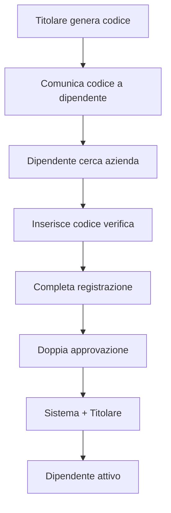

# 📋 DOCUMENTAZIONE SISTEMA REGISTRAZIONE PROFESSIONISTI
**Versione**: 5.0.0  
**Data**: 11 Gennaio 2025  
**Stato**: Production Ready

---

## 🎯 PANORAMICA SISTEMA

Il sistema di registrazione professionisti gestisce **3 tipologie di lavoratori** con percorsi personalizzati:

1. **🙋 Lavoratore Occasionale** - Senza Partita IVA
2. **👷 Ditta Individuale/Libero Professionista** - Con P.IVA personale  
3. **🏢 Società** - Con P.IVA aziendale e team

### 📊 Statistiche Sistema
- **Tipologie gestite**: 3 (+1 dipendenti)
- **Form Steps**: 2-4 (adattivo per tipo)
- **Validazioni**: 25+ controlli
- **Limiti monitorati**: Fatturato e giorni per occasionali
- **Documenti richiesti**: 1-3 per tipo

---

## 🔄 FLUSSI DI REGISTRAZIONE

### 1️⃣ LAVORATORE OCCASIONALE (SENZA P.IVA)

#### 📋 Caratteristiche
- **NO Partita IVA** richiesta
- Solo **Codice Fiscale** personale
- Limite **€5.000/anno per cliente**
- Massimo **30 giorni/anno** stesso cliente
- **Ritenuta d'acconto 20%** automatica
- Emette **ricevute** non fatture

#### 🔄 Processo Registrazione


**Step 1 - Scelta Tipo**
```
[🙋 Lavoratore Occasionale]
Lavoro saltuariamente, senza Partita IVA
✓ Massimo €5.000/anno per committente
✓ Solo codice fiscale personale  
✓ Ritenuta d'acconto del 20%
✓ Max 30 giorni/anno stesso committente
⚠️ Ideale per piccoli lavori sporadici
```

**Step 2 - Dati Personali**
- Nome e Cognome
- Codice Fiscale (16 caratteri)
- Email e Telefono personali
- Password (min 8 caratteri)
- Indirizzo residenza
- Professione (da lista)
- Anni esperienza (opzionale)

**Step 3 - SALTATO** (no dati fiscali)

**Step 4 - Documenti**
- Documento identità (obbligatorio)
- ~~Certificato P.IVA~~ (non richiesto)
- ~~Visura camerale~~ (non richiesto)

#### 💾 Dati Salvati nel Database

```javascript
// Tabella User
{
  activityType: 'OCCASIONAL',
  role: 'PROFESSIONAL',
  
  // Dati personali
  firstName: 'Mario',
  lastName: 'Rossi',
  personalFiscalCode: 'RSSMRA85M01H501Z',
  email: 'mario.rossi@email.com',
  personalPhone: '333 1234567',
  
  // NO dati aziendali
  vatNumber: null,
  companyPhone: null,
  companyEmail: null,
  
  // Status
  isApproved: false,
  approvalStatus: 'PENDING'
}

// Tabella OccasionalWorkerLimits
{
  userId: 'user_id',
  year: 2025,
  totalRevenue: 0,
  clientLimits: {} // JSON per tracciare per cliente
}
```

#### 🔒 Controlli e Limiti

```javascript
// Sistema verifica automaticamente
async function canAcceptWork(userId, clientId, amount, days) {
  const limits = await getLimits(userId, clientId);
  
  // Controllo 1: Fatturato per cliente
  if (limits.clientRevenue + amount > 5000) {
    throw Error(`Superato limite €5.000 con ${clientName}`);
  }
  
  // Controllo 2: Giorni per cliente
  if (limits.clientDays + days > 30) {
    throw Error(`Superato limite 30 giorni con ${clientName}`);
  }
  
  // Controllo 3: Alert INPS (soft limit)
  if (limits.totalRevenue + amount > 5000) {
    sendAlert('Superato €5.000 totali - Obbligo INPS');
  }
  
  return true;
}
```

---

### 2️⃣ DITTA INDIVIDUALE / LIBERO PROFESSIONISTA

#### 📋 Caratteristiche
- **Partita IVA personale** obbligatoria
- **Fatturazione elettronica**
- **PEC** e **Codice SDI** per fatture
- Sede = residenza o altro indirizzo
- Nessun limite fatturato
- Può avere **collaboratori**

#### 🔄 Processo Registrazione


**Step 3 - Dati Fiscali (AGGIUNTIVO)**
```
📊 Dati Fiscali e Professionali
├── Partita IVA (11 cifre) *
├── Telefono Professionale *
├── Email Professionale *
├── PEC (consigliata)
├── Codice SDI (7 caratteri)
└── Sede Attività
    ☐ Uso residenza come sede
    └── Se no: indirizzo sede
```

#### 💾 Dati Salvati

```javascript
{
  activityType: 'INDIVIDUAL',
  
  // Dati fiscali
  vatNumber: '12345678901',
  companyPhone: '02 12345678',
  companyEmail: 'info@mariorossi.it',
  pec: 'mario.rossi@pec.it',
  sdiCode: 'XXXXXX',
  
  // Sede (se diversa da residenza)
  legalAddress: 'Via Milano 123',
  legalCity: 'Milano',
  legalProvince: 'MI',
  legalPostalCode: '20100'
}
```

---

### 3️⃣ SOCIETÀ (S.R.L., S.N.C., S.A.S., ETC.)

#### 📋 Caratteristiche
- **Ragione Sociale** unica
- **P.IVA aziendale** unica
- **CF aziendale** (se diverso da P.IVA)
- **Sede legale** e **operativa**
- Può aggiungere **dipendenti**
- Sistema **ruoli e permessi**

#### 🔄 Processo Registrazione


**Step 3 - Dati Aziendali (ESTESO)**
```
🏢 Dati Aziendali
├── Ragione Sociale *
├── Partita IVA aziendale *
├── CF aziendale (se diverso)
├── Contatti Aziendali
│   ├── Telefono aziendale *
│   ├── Email aziendale *
│   ├── PEC
│   └── Codice SDI
├── Sede Legale *
│   ├── Indirizzo
│   ├── Città, Provincia
│   └── CAP
├── ☐ Sede Operativa diversa
│   └── Indirizzo operativo
└── Ruolo nell'azienda
    ├── Titolare/Amministratore
    ├── Dipendente
    └── Collaboratore
```

#### 💾 Struttura Database Società

```javascript
// Tabella Company
{
  businessName: 'Mario Rossi S.r.l.',
  vatNumber: '12345678901',
  companyFiscalCode: '12345678901',
  
  // Contatti aziendali
  companyPhone: '02 12345678',
  companyEmail: 'info@mariorossisrl.it',
  pec: 'mariorossisrl@pec.it',
  sdiCode: 'XXXXXX',
  
  // Sedi
  legalAddress: 'Via Roma 1',
  legalCity: 'Milano',
  hasOperativeAddress: true,
  operativeAddress: 'Via Milano 100',
  
  // Relazioni
  ownerId: 'user_id_titolare',
  professionals: [/* array dipendenti */]
}

// Tabella User (titolare)
{
  activityType: 'COMPANY',
  companyId: 'company_id',
  companyRole: 'OWNER'
}
```

---

## 👥 REGISTRAZIONE DIPENDENTI

### 📋 Processo per Dipendenti di Aziende Esistenti

#### Flusso Completo



#### 🔐 Sistema Codici Invito

**Per il Titolare:**
```javascript
// Generazione codice
POST /api/company/generate-employee-code
{
  expiresIn: 24, // ore
  maxUses: 1
}

// Response
{
  code: 'ABC12345',
  expiresAt: '2025-01-12T10:00:00Z'
}
```

**Per il Dipendente:**
```javascript
// Step 1: Cerca azienda
GET /api/companies/search?q=Mario+Rossi+Srl

// Step 2: Verifica codice
POST /api/companies/verify-employee-code
{
  companyId: 'company_id',
  code: 'ABC12345'
}

// Step 3: Registrazione
POST /api/auth/register-employee
{
  ...datiPersonali,
  companyId: 'company_id',
  companyRole: 'EMPLOYEE'
}
```

---

## 🛡️ RUOLI E PERMESSI AZIENDALI

### 📊 Gerarchia Ruoli

```
👑 OWNER (Titolare)
├── Controllo totale
├── Nomina/rimuove admin
├── Modifica dati aziendali
└── Chiude azienda

🛡️ COMPANY_ADMIN (Admin Aziendale)
├── Permessi personalizzabili
├── Gestisce team (se autorizzato)
├── Crea preventivi (se autorizzato)
├── Vede tutte le richieste (se autorizzato)
└── NON può modificare dati fiscali

👷 EMPLOYEE (Dipendente)
├── Esegue lavori assegnati
├── Vede solo sue richieste
└── Usa dati aziendali per fatturare

🤝 COLLABORATOR (Collaboratore)
├── Lavoratore temporaneo
├── Permessi limitati
└── Può essere rimosso facilmente
```

### 🔧 Permessi Configurabili Admin

#### Permessi Operativi
| Permesso | Descrizione | Uso |
|----------|-------------|-----|
| `canViewAllRequests` | Vedere tutte le richieste aziendali | Supervisione lavori |
| `canAssignRequests` | Assegnare richieste ai dipendenti | Distribuzione carico |
| `canCreateQuotes` | Fare preventivi per l'azienda | Supporto commerciale |
| `canEditQuotes` | Modificare preventivi di altri | Correzione errori |
| `canApproveQuotes` | Approvare preventivi prima invio | Controllo qualità |

#### Permessi Gestionali
| Permesso | Descrizione | Uso |
|----------|-------------|-----|
| `canManageTeam` | Aggiungere/rimuovere dipendenti | Gestione HR |
| `canGenerateCodes` | Generare codici invito | Onboarding |
| `canViewReports` | Vedere report aziendali | Analisi |
| `canManageServices` | Gestire servizi offerti | Catalogo |
| `canManagePricing` | Modificare listini prezzi | Commerciale |
| `canManageDocuments` | Gestire documenti aziendali | Amministrazione |
| `canViewFinancials` | Vedere dati finanziari | Controllo gestione |

---

## 👁️ VISIBILITÀ CONTATTI

### 📱 Sistema di Gestione Visibilità

**NON in fase di registrazione**, ma nel profilo dopo approvazione.

#### Pagina Gestione: `/professional/contact-visibility`

```
👁️ Quali contatti mostrare ai clienti?

📞 Telefoni:
☐ Personale: 333 1234567
☑ Professionale: 02 12345678

✉️ Email:
☐ Personale: mario@gmail.com
☑ Professionale: info@mariorossi.it
☐ PEC: mario.rossi@pec.it

📍 Indirizzi:
☐ Residenza: Via Roma 1, Milano
☑ Sede: Via Milano 100, Milano

⏰ Orari preferiti: Lun-Ven 9:00-18:00
💬 Note: Preferisco WhatsApp per urgenze
```

#### Database ContactVisibility

```javascript
{
  userId: 'user_id',
  
  // Visibilità telefoni
  showPersonalPhone: false,
  showCompanyPhone: true,
  
  // Visibilità email
  showPersonalEmail: false,
  showCompanyEmail: true,
  showPec: false,
  
  // Visibilità indirizzi
  showPersonalAddress: false,
  showBusinessAddress: true,
  
  // Preferenze
  preferredContactHours: 'Lun-Ven 9:00-18:00',
  contactNotes: 'Preferisco WhatsApp'
}
```

---

## 🔐 VALIDAZIONI E VINCOLI

### 📋 Unicità nel Sistema

| Campo | Scope | Validazione |
|-------|-------|-------------|
| **Email** | Globale | Unica per tutti gli utenti |
| **Codice Fiscale** | Globale | Unico, 16 caratteri, cross-table |
| **Partita IVA** | Globale | Unica, 11 cifre |
| **Ragione Sociale** | Globale | Unica per società |
| **CF Aziendale** | Globale | Se presente, unico |

### 🛡️ Validazioni Form

#### Step 2 - Dati Personali
```javascript
{
  firstName: required, min(2), max(50),
  lastName: required, min(2), max(50),
  personalFiscalCode: required, length(16), uppercase, unique,
  email: required, email, unique,
  personalPhone: required, phone_format,
  password: required, min(8), uppercase, lowercase, number,
  confirmPassword: required, matches(password),
  personalCity: required,
  personalProvince: required, length(2), uppercase,
  professionId: required, in(professions_list)
}
```

#### Step 3 - Dati Fiscali (Individual/Company)
```javascript
{
  // Individual + Company
  vatNumber: required, length(11), numeric, unique,
  companyPhone: required, phone_format,
  companyEmail: required, email, different(personalEmail),
  
  // Solo Company
  businessName: required_if(company), min(3), unique,
  companyFiscalCode: optional, length(16), unique,
  legalAddress: required,
  legalCity: required,
  legalProvince: required, length(2),
  legalPostalCode: required, length(5)
}
```

---

## 📊 API ENDPOINTS

### 🔄 Registrazione

```typescript
// Registrazione professionista (tutti i tipi)
POST /api/auth/register-professional
Content-Type: multipart/form-data
{
  registrationType: 'occasional' | 'individual' | 'company',
  activityType: 'OCCASIONAL' | 'INDIVIDUAL' | 'COMPANY',
  ...datiPersonali,
  ...datiFiscali, // se non occasional
  ...datiAzienda, // se company
  identityDocument: File,
  vatCertificate?: File,
  chamberOfCommerce?: File
}

// Registrazione dipendente
POST /api/auth/register-employee
{
  ...datiPersonali,
  companyId: string,
  companyRole: 'EMPLOYEE' | 'COLLABORATOR',
  verificationCode: string
}

// Check disponibilità real-time
GET /api/check-availability?field=email&value=test@email.com
GET /api/check-availability?field=personalFiscalCode&value=RSSMRA85M01H501Z
GET /api/check-availability?field=vatNumber&value=12345678901
```

### 👥 Gestione Team

```typescript
// Genera codice invito (OWNER/ADMIN)
POST /api/company/generate-employee-code

// Lista team
GET /api/company/team

// Promuovi ad admin (OWNER only)
POST /api/company/promote-to-admin
{
  userId: string,
  permissions: CompanyPermission
}

// Rimuovi dipendente
DELETE /api/company/team/:userId
```

### 🙋 Lavoratore Occasionale

```typescript
// Verifica limiti prima di accettare lavoro
GET /api/occasional/check-limits?clientId=xxx&amount=1000

// Aggiorna limiti dopo lavoro
POST /api/occasional/update-limits
{
  clientId: string,
  amount: number,
  days: number
}

// Riepilogo limiti
GET /api/occasional/limits-summary

// Genera ricevuta
POST /api/occasional/generate-receipt
{
  clientId: string,
  requestId: string,
  amount: number,
  description: string,
  workDays: number
}
```

### 👁️ Visibilità Contatti

```typescript
// Get impostazioni
GET /api/professional/contact-visibility

// Update impostazioni
PUT /api/professional/contact-visibility
{
  showPersonalPhone: boolean,
  showCompanyPhone: boolean,
  showPersonalEmail: boolean,
  showCompanyEmail: boolean,
  showPec: boolean,
  showPersonalAddress: boolean,
  showBusinessAddress: boolean,
  preferredContactHours?: string,
  contactNotes?: string
}
```

---

## 🗄️ SCHEMA DATABASE

### 📊 Tabelle Principali

```sql
-- Utenti (tutti i tipi)
User {
  id: string @id
  
  -- Tipo attività
  activityType: OCCASIONAL | INDIVIDUAL | COMPANY
  role: CLIENT | PROFESSIONAL | ADMIN
  
  -- Dati personali
  firstName: string
  lastName: string
  personalFiscalCode: string @unique
  email: string @unique
  
  -- Dati fiscali (null per occasional)
  vatNumber?: string @unique
  companyId?: string @relation(Company)
  companyRole?: OWNER | COMPANY_ADMIN | EMPLOYEE | COLLABORATOR
  
  -- Status
  isApproved: boolean
  approvalStatus: PENDING | APPROVED | REJECTED
}

-- Aziende
Company {
  id: string @id
  businessName: string @unique
  vatNumber: string @unique
  companyFiscalCode?: string @unique
  
  -- Relazioni
  owner: User @relation(OWNER)
  professionals: User[]
  companyPermissions: CompanyPermission[]
}

-- Limiti lavoratore occasionale
OccasionalWorkerLimits {
  id: string @id
  userId: string @relation(User)
  year: number
  totalRevenue: number
  clientLimits: JSON {
    [clientId]: {
      revenue: number,
      days: number,
      lastUpdate: Date
    }
  }
  
  @@unique([userId, year])
}

-- Ricevute occasionali
OccasionalReceipt {
  id: string @id
  userId: string @relation(User)
  clientId: string @relation(User)
  
  receiptNumber: string @unique
  receiptDate: DateTime
  
  grossAmount: number
  withholdingTax: number // 20%
  netAmount: number
  
  workDays: number
  status: DRAFT | ISSUED | PAID | CANCELLED
}

-- Visibilità contatti
ContactVisibility {
  id: string @id
  userId: string @unique @relation(User)
  
  showPersonalPhone: boolean
  showCompanyPhone: boolean
  showPersonalEmail: boolean
  showCompanyEmail: boolean
  showPec: boolean
  showPersonalAddress: boolean
  showBusinessAddress: boolean
  
  preferredContactHours?: string
  contactNotes?: string
}

-- Permessi admin aziendali
CompanyPermission {
  id: string @id
  companyId: string @relation(Company)
  userId: string @relation(User)
  
  -- Permessi operativi
  canViewAllRequests: boolean
  canAssignRequests: boolean
  canCreateQuotes: boolean
  canEditQuotes: boolean
  canApproveQuotes: boolean
  
  -- Permessi gestionali
  canManageTeam: boolean
  canGenerateCodes: boolean
  canViewReports: boolean
  canManageServices: boolean
  canManagePricing: boolean
  canManageDocuments: boolean
  canViewFinancials: boolean
  
  -- Permessi comunicazione
  canMessageAllClients: boolean
  canManageReviews: boolean
  
  @@unique([companyId, userId])
}
```

---

## 🚀 DEPLOYMENT CHECKLIST

### Pre-Deploy Verifiche

#### Database
- [ ] Migration applicata per nuove tabelle
- [ ] Indici creati su campi di ricerca
- [ ] Vincoli UNIQUE verificati
- [ ] Seed data per test

#### Backend
- [ ] Endpoint registrazione testati
- [ ] Validazioni unicità funzionanti  
- [ ] Upload documenti configurato
- [ ] Email notifiche attive
- [ ] Rate limiting su registrazione

#### Frontend
- [ ] Form multi-step responsive
- [ ] Validazioni client-side
- [ ] Upload file con preview
- [ ] Error handling completo
- [ ] Loading states

#### Security
- [ ] Password policy enforced
- [ ] File upload validation
- [ ] SQL injection prevention
- [ ] XSS protection
- [ ] CORS configurato

---

## 📈 METRICHE E MONITORING

### KPI da Monitorare

| Metrica | Target | Alert |
|---------|--------|-------|
| Registrazioni/giorno | 50-100 | < 10 |
| Tasso conversione | > 60% | < 40% |
| Tempo completamento | < 5 min | > 10 min |
| Drop-off rate | < 20% | > 30% |
| Approvazioni/giorno | 24-48h | > 72h |

### Tracking Events

```javascript
// Analytics da tracciare
{
  'registration_started': { type: string },
  'step_completed': { step: number, type: string },
  'validation_error': { field: string, error: string },
  'registration_completed': { type: string, time: seconds },
  'registration_abandoned': { step: number, type: string },
  'document_uploaded': { type: string, size: bytes },
  'availability_checked': { field: string, available: boolean }
}
```

---

## 🐛 TROUBLESHOOTING

### Problemi Comuni

#### "Codice Fiscale già registrato"
```javascript
// Verifica in database
SELECT * FROM "User" WHERE personalFiscalCode = 'CF';
SELECT * FROM "Company" WHERE companyFiscalCode = 'CF';

// Soluzione: CF già usato, utente deve fare login
```

#### "Limite €5.000 superato"
```javascript
// Check limiti
SELECT * FROM "OccasionalWorkerLimits" 
WHERE userId = ? AND year = 2025;

// Soluzione: Passare a P.IVA o cambiare cliente
```

#### Upload documenti fallisce
```javascript
// Verifiche
- File size < 10MB
- Formato: image/*, application/pdf
- Cartella uploads/ scrivibile
- Multer configurato

// Soluzione comune
chmod 755 uploads/
```

#### Codice invito non funziona
```javascript
// Verifica validità
SELECT * FROM "EmployeeInviteCode" 
WHERE code = ? AND expiresAt > NOW();

// Soluzione: Generare nuovo codice (24h validity)
```

---

## 🔄 MIGRAZIONE UTENTI ESISTENTI

### Da Sistema Precedente

```javascript
// Script migrazione
async function migrateUsers() {
  const oldUsers = await getOldUsers();
  
  for (const user of oldUsers) {
    // Determina tipo
    let activityType;
    if (!user.vatNumber) {
      activityType = 'OCCASIONAL';
    } else if (user.companyName) {
      activityType = 'COMPANY';
    } else {
      activityType = 'INDIVIDUAL';
    }
    
    // Crea nuovo record
    await prisma.user.create({
      data: {
        ...mapUserData(user),
        activityType,
        migrationDate: new Date()
      }
    });
    
    // Se occasionale, crea limiti
    if (activityType === 'OCCASIONAL') {
      await createOccasionalLimits(user.id);
    }
  }
}
```

---

## 📚 RIFERIMENTI

### Normativa Lavoratori Occasionali
- Art. 2222 Codice Civile
- Circolare INPS n. 104/2001
- Limite €5.000/anno per committente
- Obbligo INPS oltre €5.000 totali

### Standard Tecnici
- GDPR per dati personali
- PSD2 per pagamenti
- Fatturazione elettronica B2B

### Documentazione Correlata
- `/ISTRUZIONI-PROGETTO.md` - Regole tecniche
- `/ARCHITETTURA-SISTEMA-COMPLETA.md` - Architettura
- `/backend/prisma/schema.prisma` - Database schema
- `/src/pages/auth/RegisterProfessionalPageV2.tsx` - Form

---

## 📞 SUPPORTO

### Contatti Sviluppo
- **Lead Developer**: Luca Mambelli
- **Email**: lucamambelli@lmtecnologie.it
- **GitHub**: @241luca

### FAQ Frequenti

**Q: Posso avere sia P.IVA che lavorare come occasionale?**
A: No, chi ha P.IVA deve usarla sempre.

**Q: Come cambio da occasionale a P.IVA?**
A: Nuovo profilo con P.IVA, migrazione dati su richiesta.

**Q: I limiti sono per anno solare?**
A: Sì, reset automatico 1 gennaio.

**Q: Posso modificare i dati dopo registrazione?**
A: Sì dal profilo, tranne CF e P.IVA (contattare supporto).

---

**FINE DOCUMENTAZIONE**

Ultimo aggiornamento: 11 Gennaio 2025  
Versione: 5.0.0  
Status: Production Ready
